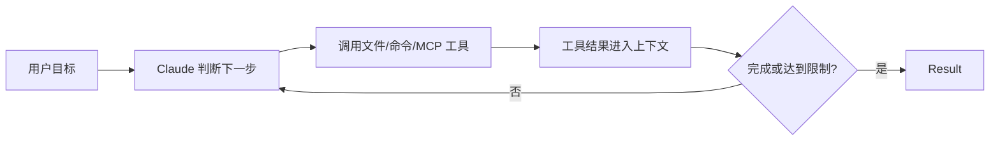
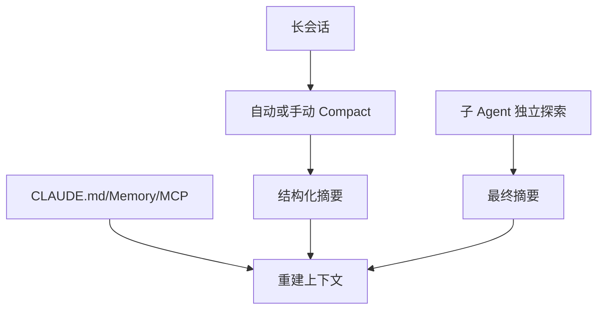

# Claude Code 模块地图

> 核验日期：2026-09-02。本文依据 Anthropic 官方 Claude Code 与 Agent SDK 文档，只描述公开行为。

## 一、定位与主链路

Claude Code 是面向软件工程任务的 Agent。官方 Agent SDK 文档将其执行方式描述为循环：模型评估 Prompt、调用工具、接收结果并重复，直到任务完成。

## 二、当前模块地图

| 模块 | 公开机制 | 学习价值 | 证据等级 |
|---|---|---|---|
| Planning | Plan mode 只读分析并提出方案，批准后再编辑 | 高风险或复杂改动先审方向 | 官方文档确认 |
| Agent Loop | 模型调用工具、接收结果并继续循环 | 标准工具反馈闭环 | 官方文档确认 |
| Context 压缩 | 自动压缩、`/compact`、compact boundary | 长会话跨窗口继续 | 官方文档确认 |
| 规则恢复 | 压缩后重载 System Prompt、`CLAUDE.md`、Memory、MCP | 稳定约束不依赖摘要 | 官方文档确认 |
| Tool Schema | MCP Tool Search 默认按需加载 Schema | 减少大量工具占用上下文 | 官方文档确认 |
| 子 Agent | 独立上下文执行，只将最终结果返回主会话 | 隔离文件读取和日志噪声 | 官方文档确认 |
| Hooks | `PreToolUse`、`PreCompact` 等生命周期事件 | 在模型循环外审计或阻断动作 | 官方文档确认 |

## 三、Plan Mode

Claude Code 官方将 Plan mode 定义为“分析后再编辑”：它可以读取文件并提出方案，但在用户批准前不修改磁盘。它适合：

- 跨模块重构；
- 需要先评审方案的高风险修改；
- 问题描述模糊，需要先探索代码库；
- 用户想控制改动范围和依赖。

对于明确的小修复，先写完整 Plan 可能只是增加交互成本。执行阶段仍然是工具反馈循环，计划需要根据测试结果修正。

> **核心小结：** Plan mode 是修改前的控制点，不是取代 Agent Loop 的另一套执行器。

## 四、Context 管理

Claude Code 公开的 Context 管理不是单一摘要，而是一组组合机制：

1. **自动压缩和 `/compact`**：旧历史替换为结构化摘要，保留近期交互与关键决策。
2. **摘要指导**：可在 `CLAUDE.md` 中指定压缩时必须保留目标、文件、测试、错误和决策原因。
3. **压缩前 Hook**：`PreCompact` 可以归档完整 Transcript。
4. **稳定内容重载**：压缩后重新加载 System Prompt、`CLAUDE.md`、Memory、MCP 工具和已调用 Skills。
5. **Tool Search**：大量 MCP 工具的完整 Schema 默认按需加载。
6. **子 Agent 隔离**：子任务使用新的上下文窗口，主会话只收到最终摘要。

> **核心小结：** Claude Code 同时控制“历史有多长、稳定规则如何恢复、工具何时加载、子任务是否污染主线程”。

## 五、待深入研究

- Memory 与 `CLAUDE.md` 在作用域、写入和冲突上的边界；
- MCP Tool Search 的触发阈值和降级行为；
- 子 Agent 自定义工具、权限和模型继承；
- Plan、Default、Auto 等权限模式如何影响执行循环；
- Session Resume、Fork 和外部 Session Store 的一致性语义；
- Hooks 如何与权限规则共同阻断高风险动作。

## 六、来源

- [How the agent loop works](https://code.claude.com/docs/en/agent-sdk/agent-loop)
- [Plan before editing](https://code.claude.com/docs/en/common-workflows#plan-before-editing)
- [Explore the context window](https://code.claude.com/docs/en/context-window)
- [Permission modes](https://code.claude.com/docs/en/permission-modes)
- [Subagents](https://code.claude.com/docs/en/sub-agents)
- [Hooks](https://code.claude.com/docs/en/hooks)
- [MCP Tool Search](https://code.claude.com/docs/en/mcp#scale-with-mcp-tool-search)

