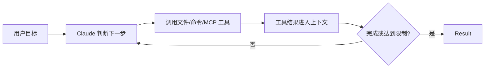
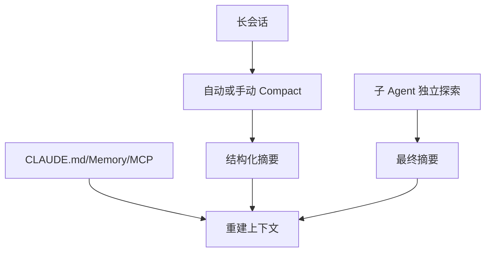
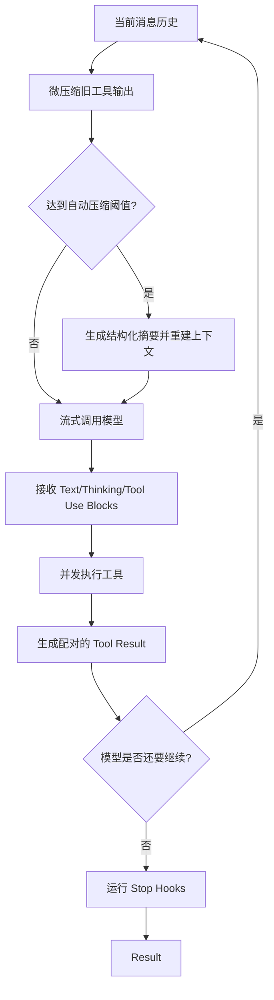
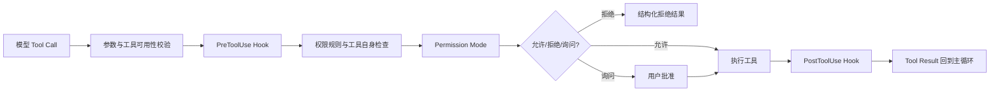

# Claude Code 模块地图

> 核验日期：2026-09-02。当前产品事实以 Anthropic 官方 Claude Code 与 Agent SDK 文档为准；实现补充来自 `D:\Work\claude-code-main\src` 的本地研究归档。该归档自述源于 2026 年 3 月 npm Source Map 暴露、于 4 月整理，不是官方仓库，也无法确认精确产品版本。本文不会将快照实现直接当成当前版本事实。

## 一、定位与主链路

Claude Code 是面向软件工程任务的 Agent。官方 Agent SDK 文档将其执行方式描述为循环：模型评估 Prompt、调用工具、接收结果并重复，直到任务完成。

## 二、当前模块地图

| 模块 | 公开机制 | 学习价值 | 证据等级 |
|---|---|---|---|
| Planning | Plan mode 只读分析并提出方案，批准后再编辑 | 高风险或复杂改动先审方向 | 官方文档确认 |
| Agent Loop | 模型调用工具、接收结果并继续循环 | 标准工具反馈闭环 | 官方文档确认 |
| Context 压缩 | 自动压缩、`/compact`、compact boundary | 长会话跨窗口继续 | 官方文档确认 |
| 规则恢复 | 压缩后重载 System Prompt、`CLAUDE.md`、Memory、MCP | 稳定约束不依赖摘要 | 官方文档确认 |
| Tool Schema | MCP Tool Search 默认按需加载 Schema | 减少大量工具占用上下文 | 官方文档确认 |
| 子 Agent | 独立上下文执行，只将最终结果返回主会话 | 隔离文件读取和日志噪声 | 官方文档确认 |
| Hooks | `PreToolUse`、`PreCompact` 等生命周期事件 | 在模型循环外审计或阻断动作 | 官方文档确认 |
| 权限管线 | 权限模式、规则、Hook 与用户批准共同决定工具是否运行 | 安全决策不只依赖模型 | 官方文档确认；快照辅助理解 |
| 会话恢复 | Transcript、Resume、Fork 与消息链重建 | 长任务可跨进程继续并分支 | 官方文档确认；快照辅助理解 |
| 多级压缩 | 工具输出微压缩、历史压缩和压缩后规则恢复 | 减少 Context 增长与信息损失 | 官方文档确认；快照辅助理解 |

## 三、Plan Mode

Claude Code 官方将 Plan mode 定义为“分析后再编辑”：它可以读取文件并提出方案，但在用户批准前不修改磁盘。它适合：

- 跨模块重构；
- 需要先评审方案的高风险修改；
- 问题描述模糊，需要先探索代码库；
- 用户想控制改动范围和依赖。

对于明确的小修复，先写完整 Plan 可能只是增加交互成本。执行阶段仍然是工具反馈循环，计划需要根据测试结果修正。

> **核心小结：** Plan mode 是修改前的控制点，不是取代 Agent Loop 的另一套执行器。

## 四、Context 管理

Claude Code 公开的 Context 管理不是单一摘要，而是一组组合机制：

1. **自动压缩和 `/compact`**：旧历史替换为结构化摘要，保留近期交互与关键决策。
2. **摘要指导**：可在 `CLAUDE.md` 中指定压缩时必须保留目标、文件、测试、错误和决策原因。
3. **压缩前 Hook**：`PreCompact` 可以归档完整 Transcript。
4. **稳定内容重载**：压缩后重新加载 System Prompt、`CLAUDE.md`、Memory、MCP 工具和已调用 Skills。
5. **Tool Search**：大量 MCP 工具的完整 Schema 默认按需加载。
6. **子 Agent 隔离**：子任务使用新的上下文窗口，主会话只收到最终摘要。

> **核心小结：** Claude Code 同时控制“历史有多长、稳定规则如何恢复、工具何时加载、子任务是否污染主线程”。

## 五、主循环在源码里如何运转

本地历史快照中，`src/query.ts` 的 `queryLoop` 是理解运行时的核心入口。它不是简单地“请求模型，如果有工具就再请求一次”，而是在每个循环中处理一组状态机问题：

源码中有几个容易被简化掉的细节：

- `tool_use` 和 `tool_result` 必须正确配对；中断或异常时会补合成结果，避免下一次 API 请求出现孤儿工具调用。
- 工具可以流式到达并并发执行，循环同时消费模型输出和工具结果，而不是等所有文本生成完才开始工作。
- 用户中断会取消在途工具，并把中断信息转换成模型可理解的消息。
- API 错误、输出长度限制和模型回退都有独立分支，必要时会重建 Executor，避免旧工具结果泄漏到重试请求。
- 一轮看似已经结束时，Stop Hook 仍可以要求继续，因此“停止”也是 Harness 决策，不完全由模型 Stop Reason 决定。

> **核心小结：** Claude Code 的 Agent Loop 既管理模型推理，也管理工具并发、消息配对、错误恢复、取消和生命周期 Hook。

## 六、Context 管理其实是多级回收

### 1. 工具输出微压缩

快照中的 `services/compact/microCompact.ts` 会优先回收较老、较大的 Tool Result，而不立刻总结整段对话。这样做的理由是：长会话中最占空间的通常不是用户问题，而是文件内容、搜索结果和测试日志。

这种局部回收比全量摘要便宜，也更有利于 Prompt Cache；但它必须保留近期工具结果和仍在使用的证据，不能把当前排障需要的报错先删掉。

### 2. 自动或手动全局压缩

当估算 Token 接近有效 Context Window 时，`autoCompact.ts` 预留模型输出空间和安全 Buffer，再调用完整压缩。快照还包含连续失败计数和 Circuit Breaker，避免压缩失败后每一轮都重复发起注定失败的请求。

历史快照里的压缩 Prompt 明确要求保留：

- 用户的主要请求和全部明确反馈；
- 关键技术概念与架构决策；
- 读取、修改和创建的文件及重要代码位置；
- 遇到的错误、修复方式和仍在排查的问题；
- 未完成任务、当前工作和合理下一步。

这说明压缩目标是创建可以继续开发的 Handoff，而不是生成一段聊天摘要。

### 3. 压缩后的确定性恢复

官方文档说明压缩后会重新加载 System Prompt、`CLAUDE.md`、Memory、MCP 工具和已调用 Skills。快照中的 Post-Compact 流程还会整理上下文并恢复继续工作需要的附件或状态。

因此，稳定规则放在 `CLAUDE.md` 比只放在会话第一条消息更可靠：前者可以在压缩后确定性重注入，后者只能期待摘要没有遗漏。

### 4. 隔离和延迟加载

- 子 Agent 使用独立 Context，主会话只接收结果摘要。
- MCP Tool Search 延迟加载完整 Tool Schema，避免大量工具定义永久占据窗口。
- Skill 只在真正调用时加载完整内容；已调用的 Skill 可以在压缩后恢复。

| 层级 | 处理对象 | 目的 |
|---|---|---|
| 微压缩 | 旧的大型 Tool Result | 低成本回收主要噪声 |
| 全局压缩 | 较早消息和执行轨迹 | 跨 Context Window 继续任务 |
| 规则重注入 | System Prompt、`CLAUDE.md`、Memory | 避免摘要丢失稳定约束 |
| Tool Search | MCP Tool Schema | 按需支付工具描述 Token |
| 子 Agent | 独立探索和大量文件读取 | 隔离主线程 Context Pollution |

> **核心小结：** 成熟的 Context Engineering 不是“快满了就总结”，而是先局部回收，再全局压缩，同时重载规则、延迟加载工具并隔离子任务。

## 七、工具和权限的决策管线

Claude Code 的工具调用不是模型输出一个 JSON 就直接执行。结合官方文档和历史快照，可以把决策理解为：

几个层次的职责不同：

- **工具输入校验**：参数是否合法、所需 MCP 是否可用。
- **Hooks**：在进程外执行组织策略、审计或拦截，例如 `PreToolUse`。
- **Permission Rules**：匹配某类工具和参数应允许、拒绝还是询问。
- **Permission Mode**：Plan、Default、Auto、Bypass 等模式改变默认执行边界。
- **用户批准**：对当前具体调用作最终交互决策。

Plan Mode 的价值也因此更清楚：它不只是给 Prompt 加一句“先规划”，而是通过权限模式限制修改类工具，在方案获批前保持只读分析。

> **核心小结：** 工具安全是多层策略合成的结果；Prompt、规则、Hook、权限模式和用户批准各自负责不同边界。

## 八、子 Agent：隔离、继承和并行

官方文档说明子 Agent 从新的消息历史开始，只加载自己的 System Prompt 和项目级上下文，最终结果作为 Tool Result 回到父 Agent。历史快照的 `AgentTool` 和 `runAgent` 还能帮助理解更多实现考虑：

- 子 Agent 类型可以限制可用工具、模型和权限模式；
- 启动前会校验它依赖的 MCP Server 是否已经连接并认证；
- 普通子 Agent 只接收任务 Prompt，Fork Worker 可以带入父会话的选定上下文；
- Worker 会重新组装自己的工具池，不应把父 Agent 的全部临时状态无条件复制过去；
- 递归 Fork 会被限制，避免无限派生；
- 后台 Agent 返回 ID，主 Agent 可以继续工作并在之后读取结果；
- 子 Agent 结束时要清理任务，并过滤没有对应 Tool Result 的不完整调用。

什么时候使用子 Agent：

- 大型代码库探索、日志分析和独立测试会产生大量中间噪声；
- 多个子任务彼此独立，能够真正并行；
- 子任务需要更小的工具集合或不同权限。

什么时候不该使用：任务依赖同一批文件连续修改、需要共享大量隐含上下文，或协调成本超过并行收益。

> **核心小结：** 子 Agent 的主要价值不只是并发，更是用独立 Context 和最小工具集隔离复杂度。

## 九、会话持久化、Resume 与 Fork

Claude Code 不把会话只存在内存里。官方文档支持 Resume、Continue、Fork 和外部 Session Store；历史快照的 `sessionStorage.ts` 显示消息以可重建的 Transcript 形式持久化，并维护父子 UUID、摘要边界、文件历史快照和一致性检查。

可以把三种操作区分为：

- **Resume**：沿原 Session ID 继续工作，复用原历史和状态。
- **Continue**：选择最近相关会话继续，强调用户入口。
- **Fork**：从已有历史创建新 Session，后续修改与原分支分离。

恢复不是简单读取所有 JSONL 行。实现需要重建消息链、处理压缩边界、过滤孤儿 Tool Call、恢复文件历史，并检查恢复后的消息数是否与运行时 Checkpoint 一致。

> **核心小结：** 长任务可靠恢复依赖结构化 Transcript 和一致性修复，而不是把上次最终回答复制到新 Prompt。

## 十、Hooks 提供模型外控制面

Hooks 覆盖 Session、Prompt、Tool、Subagent、Compact、Stop 等生命周期。它们运行在 Agent Context 之外，因此适合：

- 在 Tool 执行前做策略和合规校验；
- 在执行后记录审计、格式化或附加上下文；
- 压缩前归档完整 Transcript；
- 子 Agent 启停时统计并发和成本；
- Stop 时检查验收条件，不满足则要求 Agent 继续；
- Session 结束时同步日志或清理资源。

Hook 的输出必须结构化进入循环，不能依赖模型阅读一段模糊日志。Hook 也不是沙箱：它可以决定是否执行，但不能替代操作系统级资源边界。

> **核心小结：** Hooks 把确定性业务策略放到模型循环外，是连接 Agent 自主性与企业控制的关键扩展点。

## 十一、历史源码快照如何使用

本地 `D:\Work\claude-code-main` 自带说明将 `src/` 定义为研究归档，并要求只读。使用时遵循：

1. 当前产品能力和公开承诺以 Anthropic 官方文档为准。
2. 快照只用于解释历史实现的模块划分、调用链和工程问题。
3. 无 Git 元数据、无根目录 Package Manifest，`MACRO.VERSION` 未展开，因此不声称精确版本。
4. 不从快照复制大段代码，不披露凭据、内部端点或与架构无关的实现细节。
5. 如果快照与当前官方文档不一致，将其标为历史差异，不用快照覆盖当前事实。

推荐源码阅读路线：

1. `src/query.ts` 与 `src/QueryEngine.ts`：主循环和流式消息。
2. `src/services/compact/`：微压缩、自动压缩、摘要 Prompt 和压缩后清理。
3. `src/hooks/useCanUseTool.tsx` 与 `src/utils/permissions/`：权限决策。
4. `src/tools/AgentTool/`：子 Agent、Fork 和后台任务。
5. `src/utils/hooks.ts`：生命周期扩展。
6. `src/utils/sessionStorage.ts`：Transcript、Resume、Fork 和文件历史。
7. `src/utils/toolSearch.ts`：大规模工具的按需发现。

## 十二、可迁移到业务 Agent 的经验

- 优先回收大型工具输出，再决定是否全局压缩。
- 将长期稳定规则放在可重注入载体中，不要只依赖第一轮 Prompt。
- 为压缩保留输出空间、失败计数和 Circuit Breaker。
- Tool Call 与 Tool Result 必须严格配对，中断和重试也要保持协议完整。
- 权限采用规则、Hook、模式和用户批准的分层设计。
- 子 Agent 应有独立 Context 和最小工具集，父 Agent 只接收必要结果。
- Session 恢复要验证消息链和文件状态，不能把“能加载”当成“一致恢复”。

## 十三、待深入研究

- Memory 与 `CLAUDE.md` 在作用域、写入和冲突上的边界；
- MCP Tool Search 的触发阈值和降级行为；
- Agent Teams 与普通子 Agent 在共享任务和通信上的差异；
- 当前版本的 Microcompact 是否与历史快照保持相同策略；
- 外部 Session Store 与本地 Transcript 双写时的故障恢复语义；
- Auto Mode 的分类器和组织级策略如何组合。

## 十四、来源

- [How the agent loop works](https://code.claude.com/docs/en/agent-sdk/agent-loop)
- [Plan before editing](https://code.claude.com/docs/en/common-workflows#plan-before-editing)
- [Explore the context window](https://code.claude.com/docs/en/context-window)
- [Permission modes](https://code.claude.com/docs/en/permission-modes)
- [Subagents](https://code.claude.com/docs/en/sub-agents)
- [Hooks](https://code.claude.com/docs/en/hooks)
- [MCP Tool Search](https://code.claude.com/docs/en/mcp#scale-with-mcp-tool-search)
- 本地历史研究归档：`D:\Work\claude-code-main\src`，归档说明见仓库内 `CLAUDE.md`；不作为当前官方源码引用。

