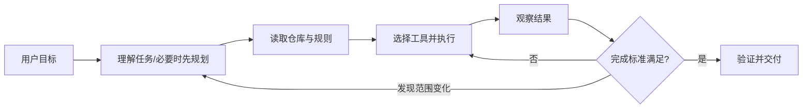
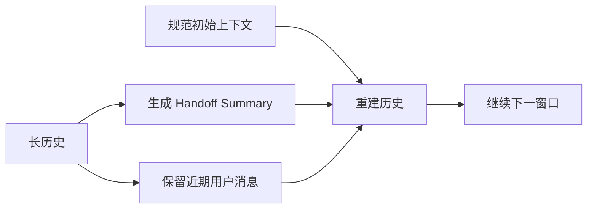
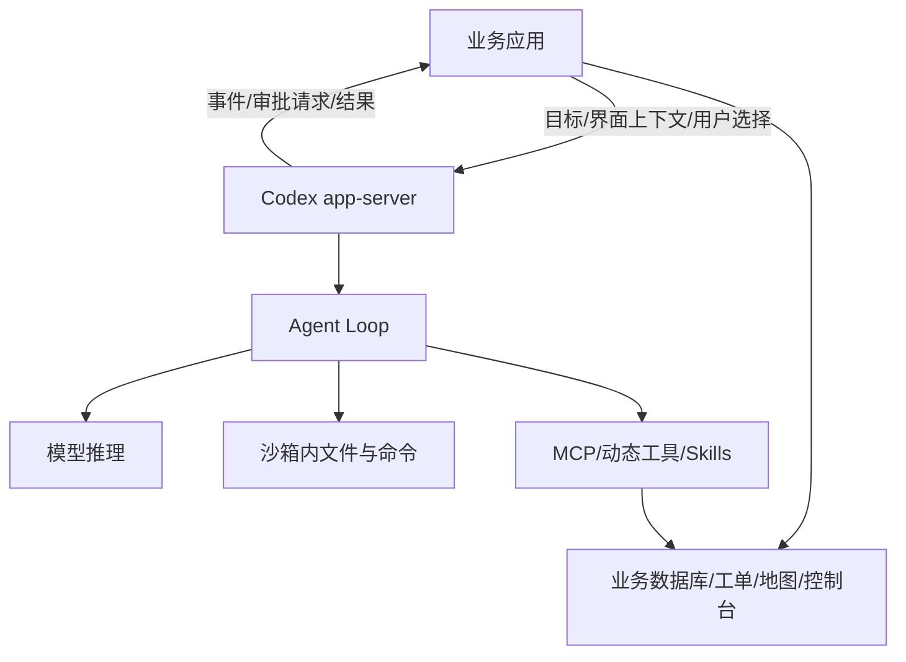
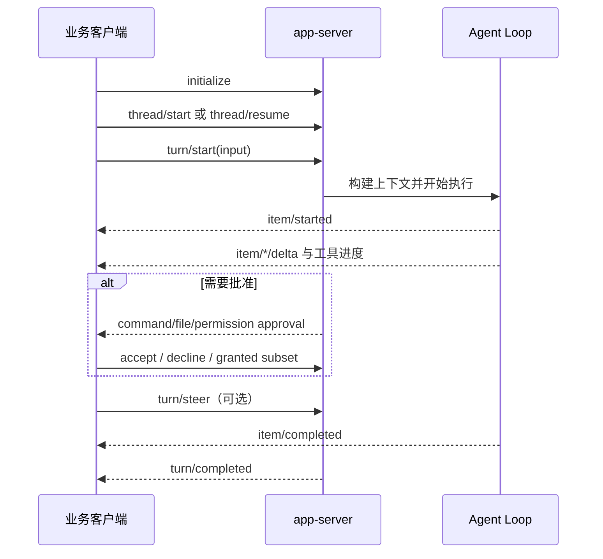

# Codex 模块地图

> 核验日期：2026-09-02。本文只记录 OpenAI 官方文档和 `openai/codex` 公开仓库能够确认的行为；产品服务端未公开部分不作猜测。

## 一、定位与主链路

Codex 是面向软件工程任务的个人 Coding Agent。一次任务通常不是单次生成代码，而是围绕目标持续读取仓库、运行命令、修改文件和验证结果。

这个流程可以用“Plan 管全局、动态工具循环处理局部、测试作为环境反馈”来理解。后两者是概念映射，不是 OpenAI 对默认模式的正式命名。

## 二、当前模块地图

| 模块 | 公开机制 | 学习价值 | 证据等级 |
|---|---|---|---|
| Planning | Plan mode 在实现前收集上下文、澄清问题和形成方案 | 复杂改动先稳定目标与范围 | 官方文档确认 |
| 长任务 | Goal mode 维护明确目标、约束和完成条件 | 让多步工作围绕终态推进 | 官方文档确认 |
| Agent Loop | 读取文件、执行命令、观察结果并继续行动 | 工具反馈驱动局部决策 | 公开源码确认；ReAct 为概念映射 |
| 产品协议 | app-server 暴露 Thread、Turn、Item 和流式事件 | 让 Agent Loop 能嵌入任意业务界面 | 官方文档确认 |
| Context 压缩 | 自动/手动压缩，使用交接摘要替换旧轨迹并重建上下文 | 长任务可以跨窗口继续 | 公开源码确认 |
| 子 Agent | 独立任务在独立上下文中执行，主线程接收摘要 | 隔离日志噪声并并行研究 | 官方文档确认 |
| 项目规则 | `AGENTS.md` 向 Agent 提供仓库约束与验证方式 | 稳定规则不依赖临时 Prompt | 官方文档确认 |
| 工具扩展 | 内置工具、MCP、Skill 和动态工具 | 将业务数据与动作接入同一循环 | 官方文档确认 |
| 权限 | 沙箱、审批和权限请求控制外部动作 | 模型决策不能等同于执行权限 | 官方文档和源码确认 |
| 可观测性 | Item 生命周期、增量消息、工具进度和 Turn 状态事件 | UI 可展示过程，平台可记录与恢复 | 官方文档确认 |

## 三、Plan 与动态执行如何组合

Codex 官方建议复杂、模糊或难以描述的任务先使用 Plan mode。Plan 的价值不是多写一份步骤列表，而是：

- 在写代码前发现需求歧义；
- 建立模块依赖和验证标准；
- 让用户在产生修改前审阅方向。

进入实现后，真实测试结果可能推翻初始假设，因此仍需要动态选择工具和调整方案。简单、小范围任务可以直接执行；跨模块改造和高风险修改更适合先 Plan。

> **核心小结：** Codex 的 Plan 用来降低“改错方向”的风险，动态执行用来处理代码和测试暴露出的局部不确定性。

## 四、Context 压缩

`openai/codex` 公开仓库提交 `02f47d3` 能确认：

- 存在自动压缩 Token 阈值，也支持用户请求的手动压缩；
- 本地压缩 Prompt 要求生成另一个模型可接手的 Handoff Summary；
- 摘要包含进展、决策、约束、剩余工作和继续执行需要的引用；
- 重建历史时按预算保留较新的用户消息；
- 规范初始上下文会在压缩后重新插入；
- 多次压缩会有准确性损失，源码建议保持任务聚焦，必要时新开线程。

Responses API 的服务端压缩内部算法未全部公开，不能从客户端代码推断摘要模型或服务端保留策略。

> **核心小结：** Codex 压缩的重点是“能继续工作”，因此同时保留稳定规则、用户约束、任务状态和下一步，而不只是缩短聊天记录。

## 五、Codex 为什么可以作为 Agent 平台

OpenAI 在《Codex as a platform》中把 Codex 定义为可复用的开放 Agent Harness，而不只是 CLI 或编辑器插件。真正可复用的是模型外面的执行系统：维护会话状态、流式执行、调用工具、处理失败、执行沙箱与审批策略，并把工作延续到后续轮次。

平台边界可以画成三层：

职责不是全部交给 Codex：

| 应用负责 | Codex Harness 负责 |
|---|---|
| 业务界面和用户正在看的对象 | Agent Loop 和模型交互 |
| 领域数据、业务规则、系统记录 | Thread/Turn 状态和流式事件 |
| 暴露哪些工具、谁能调用 | 工具调用协议和结果回灌 |
| 产品级同意与审批体验 | 沙箱执行与审批请求 |
| 结果如何进入工单、告警或业务流程 | 在配置边界内持续执行任务 |

这意味着接入 Codex 时，不需要复制一个聊天应用。客服系统可以继续使用客户历史和工单面板，安全平台可以继续使用告警队列与处置审批，Codex 只承接需要推理和工具执行的那一段。

> **核心小结：** Codex 平台化的关键是把 Agent Loop 做成基础设施，同时让业务应用保留界面、上下文、工具和最终控制权。

### 三种接入层级

| 接入方式 | 适合场景 | 控制粒度 |
|---|---|---|
| `codex exec` | 脚本、CI、一次性后台任务 | 最简单，运行一个有边界的任务 |
| Codex SDK | 应用代码启动、恢复和流式消费任务 | 封装常见编程接口 |
| app-server | Agent 成为产品本身的一部分 | 直接控制线程、轮次、事件、审批和 UI 生命周期 |

如果只是批量修复代码，使用 `exec` 即可；如果要做一个具有暂停、恢复、审批、进度面板和业务工具的垂直 Agent 产品，app-server 更合适。

## 六、app-server 的运行时协议

app-server 将 Agent 运行时拆成三个稳定原语：

- **Thread**：一段可以持久化、恢复、Fork 或归档的对话；包含多个 Turn。
- **Turn**：一次用户输入以及为完成它发生的 Agent 工作；可以被 steer 或 interrupt。
- **Item**：Turn 内最小的过程对象，例如消息、命令执行、文件修改和工具调用。

这个协议有三个重要设计：

1. **过程是结构化对象，不是终端文本。** UI 可以分别渲染命令、Diff、工具调用和 Agent 消息。
2. **运行中的 Turn 可以被干预。** 用户可以 steer 当前 Turn，或 interrupt 取消，而不是只能等待最终答案。
3. **Thread 与连接解耦。** Thread 可以持久化，之后 resume；也可以 fork 出具有共同历史的新分支。

> **核心小结：** Thread/Turn/Item 把一次不可见的模型调用，变成可恢复、可干预、可观测的产品运行时。

## 七、工具与审批为什么是一等事件

Agent 的风险不来自“模型想了什么”，而来自它实际执行了什么。Codex 因此把审批放在工具执行路径中：

- 命令执行可以请求一次性或会话级批准；
- 文件修改可以在真正落盘前请求批准；
- 文件系统和网络权限可以按 Turn 或 Session 授予，而且只能授予工具明确请求的子集；
- MCP Server 可以发出表单或 URL 类型的 elicitation，请客户端补充信息；
- 带副作用或破坏性标注的 App/MCP 工具会触发批准，拒绝后工具以错误结束；
- 动态工具以 `item/started → item/tool/call → client response → item/completed` 的生命周期运行。

沙箱与审批解决不同问题：沙箱定义“即使执行也不能越过的边界”，审批定义“边界内哪些动作仍需用户同意”。因此不能只依赖 Prompt 告诉模型“不要做危险操作”。

> **核心小结：** 权限必须绑定到真实 Tool Call 和执行环境，而不是绑定到模型自然语言承诺。

## 八、流式事件与可观测性

app-server 为 Turn、Item、增量消息、命令输出、工具进度、文件变更和错误提供独立事件。对业务系统的价值是：

- UI 可以展示当前正在读文件、运行命令还是等待批准；
- 后台可以按 Item 记录耗时、失败和重试，而不是只有整轮总耗时；
- Turn 结束状态可以区分完成、中断和失败；
- 持久化 Thread 可以只读取摘要视图，也可以按需分页加载完整 Item，避免管理界面一次载入整个长会话。

官网 Relay 案例体现了这种模式：它不是把 Codex UI 换皮，而是把多个 Agent 的工作组织进专门界面；app-server 负责 Agent 运行，宿主产品负责人与多个 Agent 如何调度和协作。

> **核心小结：** 结构化事件既服务用户体验，也是 Agent 评估、故障定位和运营治理的基础数据。

## 九、从源码怎么读 Codex

以 `openai/codex` 提交 `02f47d3fb36414d99cdf34fff553826d587d1405` 为本轮快照，推荐阅读顺序：

1. `codex-rs/app-server/`：先理解 Thread/Turn/Item、事件与审批如何暴露给产品。
2. `codex-rs/core/src/session/`：理解会话、Turn Context、历史和状态如何组织。
3. `codex-rs/core/src/tools/`：理解 Tool Router 如何把模型 Tool Call 路由到命令、文件、MCP 和其他处理器。
4. `codex-rs/core/src/compact.rs`：理解自动/手动压缩、历史替换和规范上下文重注入。
5. `codex-rs/core/src/agent/`：理解子 Agent 的 Spawn、Fork、控制和结果回传。
6. `codex-rs/protocol/`：最后查看跨进程稳定的数据结构和事件定义。

源码阅读时要区分三个层次：公开协议是产品可以依赖的接口；Core 是 Harness 实现；Responses API 和模型服务端仍有未公开部分。

## 十、可迁移到业务 Agent 的经验

- 用 Thread/Turn/Item 建模长任务，不要只存一串聊天文本。
- 将工具调用、审批、错误和重试建模为结构化事件。
- 宿主应用保留业务规则和最终写入权，Harness 专注推理与执行循环。
- 沙箱、权限和审批同时存在；不要让任一层承担全部安全责任。
- 长任务通过压缩、持久化、Resume 和 Fork 延续，而不是无限增长一个 Prompt。
- 业务 UI 应围绕工作对象设计，例如工单、告警和客户记录，而不是默认复制聊天框。

## 十一、待深入研究

- Tool Schema 如何选择、延迟加载和裁剪？
- Plan mode 与 Goal mode 的状态在协议层如何表达？
- 子 Agent 的 Fork 历史、并发和写冲突如何控制？
- Hooks 与 Rules 如何在 app-server 审批之外增加策略层？
- Context compaction 本地路径与 Responses API 路径如何选择？
- 长任务的会话持久化、恢复和 Fork 有哪些状态语义？

## 十二、来源

- [Codex as a platform](https://developers.openai.com/blog/codex-as-a-platform)
- [Codex app-server](https://developers.openai.com/codex/app-server)
- [Codex 官方手册](https://learn.chatgpt.com/docs/codex-manual.md)
- [Long-running work](https://developers.openai.com/codex/long-running-work)
- [AGENTS.md](https://developers.openai.com/codex/agent-configuration/agents-md)
- [Subagents](https://developers.openai.com/codex/agent-configuration/subagents)
- [Agent approvals & security](https://developers.openai.com/codex/agent-approvals-security)
- [openai/codex](https://github.com/openai/codex)，核验提交：`02f47d3fb36414d99cdf34fff553826d587d1405`
- 关键源码：`codex-rs/core/src/compact.rs`、`codex-rs/prompts/templates/compact/prompt.md`

