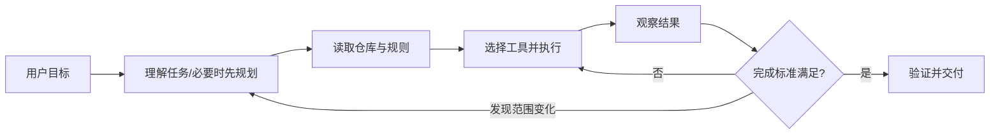
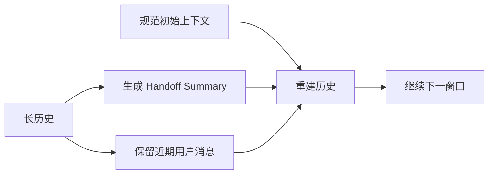

# Codex 模块地图

> 核验日期：2026-09-02。本文只记录 OpenAI 官方文档和 `openai/codex` 公开仓库能够确认的行为；产品服务端未公开部分不作猜测。

## 一、定位与主链路

Codex 是面向软件工程任务的个人 Coding Agent。一次任务通常不是单次生成代码，而是围绕目标持续读取仓库、运行命令、修改文件和验证结果。

这个流程可以用“Plan 管全局、动态工具循环处理局部、测试作为环境反馈”来理解。后两者是概念映射，不是 OpenAI 对默认模式的正式命名。

## 二、当前模块地图

| 模块 | 公开机制 | 学习价值 | 证据等级 |
|---|---|---|---|
| Planning | Plan mode 在实现前收集上下文、澄清问题和形成方案 | 复杂改动先稳定目标与范围 | 官方文档确认 |
| 长任务 | Goal mode 维护明确目标、约束和完成条件 | 让多步工作围绕终态推进 | 官方文档确认 |
| Agent Loop | 读取文件、执行命令、观察结果并继续行动 | 工具反馈驱动局部决策 | 公开源码确认；ReAct 为概念映射 |
| Context 压缩 | 自动/手动压缩，使用交接摘要替换旧轨迹并重建上下文 | 长任务可以跨窗口继续 | 公开源码确认 |
| 子 Agent | 独立任务在独立上下文中执行，主线程接收摘要 | 隔离日志噪声并并行研究 | 官方文档确认 |
| 项目规则 | `AGENTS.md` 向 Agent 提供仓库约束与验证方式 | 稳定规则不依赖临时 Prompt | 官方文档确认 |
| 权限 | 沙箱、审批和规则控制外部动作 | 模型决策不能等同于执行权限 | 官方文档确认，待深挖 |

## 三、Plan 与动态执行如何组合

Codex 官方建议复杂、模糊或难以描述的任务先使用 Plan mode。Plan 的价值不是多写一份步骤列表，而是：

- 在写代码前发现需求歧义；
- 建立模块依赖和验证标准；
- 让用户在产生修改前审阅方向。

进入实现后，真实测试结果可能推翻初始假设，因此仍需要动态选择工具和调整方案。简单、小范围任务可以直接执行；跨模块改造和高风险修改更适合先 Plan。

> **核心小结：** Codex 的 Plan 用来降低“改错方向”的风险，动态执行用来处理代码和测试暴露出的局部不确定性。

## 四、Context 压缩

`openai/codex` 公开仓库提交 `02f47d3` 能确认：

- 存在自动压缩 Token 阈值，也支持用户请求的手动压缩；
- 本地压缩 Prompt 要求生成另一个模型可接手的 Handoff Summary；
- 摘要包含进展、决策、约束、剩余工作和继续执行需要的引用；
- 重建历史时按预算保留较新的用户消息；
- 规范初始上下文会在压缩后重新插入；
- 多次压缩会有准确性损失，源码建议保持任务聚焦，必要时新开线程。

Responses API 的服务端压缩内部算法未全部公开，不能从客户端代码推断摘要模型或服务端保留策略。

> **核心小结：** Codex 压缩的重点是“能继续工作”，因此同时保留稳定规则、用户约束、任务状态和下一步，而不只是缩短聊天记录。

## 五、待深入研究

- Tool Schema 如何选择、延迟加载和裁剪？
- Plan mode 与 Goal mode 的状态在协议层如何表达？
- 子 Agent 的上下文继承、并发和写冲突如何控制？
- Hooks、Rules、沙箱和审批如何构成完整权限链？
- Context compaction 本地路径与 Responses API 路径如何选择？
- 长任务的会话持久化、恢复和 Fork 有哪些状态语义？

## 六、来源

- [Codex 官方手册](https://learn.chatgpt.com/docs/codex-manual.md)
- [Long-running work](https://developers.openai.com/codex/long-running-work)
- [AGENTS.md](https://developers.openai.com/codex/agent-configuration/agents-md)
- [Subagents](https://developers.openai.com/codex/agent-configuration/subagents)
- [Agent approvals & security](https://developers.openai.com/codex/agent-approvals-security)
- [openai/codex](https://github.com/openai/codex)，核验提交：`02f47d3fb36414d99cdf34fff553826d587d1405`
- 关键源码：`codex-rs/core/src/compact.rs`、`codex-rs/prompts/templates/compact/prompt.md`

