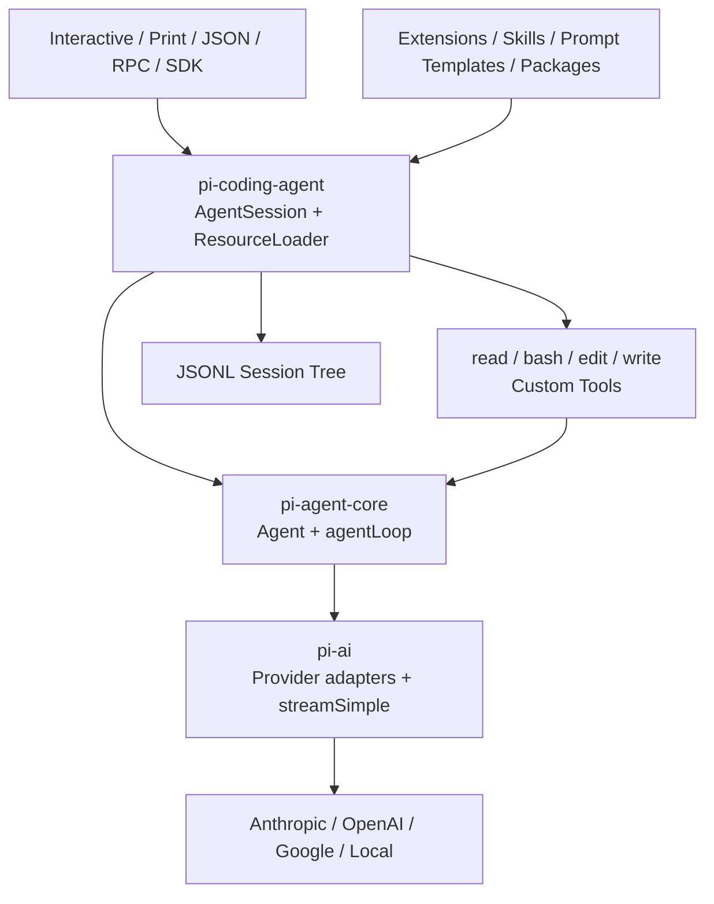
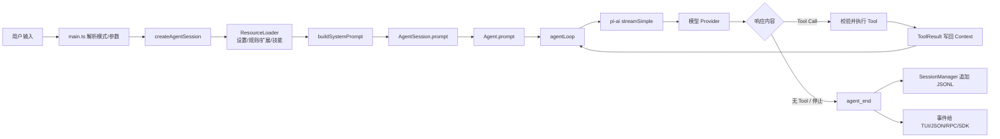
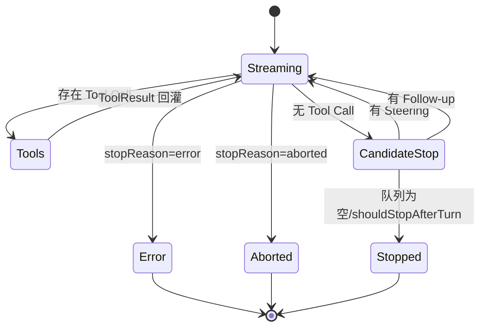
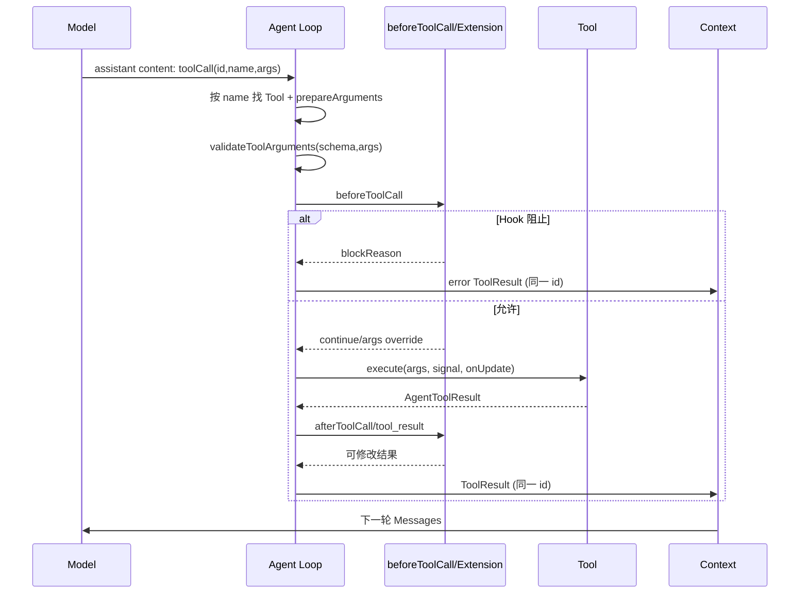
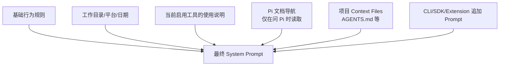
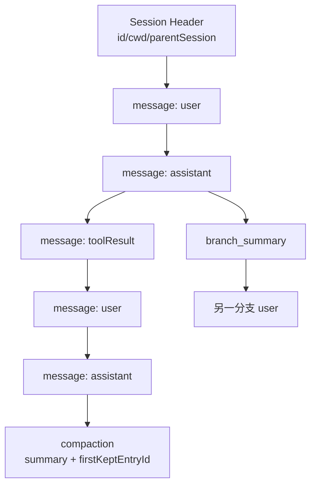
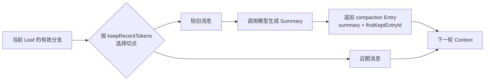
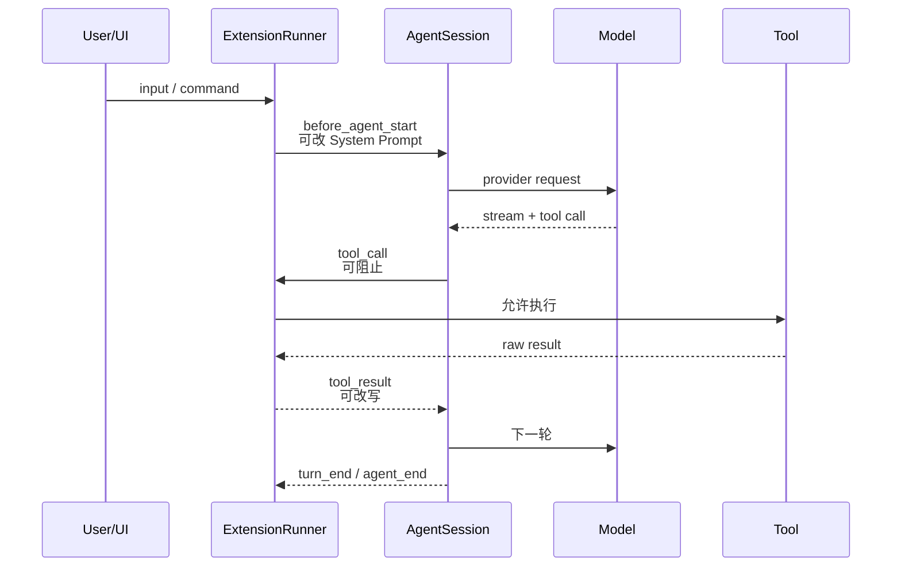
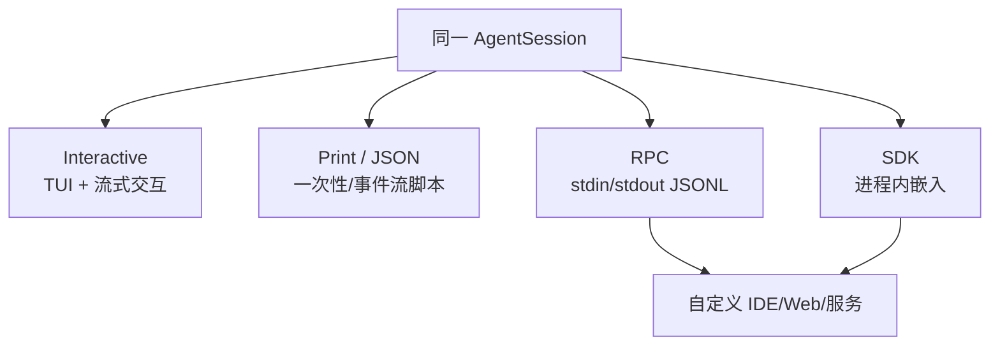
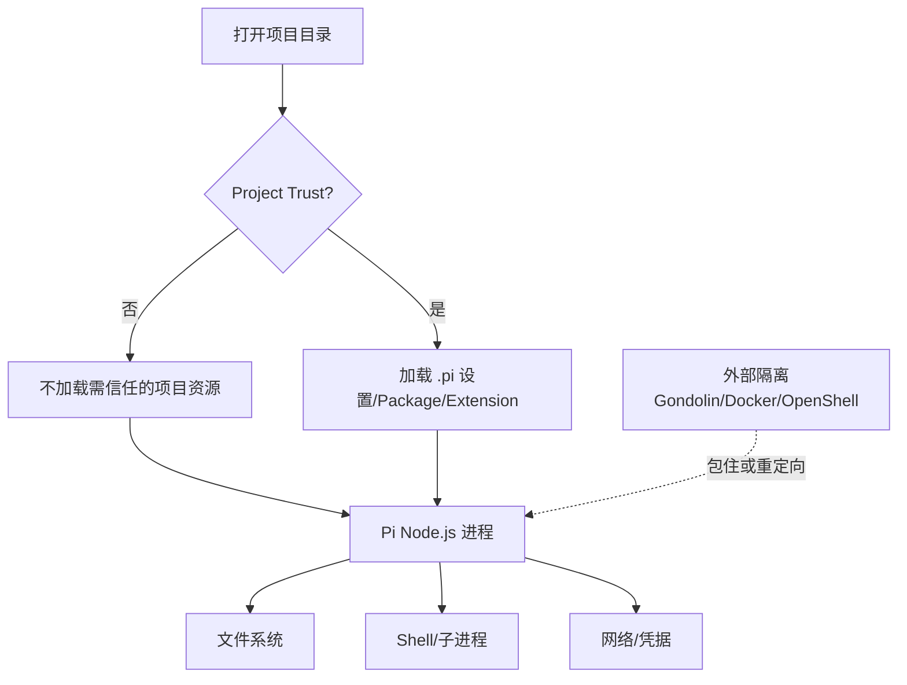

# Pi Agent 源码级实现拆解

> 核验日期：2026-09-03<br>
> 当前版本：`@earendil-works/pi-coding-agent@0.84.4`<br>
> 官方仓库：`earendil-works/pi`（旧入口 `badlogic/pi-mono` 会重定向）<br>
> 核验 Commit：`3316c4e35b1eb505e791610d3a97d6b4c1c48309`<br>
> 证据边界：只把官方文档、上述 Commit 的官方公开源码和本轮可复现实验写成确定事实；教学类比、工程建议和实验性 Chord 路径单独标记。

## 一、先说结论：Pi 到底是什么

Pi 不是“一个 Prompt 加四个工具”的简单 CLI，也不是把所有 Coding Agent 功能都内置好的大产品。当前 Pi 更准确的定位是一个**可组合的 Agent Harness Monorepo**：

| 层次 | 当前包 | 主要职责 | 证据等级 |
|---|---|---|---|
| Provider 适配 | `pi-ai` | 统一不同模型的消息、流式事件、Thinking、Tool Call 和 Usage | 官方公开源码确认 |
| Agent Runtime | `pi-agent-core` | 双循环、Tool 执行、Steering/Follow-up、状态与事件 | 官方公开源码确认 |
| Coding Harness | `pi-coding-agent` | System Prompt、工具、Session、Compaction、Extension、TUI/RPC/SDK | 官方公开源码确认 |
| 界面 | `pi-tui` | 终端增量渲染、输入和组件 | 官方公开源码确认 |
| 实验性组合层 | `chord` + protocol/client/server | Client/Server、Facet Plugin、复制状态和 RPC | 官方公开源码确认；主要位于 `experimental/` |

它最鲜明的选择不是“功能最多”，而是：**核心保持小，把不同团队有争议的能力交给 Extension、Package 或外部环境。** 官方 README 明确写出：默认没有内建 MCP、Subagent、Plan Mode、To-Do、Permission Popup 和 Background Bash。

> **核心小结：** Pi 的产品哲学是“提供可组合的循环、状态和扩展点”，而不是在核心里规定唯一的 Agent 工作方式。

## 二、五层模块地图



控制权分得很清楚：`pi-ai` 解决“不同 Provider 怎么统一说话”；`pi-agent-core` 解决“模型和工具如何反复交互”；`pi-coding-agent` 解决“怎样成为可用的 Coding Agent 产品”；Extension 解决“我想要不同能力和工作流”；外部容器解决“进程到底能访问什么”。

> **核心小结：** Pi 把模型协议、Agent Loop、Coding Harness 和 UI 分开，业务定制通常发生在 Harness/Extension，而不是修改循环核心。

## 三、一条真实请求如何跑完

### 3.1 端到端主链路



对应源码阅读入口：

1. `packages/coding-agent/src/main.ts`：CLI 解析和模式选择；
2. `packages/coding-agent/src/core/sdk.ts#createAgentSession`：装配模型、工具、资源和 Session；
3. `packages/coding-agent/src/core/agent-session.ts#AgentSession.prompt`：产品层编排；
4. `packages/agent/src/agent.ts#Agent.prompt`：启动运行；
5. `packages/agent/src/agent-loop.ts#runLoop`：真正的模型—工具循环；
6. `packages/ai/src/*`：Provider 事件转换；
7. `packages/coding-agent/src/core/session-manager.ts`：会话树落盘。

### 3.2 为什么不是一次模型调用

下面是源码结构的等价缩写，省略了取消、扩展 Hook、压缩和错误分支：

```ts
// 等价伪代码，对应 packages/agent/src/agent-loop.ts#runLoop
while (true) {                         // outer: follow-up
  while (hasToolCalls || steering) {   // inner: tool + steering
    context = await prepareNextTurn(context);
    context.messages.push(...drainSteering());

    const assistant = await streamAssistantResponse(context);
    if (assistant.error || assistant.aborted) return;

    const toolResults = await executeToolCalls(assistant);
    context.messages.push(assistant, ...toolResults);
    hasToolCalls = toolResults.length > 0;
  }

  const followUps = await drainFollowUps();
  if (followUps.length === 0) return;
  steering = followUps;
}
```

双循环区分两种用户消息：

- **Steering**：Agent 正在执行时，用户补一句“先别改配置”“也检查 Windows”；它在下一次模型请求前注入当前运行。
- **Follow-up**：Agent 本来已经要停，队列里又有新任务；Outer Loop 再开启一个 Turn，而不是让调用方重建 Agent。

> **核心小结：** Pi 的动态性不是来自一个庞大 Planner，而是来自“模型响应—工具反馈—消息队列”的双循环。

## 四、Agent Core：状态、事件与停止条件

### 4.1 核心对象

`Agent` 持有可变的 `AgentState`，包括 System Prompt、Model、Thinking Level、Tools、Messages、流式状态和错误状态。`AgentLoopConfig` 把运行策略作为回调注入：

- `transformContext` / `convertToLlm`：把 AgentMessage 转成 Provider Context；
- `getSteeringMessages` / `getFollowUpMessages`：从队列取消息；
- `prepareNextTurn`：在下一轮前更换 Context、Model、Thinking 或 Tools；
- `beforeToolCall` / `afterToolCall`：执行前拦截、执行后改写；
- `shouldStopAfterTurn`：由 Harness 增加确定性停止条件；
- `toolExecutionMode`：控制同一响应内 Tool Call 串行或并行。

事件协议如下：

```text
agent_start
  turn_start
    message_start
    message_update(text/thinking/toolcall delta...)
    message_end
    tool_execution_start/update/end
  turn_end
agent_end
```

`Agent.subscribe()` 的监听器接收事件；官方类型注释明确说明 `agent_end` 是一次运行的最后事件，订阅回调在分发时会被等待。因此日志、持久化或 UI 不必通过轮询猜测 Agent 是否结束。

### 4.2 停止与失败



若模型响应因输出 Token 上限被截断且包含 Tool Call，Pi 不会拿可能残缺的参数执行，而是生成错误 ToolResult，要求模型用完整参数重发。

> **核心小结：** JSON 能解析不代表参数完整，流式响应的终止原因也是执行前条件。

## 五、Tool 系统：小默认集、严格配对、可并行

### 5.1 默认工具

当前 `createAgentSession` 默认启用四个内置工具：

| Tool | 能力 | 关键边界 |
|---|---|---|
| `read` | 读取文本/图片，支持 offset/limit | 大输出截断并提示续读 |
| `bash` | 执行 Shell 命令 | 继承 Pi 进程权限，可超时/取消 |
| `edit` | 精确替换一个或多个片段 | 匹配原始文件，拒绝重叠或歧义 |
| `write` | 创建或完整覆写文件 | 与 Edit 共用文件变更队列 |

`grep/find/ls` 有实现且可通过设置或 SDK 选择，但默认 System Prompt 指导模型用 `bash` 执行 `rg/find/ls`。因此“源码中存在”不能等同于“默认暴露给模型”。

### 5.2 Tool Call 的真实时序



多个 Tool Call 默认可以并行执行，但“准备”仍按源码顺序进行；完成事件按完成顺序发出，最终 ToolResult Message 再按 Assistant 源顺序写回，保证 Provider 对调用/结果配对的确定性。若其中任一 Tool 声明 `sequential`，这一批会走串行路径。

文件编辑还有单独的 Mutation Queue：并发 Edit/Write 会按规范路径串行，连符号链接指向同一文件的情况也有测试覆盖。这解决的是文件级竞态，不等于整个 Agent 有事务。

> **核心小结：** Pi 将“执行并发”和“消息确定顺序”分开处理，并对文件副作用额外串行化。

## 六、Context：哪些内容真正进入模型

### 6.1 初始 System Prompt 的组成

`buildSystemPrompt` 不是读取整个仓库，而是把几类稳定信息组合起来：



ResourceLoader 负责发现全局和项目资源：Context Files、Prompt Templates、Skills、Extensions、Themes 和 Packages。交互界面的启动 Header 也会显示加载了哪些 AGENTS.md、模板、Skill 和 Extension，便于用户知道当前 Agent 受什么规则影响。

这里要区分三种东西：

- **Context File**：启动时进入 System Prompt 的稳定项目规则；
- **Skill**：按名称/描述发现，需要时由模型读取其完整 SKILL.md；
- **Prompt Template**：用户显式触发或复用的任务模板。

> **核心小结：** Pi 的 Context 不是把所有资源一次塞给模型，而是稳定规则预载、专题材料按需读取。

### 6.2 每一轮 Provider Context

`AgentSession` 从当前 Session Tree 的 Leaf 重建有效分支，再转换成 Provider 能接受的 `Context`：

```text
systemPrompt
messages on active branch:
  user
  assistant(text/thinking/toolCall)
  toolResult(toolCallId, content, isError)
tools:
  active JSON schemas
```

Provider 适配层再解决不同 API 的差异，例如 Tool Call ID 规则、Thinking 字段、Cache 参数、Usage 和 Finish Reason。Agent Core 始终使用统一 Message/Event，不把 Anthropic/OpenAI/Google 的协议分支散落到循环里。

### 6.3 PrepareNextTurn 是关键接缝

每次新的 Provider 请求前，`prepareNextTurn` 都有机会更新 Context、Model、Thinking Level 和 Tools。这让以下变化能在同一次 Agent Run 的下一轮立即生效：自动 Compaction 后替换 Context、Extension 调用 `setActiveTools` 改变工具集、用户切换模型或 Thinking、Steering 消息注入。

本轮定向测试 `6162-extension-active-tools-next-turn` 验证了工具集能在同一次运行的下一次 Provider Request 生效，并且不会丢失 `before_agent_start` 对 System Prompt 的覆盖。

> **核心小结：** Pi 把“下一轮请求前重算运行快照”设为正式扩展点，因此 Context 和工具不是一次启动后永久冻结。

## 七、Session：JSONL 不是聊天数组，而是一棵树

Session 文件第一行是 Header，后续每行一个 Entry。Entry 有 `id` 和 `parentId`，因此同一文件可保存多条分支，而不必复制全部历史。



| Entry | 是否进入 LLM Context | 作用 |
|---|---:|---|
| `message` | 是 | User/Assistant/ToolResult 消息 |
| `compaction` | 是 | 旧历史摘要和保留边界 |
| `branch_summary` | 是 | 切换分支时的摘要 |
| `custom_message` | 可配置 | Extension 注入可见消息 |
| `custom` | 否 | Extension 持久化私有状态 |
| `model_change` / `thinking_level_change` | 影响后续状态 | 重建当时配置 |
| `label` | 否 | 书签或用户标签 |

`CustomEntry` 与 `CustomMessageEntry` 分离：扩展内部状态可以持久化，但不必污染模型 Context；只有真正需要模型看见的内容才用 Custom Message。

- **Branch**：在同一个 JSONL Session Tree 中改变当前 Leaf，保留所有分支。
- **Fork**：创建新 Session 文件，Header 的 `parentSession` 指向来源，并复制来源的非 Header Entries。
- **Resume**：加载同一个 Session，选择已有 Leaf 继续。

> **核心小结：** Pi 的会话持久化是可分叉的事件树，不是“最后 N 条聊天记录”。

## 八、Compaction：摘要节点，不破坏原始历史

官方默认启用 Auto Compaction：`reserveTokens = 16384`，`keepRecentTokens = 20000`；也可以用 `/compact` 手动触发。触发条件可理解为 Context 接近 `contextWindow - reserveTokens`，或 Provider 已返回 Context Overflow。



Compaction 不删除 JSONL 原始 Entry；它追加一个 `compaction` 节点。重建 Context 时，用 Summary 表示旧部分，再从 `firstKeptEntryId` 加入近期原文。Extension 可通过 `session_before_compact` 取消压缩、返回自定义 Summary，并观察成功、失败或中断事件。

本轮 `agent-session-compaction.test.ts` 验证了 Extension Summary 可用于手动压缩；`7150-rpc-prompt-during-compaction` 验证了手动压缩期间 RPC Prompt 会被拒绝，而不是破坏消息顺序。

> **核心小结：** Pi 的 Compaction 是“在 Session 树上新增摘要边界”，而不是覆写或丢弃 Transcript。

## 九、Extension：Pi 自扩展的核心

### 9.1 能扩展什么

Extension 是运行在同一 Node.js 进程中的 TypeScript/JavaScript 模块，可以注册 Tool/Command/Shortcut/Flag，拦截 Tool Call，修改 Tool Result/System Prompt/Provider Request，增加 TUI 组件，参与 Session/Branch/Compaction 事件，持久化自定义 Entry，或暴露自定义 Provider/OAuth。

一个最小 Tool Extension：

```ts
import { Type } from "typebox";

export default function (pi) {
  pi.registerTool({
    name: "greet",
    label: "Greet",
    description: "Greet someone by name",
    parameters: Type.Object({
      name: Type.String({ description: "Name to greet" }),
    }),
    async execute(_id, { name }) {
      return {
        content: [{ type: "text", text: "Hello, " + name + "!" }],
        details: {},
      };
    },
  });
}
```

### 9.2 事件生命周期



这就是 Pi 所说的 self-extensible：Agent 可创建 Extension 文件、重载资源并使用新能力；但 Extension 本质是进程内代码，不是经过 Capability Sandbox 的安全插件。

### 9.3 内建能力少，扩展选择多

官方明确不内建 MCP 和 Subagent：MCP 用 CLI + README/Skill 或 Extension；Subagent 可由 Extension 注册 Tool，内部 Spawn 另一个 Pi/SDK Session，官方示例目录有 `subagent/`；Plan Mode/To-Do/Background Bash 也作为 Package 或 Extension 选择性加入。

因此不能说“Pi 不支持这些”，更准确的是“Pi 默认不规定这些，生态可以实现多个版本”。代价是不同团队的语义、权限和互操作性可能不一致。

> **核心小结：** Pi 的扩展能力很强，但扩展自由度越高，团队越需要自己治理信任、版本、冲突和评测。

## 十、四种运行模式与 SDK



RPC 是跨进程控制协议：调用方写入一行 Command JSON，读取 Response 与 Agent Event JSONL。例如：

```json
{"type":"prompt","message":"Run tests and explain the failure"}
{"type":"abort"}
```

模型流式 Text Delta、Tool Execution 和 Agent End 都作为事件输出。SDK 则直接返回 AgentSession，更适合在同一 Node 进程中注入自定义 ResourceLoader、SessionManager、Tools 和 Extension。

Chord/Protocol/Client/Server 在当前仓库提供更完整的实验性 Client/Server 和 Facet Plugin 组合，但主要入口仍位于 `packages/coding-agent/src/experimental/`。因此本文不把它描述成默认 CLI 主链路。

> **核心小结：** Pi 不是把 TUI 写死在 Runtime 上；同一 AgentSession 可以通过终端、JSONL、RPC 或 SDK 进入别的产品。

## 十一、安全：Project Trust 不等于 Permission Sandbox

这是理解 Pi 最容易出错的地方。

### 11.1 两层完全不同的控制



**Project Trust** 只回答：“是否允许这个目录的 `.pi` 配置、Package 和 Extension 被加载/安装/执行？”它避免打开陌生仓库就自动执行项目扩展。

它不回答：

- Bash 命令能不能运行；
- 哪个路径可读写；
- 网络和凭据能否访问；
- 每次危险操作是否弹窗。

官方根 README 和 Security 文档明确说明：Pi 默认没有内建文件、进程、网络或凭据 Permission System，继承启动用户与进程的权限。

### 11.2 怎样获得隔离

官方给出三种外部方案：

| 方案 | Pi 在哪里 | 凭据在哪里 | 特点 |
|---|---|---|---|
| Gondolin Extension | Host | Host | 将内置工具和 `!` 命令路由进本地 Linux Micro-VM |
| Docker | Container | 通常 Container/挂载 | 简单、边界直观 |
| OpenShell | Policy Sandbox | 按策略 | 更细策略控制 |

Extension 也可以拦截 `tool_call` 实现团队审批，但那是自定义策略，不是 Pi Core 的统一安全保证。

> **核心小结：** Pi 的默认信任模型是“信任运行进程的用户”，安全隔离必须由容器、VM 或自定义 Extension 额外提供。

## 十二、完整运行示例：修复一个失败测试

假设用户输入：

> 运行 `npm test`，修复 Windows 下失败的路径断言，并只改测试。

### 12.1 Context 初始化

System Prompt 会包含当前工作目录、已启用 Tool、平台提示、加载到的 AGENTS.md，以及“只改测试”的用户约束。SessionManager 追加 User Message Entry。

### 12.2 第一轮模型响应

模型可能同时发出两个只读 Tool Call：读取测试文件和运行目标测试。若都允许并行，Agent Loop 先依次准备/校验，再并发执行。

```json
{
  "assistant": [
    {"type":"toolCall","id":"c1","name":"read","arguments":{"path":"test/path.test.ts"}},
    {"type":"toolCall","id":"c2","name":"bash","arguments":{"command":"npm test -- path.test.ts"}}
  ]
}
```

结果按 `c1/c2` 配对写回 Context：

```text
assistant(toolCall c1, toolCall c2)
toolResult(c1, file content, isError=false)
toolResult(c2, assertion diff, isError=true)
```

### 12.3 Steering

测试运行期间用户又输入：“不要把 Windows 路径全转成 POSIX，只规范比较值。”这条消息进入 Steering Queue，在下一次 Provider Request 前加入 Context；模型不必等整个 Agent 结束。

### 12.4 第二轮修改

模型调用 `edit`。Tool 的 TypeBox Schema 先验证参数；Edit 检查 oldText 唯一、多个编辑不重叠，并通过文件变更队列串行化写入。若 Extension 注册了 `tool_call` Handler，还能在这里阻止修改非测试文件。

### 12.5 第三轮验证与结束

模型调用 Bash 重跑目标测试，ToolResult 成功后返回总结。没有新 Tool Call、Steering 或 Follow-up，Agent 发出 `agent_end`。Session Tree 此时至少包含：

```text
user
assistant(toolCalls)
toolResult(read)
toolResult(test failure)
user(steering)
assistant(edit toolCall)
toolResult(edit)
assistant(test toolCall)
toolResult(test success)
assistant(final text)
```

如果 Context 接近窗口上限，`prepareNextTurn` 会先追加 Compaction Entry，再把“旧摘要 + 最近原文”交给模型。

> **核心小结：** 一次 Coding Agent 任务是消息、工具和状态的事件链；最终文本只是这条链的最后一个节点。

## 十三、失败与边界示例

| 场景 | Pi 当前行为 | 设计意义 |
|---|---|---|
| 模型输出被 Token 上限截断且含 Tool Call | 生成错误 ToolResult，不执行残缺参数 | 防止半个命令被运行 |
| Tool 参数不满足 Schema | 返回验证错误 | 错误回到模型，可下一轮修复 |
| 手动 Compaction 正在执行时 RPC 又发 Prompt | 拒绝新 Prompt | 保持 Context/Session 顺序 |
| 多个文件写操作并发 | File Mutation Queue 串行化 | 降低覆盖和竞争 |
| 用户 Abort | AbortSignal 传播，最终 stopReason=aborted | UI 与 Tool 可协同取消 |
| Extension 未受信任 | Project Trust 阻止项目资源执行 | 防止打开仓库即执行代码 |
| Bash 试图访问敏感路径 | 默认按当前用户权限执行 | 必须使用外部沙箱或自定义策略 |

## 十四、Pi 为什么有意“不内置”很多能力

官方 README 的观点很直接：MCP、Subagent、Plan Mode、Permission Popup 等都有多种合理实现，核心不替用户做唯一选择。可以把这种风格称为“可编程 Harness”，但这是概念映射，不是官方架构名。

| 维度 | Pi 默认 | 好处 | 代价 |
|---|---|---|---|
| 工具 | 4 个核心工具 | Prompt 小、机制容易理解 | 高级能力需扩展 |
| Planning | 无固定 Plan Mode | 不强迫所有任务先规划 | 团队需自行约定工作流 |
| Subagent | 无内建语义 | 可按任务设计隔离/并发 | 生态实现不统一 |
| MCP | 无内建 Client | 避免大工具面和协议复杂度 | 接入标准 Server 需扩展 |
| Permission | 无弹窗/策略核心 | 非交互和自动化简单 | 默认风险高，需容器 |
| Session | JSONL Tree | 易审计、Branch/Fork 自然 | 长期多进程需更强 Backend |
| Extension | 进程内代码 | 能改几乎所有层 | 信任和兼容责任更重 |

> **核心小结：** Pi 把“机制”放进核心，把“策略”留给用户；这很灵活，但也把更多工程治理责任交给使用者。

## 十五、与 Codex、Claude Code 的差异

以下比较只针对公开可确认的产品机制，不比较模型质量：

| 维度 | Pi | Codex | Claude Code |
|---|---|---|---|
| 核心取向 | 小核心 + 强 Extension | 产品化 Harness + 沙箱/审批/任务协议 | 产品化 CLI + 权限/Hooks/子 Agent |
| 默认 Tool | read/bash/edit/write | 内建工具 + MCP/Skill 等 | 内建工具 + MCP/Skill 等 |
| Planning | 不内建固定 Plan Mode | 官方 Plan Mode | 官方 Plan/探索工作流 |
| Subagent | 不内建，Extension/外部进程实现 | 官方支持 | 官方支持 |
| Permission | 默认继承用户权限 | 沙箱与审批 | Permission Mode/Hooks |
| Session | 本地 JSONL 树、Branch/Fork/Compaction | Thread/Turn/Item 等 | Transcript/Resume/Fork 等 |
| 扩展 | 进程内 Extension 可改 UI/Tool/Provider/事件 | Skill/MCP/配置/工具 | Skill/MCP/Hooks/Subagent |

Pi 特别适合：想读懂并控制完整 Harness、愿意自己组合安全与工作流、需要轻量 SDK/RPC 的团队。若组织要求统一审批、托管执行、开箱即用的多 Agent 和企业策略，产品化更强的系统可能更省集成成本。

## 十六、Chord 与新 Harness：当前应该怎么理解

当前 Monorepo 已包含 Chord、Protocol、Client、Server 和新的 Harness Session 子模块；`pi-agent-core` 与 `pi-coding-agent` 也依赖 Chord。但在本 Commit 中，Coding Agent 里直接使用 Chord Client/Facet/Plugin 的大量路径位于 `src/experimental/`。

因此可以确认：

- Pi 正在发展 Client/Server、复制状态和 Facet Plugin 组合架构；
- Chord 已是官方仓库和依赖的一部分；
- 默认 Coding Agent 的经典 `AgentSession -> Agent -> agentLoop` 主链仍然存在。

不能确认或不应夸大：

- 所有普通 `pi` 请求都已经由 Chord 分布式运行时驱动；
- 实验性 Client/Server 已替代默认本地 Session；
- Chord 自动带来 Subagent 或安全沙箱。

> **核心小结：** Chord 是值得继续跟踪的新架构层，但当前分析必须把实验路径与默认主链分开。

## 十七、验证结果

### 17.1 可复现实验确认

研究副本固定在 Commit `3316c4e35b1eb505e791610d3a97d6b4c1c48309`，执行结果：

- `npm run hydrate:model-data`：成功，生成并校验 Provider Model Data；
- `npm run build:offline`：成功，Chord、TUI、Telemetry、AI、Agent、Protocol、Client、Server、Coding Agent 全部构建；
- Coding Agent 定向测试：38 个中 36 个通过；Compaction、Extension Tool、动态 Tool 集与 RPC/Compaction 互斥用例通过；
- Agent Core 全量测试：绝大多数通过，但存在 Windows/WSL 临时路径断言失败。

### 17.2 没有全绿的两类 Windows 差异

1. `NodeExecutionEnv` 测试将 WSL 风格 `/tmp/...` 与原生 Windows 临时路径比较；
2. `sdk-session-manager.test.ts` 有2个路径字符串/Session Path 预期在 Windows 下不一致。

这些失败说明该 Commit 的跨平台路径测试仍有边界；它们不推翻 Agent Loop、Compaction 和 Extension 的源码结论，也不能被忽略成“全部测试通过”。

## 十八、源码阅读路线

建议按控制流阅读，不要从目录树随机点开：

1. `packages/coding-agent/README.md`：产品有意包含/不包含什么；
2. `packages/coding-agent/src/core/sdk.ts`：完整 Session 如何组装；
3. `packages/agent/src/agent.ts`：状态与调用入口；
4. `packages/agent/src/agent-loop.ts`：双循环、Tool 并行、停止与错误；
5. `packages/agent/src/types.ts`：事件和 Hook 契约；
6. `packages/coding-agent/src/core/agent-session.ts`：Extension、队列、Compaction 与产品状态；
7. `packages/coding-agent/src/core/session-manager.ts`：JSONL Tree、Branch/Fork/Resume；
8. `packages/coding-agent/src/core/system-prompt.ts` 与 `resource-loader.ts`：Context 与资源发现；
9. `packages/coding-agent/src/core/extensions/`：Extension API 与 Runner；
10. `packages/coding-agent/src/core/tools/`：Tool 的真实文件/命令语义；
11. `packages/ai/src/api/`：选择一个 Provider 看协议转换；
12. `packages/coding-agent/src/modes/rpc/`：外部应用如何控制同一 Runtime；
13. `packages/coding-agent/src/experimental/`：最后再看 Chord Client/Server/Plugin。

## 十九、可迁移的工程经验

- 把 Provider 协议差异隔离在模型适配层，Agent Loop 只认统一事件。
- Tool Call 并行执行时，执行完成顺序和回灌顺序应分开设计。
- 流式输出的 Finish Reason 必须参与 Tool 安全判断。
- 下一轮前的 `prepareNextTurn` 是压缩、换模型、换工具和 Steering 的好接缝。
- Session 用 Append-only Tree 表达 Branch/Fork，比反复复制聊天数组更可审计。
- Compaction 应追加摘要边界并保留原始历史，不直接覆盖 Transcript。
- 扩展私有状态和模型可见消息应使用不同 Entry 类型。
- Project Trust、Tool Approval 与 OS Sandbox 是三种不同控制，不能混称“权限”。
- “核心不内置”能提高组合自由，但必须补充组织级安全、版本和 Eval 治理。

## 二十、待核验

- Chord 新 Harness 何时成为默认 Coding Agent 主链；
- 官方 Server/SQLite Backend 与经典 JSONL Session 的迁移和一致性语义；
- Extension/Package 生态的签名、供应链和组织级 Allowlist 方案；
- 大规模 Session Tree 下的加载、索引和 Compaction 性能；
- 官方 Subagent Extension 在 Context、权限和写冲突上的推荐标准是否会稳定下来。

## 二十一、来源

- [Pi 官方仓库](https://github.com/earendil-works/pi)
- [Pi 官方文档](https://pi.dev/docs/latest)
- [Pi Coding Agent README](https://github.com/earendil-works/pi/tree/main/packages/coding-agent)
- [Agent Core 源码](https://github.com/earendil-works/pi/tree/main/packages/agent/src)
- [Coding Agent 源码](https://github.com/earendil-works/pi/tree/main/packages/coding-agent/src)
- [Extension 文档](https://github.com/earendil-works/pi/blob/main/packages/coding-agent/docs/extensions.md)
- [Session Format](https://github.com/earendil-works/pi/blob/main/packages/coding-agent/docs/session-format.md)
- [Compaction](https://github.com/earendil-works/pi/blob/main/packages/coding-agent/docs/compaction.md)
- [Security](https://github.com/earendil-works/pi/blob/main/packages/coding-agent/docs/security.md)
- [Containerization](https://github.com/earendil-works/pi/blob/main/packages/coding-agent/docs/containerization.md)
- [RPC](https://github.com/earendil-works/pi/blob/main/packages/coding-agent/docs/rpc.md)
