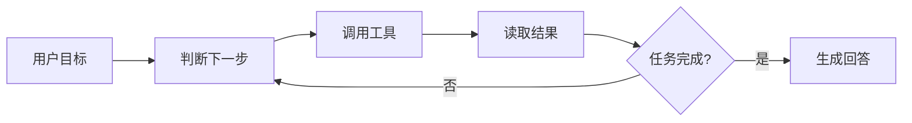
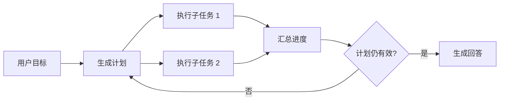

# ReAct 与 Plan 模式有什么区别？

## 原题原文

> ReAct 和 Plan 模式有什么区别？

## 答案

### 面试直答

ReAct 和 Plan 的核心区别是决策时机：**ReAct 每获得一次工具结果就决定下一步，Plan 则先生成整体任务结构，再按计划执行并在必要时重规划。** 前者灵活，后者全局性更强；生产系统通常会组合使用。

### 一、ReAct 如何工作

ReAct 按“思考 → 行动 → 观察”循环：

每一轮只根据当前目标、已有轨迹和最新观察选择动作，因此能够处理：

- 工具结果不确定、需要边查边决定的任务；
- 中途出现错误，需要换工具或修改参数的任务；
- 无法在开始时确定完整步骤的探索任务。

代价是调用轮次不稳定，容易出现重复调用、路径震荡或迟迟不停止。

> **核心小结：** ReAct 是局部动态决策，强项是适应变化，弱项是路径和成本不容易预测。

### 二、Plan 模式如何工作

Plan 模式先把目标拆成有依赖关系的子任务，再交给执行器完成：

它适合长任务、多信息源或可以并行的子任务。全局计划让依赖关系、进度和完成条件更清楚，但初始计划可能建立在错误假设上，因此不能把计划当成不可修改的脚本。

> **核心小结：** Plan 提供全局任务结构，但必须配合执行反馈、计划校验和重规划。

### 三、对比与选型

| 维度 | ReAct | Plan 模式 |
|---|---|---|
| 决策方式 | 每轮观察后决定下一步 | 先生成整体计划 |
| 灵活性 | 高 | 中高 |
| 全局性 | 较弱 | 强 |
| 调用次数 | 波动较大 | 相对可估算 |
| 并行能力 | 通常较弱 | 独立子任务可并行 |
| 适合场景 | 探索、排障、动态环境 | 长任务、多约束、多子目标 |

工程上常用混合方式：先用 Planner 拆任务，每个复杂子任务内部再运行有限步 ReAct；外层代码负责预算、权限、超时和停止条件。

> **核心小结：** 选型不是二选一，常见生产形态是“Plan 管全局，ReAct 解局部，代码控制边界”。

### 四、真实系统里怎么组合

#### 1. Codex 这类个人 Coding Agent

以“修复登录模块并补测试”为例，更合理的执行方式通常是：

1. **先 Plan**：读取仓库规则和关键入口，明确认证链路、改动范围和验收命令。
2. **局部动态执行**：运行测试后根据真实报错，决定继续读哪个文件、修改哪个函数。
3. **必要时重规划**：如果发现根因其实是数据库 Schema，而不是认证逻辑，就调整原计划。
4. **确定性收尾**：执行 lint、单测和 diff 检查。

OpenAI 官方建议复杂、模糊或难以一次描述清楚的任务先使用 Codex Plan mode，让 Codex 收集上下文、澄清问题并形成方案。进入实现阶段后，Codex 会根据文件读取、命令和测试结果继续选择动作，这可以用 ReAct 的思想理解，但这是**概念映射**，不代表官方把默认执行模式命名为 ReAct。

> **核心小结：** Coding Agent 通常是“Plan 管改动范围，动态工具循环处理局部不确定性”，而不是全程只用一种模式。

#### 2. 低延迟业务 Agent

假设用户问：“周末去杭州，两晚预算三千，给我酒店和景点建议。”开放式 ReAct 可能形成串行链路：

~~~text
查酒店 → 看结果 → 再决定查景点 → 看结果 → 再查距离 → 总结
~~~

每一步都需要等待工具结果，再做一次模型决策，长尾延迟会被不断叠加。低延迟业务更常使用：

~~~text
一次拆解酒店/景点/约束 → 酒店与景点并行调用 → 一次充分性判断 → 总结
~~~

Dynamic Planner 当前活跃链路就是 Planner 流式产生旅行子目标，Executor 并行调用旅行技能，Judge 判断必需信息是否充分，再进入 Summary 和 SSE 输出。它是受控业务 DAG，不是无限自由探索的 ReAct Loop。

但“有 Planner 就一定更快”也不准确：Planner 本身增加了一次模型调用。只有当子任务能稳定拆开并行、减少后续串行决策时，整体延迟才可能下降。对于非常固定的高频请求，可以直接由规则路由并行工具，甚至不需要 LLM Planner。

> **核心小结：** 低延迟场景要减少模型决策轮数；正常链路优先固定 Workflow 或一次规划加并行执行，只把有限步 ReAct 留给搜索失败、约束冲突等异常分支。

#### 3. 三种场景的选型

| 场景 | 推荐控制方式 | 原因 |
|---|---|---|
| 单文件小改动 | 直接执行或短 ReAct | 目标明确，先规划收益小 |
| 跨模块重构 | Plan + 局部动态执行 | 先控制范围，再根据测试反馈调整 |
| 高频低延迟业务 | Workflow 或一次 Plan + 并行工具 | 降低模型轮次和串行等待 |
| 开放式研究/排障 | 有预算的 ReAct | 路径依赖中间观察，难以预先确定 |

> **核心小结：** 任务越确定、延迟要求越高，控制权越应该前移到代码；任务越开放，才越需要模型动态决定下一步。

### 五、工程保护

- 为 ReAct 设置最大步数、Token 和工具调用预算。
- 检测连续重复的动作和状态，避免路径震荡。
- 为 Plan 记录子任务依赖、状态和完成条件。
- 只有执行结果使原计划失效时才重规划，避免频繁推翻计划。
- 重要动作由代码鉴权，不能让模型自行扩大权限。

> **核心小结：** 模型负责决策，系统必须负责预算、权限、状态和终止。

### 实现依据与延伸阅读

- [本题对应的主流 Agent 实现拆解](<../Agent实现拆解/README.md>)
- [Codex 模块地图](<../Agent实现拆解/Codex.md>)
- [Claude Code 模块地图](<../Agent实现拆解/Claude Code.md>)
- [OpenAI Codex：长任务与 Goal mode](https://developers.openai.com/codex/long-running-work)
- [OpenAI Codex 官方手册：复杂任务先使用 Plan mode](https://learn.chatgpt.com/docs/codex-manual.md)
- [Claude Code：Plan before editing](https://code.claude.com/docs/en/common-workflows#plan-before-editing)
- Dynamic Planner：本地 `AGENTS.md` 与 `agent/orchestrator.py` 当前活跃链路。

### 常见追问

- **Plan 模式是不是 Workflow？** 不是。Plan 通常由模型动态生成，Workflow 的节点和分支主要由代码预定义。
- **ReAct 为什么会震荡？** 模型看不到稳定进展、停止条件不清或失败结果没有结构化反馈时，容易在相似动作间反复切换。
- **业务 Agent 是否完全不能使用 ReAct？** 不是。可以在搜索无结果、工具失败或约束冲突时进入有限步 ReAct，但主链路应尽量短且可预测。

## 问题来源

- 公司：字节跳动
- 页面标题：字节面经-字节跳动AI Agent开发岗面经-01
- 面经小节：面经 01
- 岗位与面试时间：AI Agent 开发 ｜ 面试时间：2026 年 8 月 20 日
- 题目在小节内的位置：第 2 条
- 来源链接：https://www.nowcoder.com/discuss/922659050167226368
- 在线核验：2026-09-01 已在公开网页正文中逐条核验
- 证据级别：网页公开正文原文
