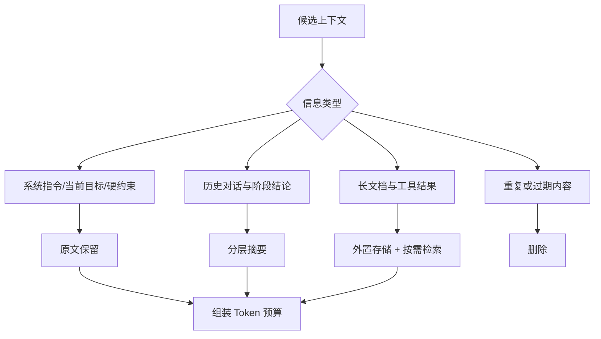

# 上下文超过模型限制时如何处理？

## 原题原文

> 上下文超过模型限制如何处理？

## 答案

### 面试直答

上下文超过模型限制时，不能简单截掉最前面的内容。我会先区分 **必须精确保留的信息、可以压缩的历史、可以外置检索的资料和已经失效的内容**，再通过裁剪、摘要、检索和结构化状态组合控制 Token。

### 一、先理解问题本质

模型的上下文窗口是有限预算。上下文过长会带来三个问题：

- 请求无法进入模型，直接超过最大 Token。
- 即使没有超限，长上下文也会增加延迟和成本。
- 无关信息过多会稀释关键证据，出现“上下文里有但模型没用到”。

因此目标不是把内容全部塞进去，而是让当前决策所需的信息始终处于模型可见范围。

> **核心小结：** 上下文管理追求的是有效信息密度，不是保留最多文字。

### 二、分层处理策略

#### 1. 必须原文保留

系统指令、当前用户问题、权限边界、关键参数和不可丢失的约束应放在稳定位置，不能依赖摘要。

#### 2. 可以压缩

较早的对话、已经完成的子任务和冗长工具输出，可以压缩成“结论、证据、未决事项、关键 ID”的结构化摘要。

#### 3. 可以外置

长文档、历史工具结果和跨会话资料放到数据库或向量库，需要时按当前问题检索相关片段。模型不需要每轮都看到全部原文。

#### 4. 应该删除

重复消息、无效尝试、过期计划、调试噪声和与当前目标无关的内容应直接移除。

> **核心小结：** 原文保留硬约束，摘要保留阶段结论，检索召回外部证据，删除清理噪声。

### 三、工程上的 Token 预算

可以把上下文预算显式分区：

- 固定区：System Prompt、工具说明、安全规则。
- 任务区：当前问题、计划、关键状态。
- 证据区：检索文档和工具结果。
- 输出预留区：为模型生成结果保留空间。

当预算不足时，按优先级缩减证据数量、压缩旧历史，再裁剪低价值内容；不能等到请求报错后才临时截断。

> **核心小结：** 上下文应在请求构建阶段按预算组装，而不是在最后一步粗暴截断。

### 四、摘要与检索的风险

- 摘要可能遗漏细节，因此要保留原始消息 ID，必要时可回查。
- 多次摘要会累积信息损失，最好从原始记录重新生成阶段摘要。
- 检索可能漏召回，应保留最近对话和当前任务状态作为稳定底座。
- Tool Schema 过多时，应先路由到相关工具集合，而不是压缩到难以理解。
- 对需要逐字引用、代码修改或精确数值的任务，关键内容必须使用原文。

> **核心小结：** 压缩是有损操作，必须保留可回溯的原始证据，并根据任务精度决定哪些内容不能压缩。

### 五、一个具体的压缩例子

假设 Coding Agent 已运行 40 轮，读取了 30 个文件并产生大量测试日志。压缩前保存完整工具轨迹；压缩后可以重建为：

~~~text
[稳定上下文]
仓库规则、权限、当前目录、验收命令

[结构化摘要]
目标：修复 token refresh 并补回归测试
决策：不修改公共 API；复用现有 RefreshTokenStore
已改：auth/refresh.ts、tests/refresh.test.ts
验证：单测 18/19 通过
剩余错误：expired token case 期望状态码不一致

[近期原文]
用户最后一次补充要求
最近一轮失败日志
当前正在处理的工具结果
~~~

下一轮模型仍然知道“为什么这样改、已经改了什么、还差什么”，但不用再次携带此前每次搜索、文件读取和重复测试输出。如果摘要中的错误信息不够精确，可以根据保存的日志或文件路径重新读取。

> **核心小结：** 好的压缩不是把一切写短，而是把执行轨迹转换成另一个 Agent 可以接着工作的状态快照。

### 六、Codex 的公开实现

以下结论来自 OpenAI 官方文档和 `openai/codex` 公开仓库 2026-09-02 的提交 `02f47d3`：

- Codex 配置存在自动压缩 Token 阈值，达到条件后可自动触发，也支持手动压缩。
- 本地压缩使用专门的 Checkpoint Prompt，要求保留当前进展、关键决策、用户约束、剩余步骤和继续工作所需的引用。
- 公开代码会收集用户消息，并在预算内优先保留较新的消息；旧的执行轨迹由摘要替代。
- 压缩后会重新插入当前会话的规范初始上下文，使稳定规则不完全依赖摘要记忆。
- 源码明确警告：长线程和多次压缩可能降低准确率，应在合适时开启新的、目标更聚焦的任务。
- OpenAI 官方建议将独立探索、测试或日志分析交给子 Agent，只让摘要返回主线程，减少 Context pollution。

可以把 Codex 的重建结果理解为：

~~~text
规范初始上下文 + 最近用户约束 + 任务交接摘要 + 当前窗口状态
~~~

Responses API 服务端压缩的完整内部算法并未全部公开，因此不能从客户端代码继续猜测摘要模型或服务端策略。

> **核心小结：** Codex 将压缩设计成可续接任务的 Checkpoint，并通过规则重注入、近期消息保留和子 Agent 隔离降低信息损失。

### 七、Claude Code 的公开实现

Anthropic 官方 Agent SDK 文档公开了更明确的可配置机制：

- 接近上下文上限时自动压缩旧历史，保留近期交互和关键决策。
- 支持 `/compact` 手动触发，并在流中发出 compact boundary 事件。
- 可以在 `CLAUDE.md` 中告诉压缩器必须保留什么，例如目标、验收标准、文件路径、测试结果、错误和决策原因。
- `PreCompact` Hook 可以在压缩前归档完整 Transcript。
- 压缩后会重新加载 System Prompt、`CLAUDE.md`、Memory 和 MCP 工具；已调用的 Skill 可以重新注入。
- 子 Agent 使用独立上下文，文件读取和工具轨迹不进入主会话，主会话只接收最终摘要。
- MCP Tool Search 默认延迟加载工具 Schema，减少工具定义在任务开始前占用的上下文。

因此 Claude Code 不只做“摘要”，而是在 **压缩、规则恢复、按需加载和上下文隔离** 四个层面共同控制 Token。

> **核心小结：** Claude Code 将压缩做成可配置生命周期：压缩前可归档、摘要内容可指导、压缩后重新注入稳定规则，并用子 Agent 和 Tool Search 减少主上下文增长。

### 八、两个 Harness 的共同方法

| 方法 | 解决的问题 | Codex | Claude Code |
|---|---|---|---|
| 旧历史摘要 | 对话持续增长 | 自动/手动压缩 | 自动压缩与 `/compact` |
| 稳定规则重注入 | 摘要可能遗漏约束 | 规范初始上下文重建 | `CLAUDE.md` 等重新加载 |
| 近期消息保留 | 保证当前任务连续性 | 预算内保留较新用户消息 | 保留近期交互和关键决策 |
| 子任务隔离 | 避免探索日志污染主线程 | 子 Agent 返回摘要 | 子 Agent 独立上下文 |
| 按需加载 | 工具描述占用窗口 | Skills/工具按任务使用 | MCP Tool Search、Skills 延迟加载 |

> **核心小结：** 成熟 Harness 不依赖单一摘要算法，而是组合使用压缩、重注入、隔离、检索和延迟加载。

### 实现依据与延伸阅读

- [本题对应的主流 Agent 实现拆解](<../Agent实现拆解/README.md>)
- [Codex 模块地图](<../Agent实现拆解/Codex.md>)
- [Claude Code 模块地图](<../Agent实现拆解/Claude Code.md>)
- [OpenAI Codex 官方手册](https://learn.chatgpt.com/docs/codex-manual.md)
- [OpenAI Codex 公开仓库](https://github.com/openai/codex)
- [OpenAI API：Compaction](https://developers.openai.com/api/docs/guides/compaction)
- [Claude Code：Context window](https://code.claude.com/docs/en/context-window)
- [Claude Agent SDK：Automatic compaction](https://code.claude.com/docs/en/agent-sdk/agent-loop#automatic-compaction)

### 常见追问

- **直接使用滑动窗口行不行？** 可以作为兜底，但可能丢掉最早的关键约束，不应作为唯一方案。
- **模型窗口越大是否就不需要上下文工程？** 仍然需要。更大的窗口缓解硬限制，但不会自动解决成本、延迟和注意力稀释。
- **什么时候应该开新会话，而不是继续压缩？** 任务目标已经改变、经历多次压缩、需要精确回看大量旧细节，或当前上下文明显开始混淆时，应开启新会话并携带人工确认的交接摘要。

## 问题来源

- 公司：字节跳动
- 页面标题：字节面经-字节跳动AI Agent开发岗面经-01
- 面经小节：面经 01
- 岗位与面试时间：AI Agent 开发 ｜ 面试时间：2026 年 8 月 20 日
- 题目在小节内的位置：第 3 条
- 来源链接：https://www.nowcoder.com/discuss/922659050167226368
- 在线核验：2026-09-01 已在公开网页正文中逐条核验
- 证据级别：网页公开正文原文
