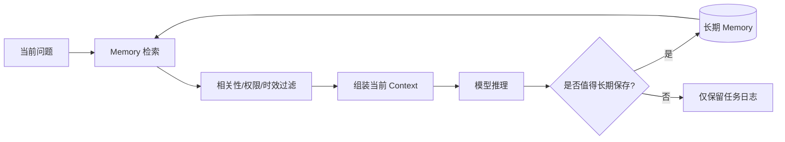

# Context 与长期 Memory 有什么区别？

## 原题原文

> Context 和长期 Memory 有什么区别？

## 答案

### 面试直答

Context 是 **当前这次模型调用实际看到的信息**，长期 Memory 是 **跨轮次或跨会话保存、未来可能再次取用的信息**。Memory 只有经过检索或注入进入当前 Prompt 后，才成为这一次调用的 Context。

### 一、两者的边界

| 维度 | Context | 长期 Memory |
|---|---|---|
| 生命周期 | 当前请求或当前任务 | 跨轮次、跨会话 |
| 存放位置 | 模型上下文窗口 | 数据库、向量库、用户画像等 |
| 容量 | 受上下文窗口限制 | 可长期扩展 |
| 是否直接影响模型 | 是，模型当前可见 | 否，需先召回并注入 |
| 典型内容 | 当前问题、计划、工具结果 | 稳定偏好、历史事实、经验结论 |

> **核心小结：** Context 是“现在给模型看什么”，Memory 是“以后可能还要记住什么”。

### 二、Memory 如何进入 Context

读取时通常依据用户、会话、语义相关性和时间范围召回；写入时应判断内容是否稳定、是否有长期价值、是否涉及隐私以及是否与已有记忆冲突。

> **核心小结：** Memory 不是自动追加的聊天历史，而是一套有筛选的读写机制。

### 三、短期状态不能都塞进长期 Memory

以下内容通常属于当前任务状态，不适合长期保存：

- 本轮临时计划和中间草稿；
- 一次性工具返回值；
- 已失效的错误尝试；
- 未经用户确认的模型推断。

更适合长期记忆的是稳定偏好、已确认事实、可复用经验和长期任务进度。即使保存，也应带来源、时间、作用域和置信度。

> **核心小结：** 长期 Memory 应保存稳定且可复用的信息，而不是把所有执行轨迹永久化。

### 四、工程设计重点

- **作用域隔离**：区分用户、团队、任务和全局记忆，防止串数据。
- **写入策略**：规则或模型提取候选，再去重、校验和脱敏。
- **检索策略**：语义相关性结合时间、权限和重要性，不能只看向量相似度。
- **冲突处理**：新旧记忆矛盾时保留版本与来源，不静默覆盖。
- **遗忘机制**：支持过期、删除和用户更正。
- **效果评估**：既看召回是否有用，也看错误记忆是否误导回答。

> **核心小结：** Memory 系统真正难的不是存储，而是决定何时写、写什么、何时读以及如何避免错误记忆污染。

### 常见追问

- **聊天历史等于 Memory 吗？** 不完全等于。聊天历史是原始记录，Memory 通常是经过筛选、压缩或结构化后的长期信息。
- **为什么不能每轮都把全部 Memory 放进 Prompt？** 会增加成本和噪声，还可能引入过期或不相关信息。

## 问题来源

- 公司：字节跳动
- 页面标题：字节面经-字节跳动AI Agent开发岗面经-01
- 面经小节：面经 01
- 岗位与面试时间：AI Agent 开发 ｜ 面试时间：2026 年 8 月 20 日
- 题目在小节内的位置：第 5 条
- 来源链接：https://www.nowcoder.com/discuss/922659050167226368
- 在线核验：2026-09-01 已在公开网页正文中逐条核验
- 证据级别：网页公开正文原文
