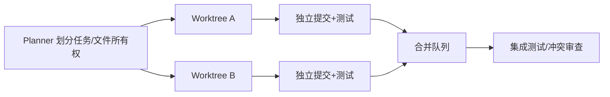

# 多个 Agent 同时修改文件时如何避免冲突？

## 原题原文

> 多个 Agent 同时修改文件如何避免冲突？

## 答案

### 面试直答

多个 Agent 同时修改文件时，核心是避免“共享工作目录上的无协调写入”。我会使用**任务分区 + 独立 Worktree/沙箱 + 文件所有权 + 合并队列 + 测试校验**；确实必须改同一文件时串行化或由一个集成 Agent 统一修改。

### 一、冲突来源

Agent 可能基于不同版本读取同一文件，随后互相覆盖；即使 Git 能自动合并，语义也可能冲突。仅依赖最后一次写入或文本锁都不够。

> **核心小结：** 文件冲突既有 Git 文本冲突，也有“都能合并但逻辑错误”的语义冲突。

### 二、推荐流程

任务开始记录基线 Commit 和允许修改路径；合并前检测目标分支变化，重放或重规划。数据库迁移、锁文件和公共 Schema 通常由专属任务统一管理。

> **核心小结：** 最有效的冲突治理发生在任务拆分阶段，而不是冲突出现后才解决。

### 三、工程保护

- 对同一目标文件最多一个写 Agent，其他 Agent只做只读研究。
- 使用原子提交和可回滚 Patch，不共享未提交修改。
- 合并后运行编译、单测、契约测试和 Diff 审查。
- 冲突时不得让模型无条件选择一边，应回看双方意图和验收标准。

> **核心小结：** 隔离保证物理安全，所有权与集成测试保证语义正确。

## 问题来源

- 公司：字节跳动
- 页面标题：字节面经-字节跳动AI Agent开发岗面经-01
- 面经小节：面经 01
- 岗位与面试时间：AI Agent 开发 ｜ 面试时间：2026 年 8 月 20 日
- 题目在小节内的位置：第 7 条
- 来源链接：https://www.nowcoder.com/discuss/922659050167226368
- 在线核验：2026-09-01 已在公开网页正文中逐条核验
- 证据级别：网页公开正文原文
