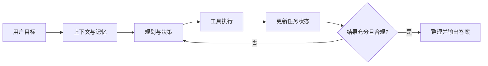

# 一个完整的 Agent 系统通常包含哪些核心模块？

## 原题原文

> 一个完整的Agent系统通常包含哪些核心模块？

## 答案

### 面试直答

一个完整的 Agent 系统通常包含六层：**输入与上下文、决策规划、工具执行、状态记忆、校验控制、最终输出**。LLM 负责不确定性判断，代码负责权限、状态、超时和停止条件。

### 一、核心模块

#### 1. 输入与上下文

- 解析用户目标、历史对话、环境信息和权限。
- 对上下文做裁剪、摘要或检索，避免所有历史内容都塞入 Prompt。
- 必要时先澄清需求，而不是带着错误假设执行。

> **核心小结：** 先把“用户真正要什么”和“模型现在知道什么”整理清楚。

#### 2. 决策与规划

- 判断是直接回答、调用单个工具，还是拆成多个子任务。
- 维护子任务依赖、优先级和停止条件。
- 环境变化或执行失败时，决定重试、换方案或重新规划。

> **核心小结：** 规划模块负责决定下一步，不负责真正执行外部动作。

#### 3. 工具与执行

- 工具注册表描述名称、用途、参数 schema 和权限。
- 执行器负责参数校验、超时、重试、限流和结果标准化。
- 高风险动作应由代码鉴权，必要时要求人工确认。

> **核心小结：** 模型只能“申请调用”，真正的权限和执行边界必须由系统掌握。

#### 4. 状态与记忆

- 短期状态保存当前计划、工具结果和任务进度。
- 长期记忆保存跨会话偏好或稳定事实，但写入前需要筛选。
- 状态应可持久化，便于恢复、调试和审计。

> **核心小结：** 状态记录“任务做到哪”，记忆记录“以后仍可能有用什么”。

#### 5. 校验与输出

- 校验任务是否完成、证据是否充分、格式是否符合要求。
- 信息不足时返回规划层补充，而不是强行生成答案。
- 最后完成引用、脱敏、内容安全检查和流式输出。

> **核心小结：** 生成答案不是终点，经过完成度与安全校验后才是可交付结果。

### 二、完整闭环

### 三、工程实现重点

- **可控**：最大步数、总预算、工具白名单和人工审批。
- **可靠**：幂等、超时、有限重试、熔断和失败回退。
- **可观测**：记录计划、工具参数、返回结果、Token、延迟和终止原因。
- **可评估**：既看最终成功率，也看工具正确率、路径效率和成本。

> **核心小结：** Agent 的工程价值不只是“会自主调用工具”，而是自主过程仍然可限制、可恢复、可复盘。

### 常见追问

- **LLM 属于哪个模块？** 它可参与理解、规划、工具选择和生成，但不应直接控制权限与系统状态。
- **最容易出问题的地方？** 工具参数错误、循环失控、上下文膨胀以及没有明确的完成判定。

## 问题来源

- 公司：字节跳动
- 页面标题：字节面经-字节跳动AI Agent开发岗面经-01
- 面经小节：面经 02
- 岗位与面试时间：AI Agent开发岗 ｜ 面试时间：2026 年 8 月 20 日
- 题目在小节内的位置：第 1 条
- 来源链接：https://www.nowcoder.com/discuss/922659050167226368
- 在线核验：2026-09-01 已在公开网页正文中逐条核验
- 证据级别：网页公开正文原文
