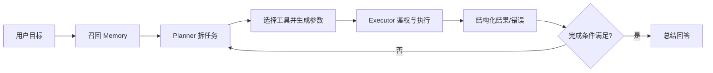

# Agent 项目中的 Planning、Memory、Tool Use 和执行模块分别承担什么职责？

## 原题原文

> 在Agent项目中，常见的规划（Planning）、记忆（Memory）、工具调用（Tool Use）和执行模块分别承担什么职责？

## 答案

### 面试直答

Planning、Memory、Tool Use 和执行模块分别解决四类问题：**Planning 决定做什么和先后关系，Memory 提供跨轮次可复用信息，Tool Use 把模型意图变成结构化调用，执行模块负责真正运行、回传结果并控制权限和超时。** 模型可以参与决策，但状态、权限和终止必须由 Harness 兜底。

### 一、四个模块的职责

| 模块 | 输入 | 输出 | 主要风险 |
|---|---|---|---|
| Planning | 用户目标、约束、当前状态 | 子任务、依赖、完成条件 | 拆错、漏约束、过度规划 |
| Memory | 当前问题、用户/任务作用域 | 相关历史事实和经验 | 错记、串用户、信息过期 |
| Tool Use | 当前步骤、工具 Schema | 工具名和结构化参数 | 选错工具、参数幻觉 |
| Executor | 工具调用、权限和预算 | 真实结果、错误、状态变化 | 超时、重试风暴、越权 |

Planning 不应直接假设工具成功；每个执行结果都要回写状态，再决定继续、重试、降级还是重规划。Memory 也不是完整聊天记录，只有召回进入当前 Prompt 后才成为 Context。

> **核心小结：** Planning 管任务结构，Memory 管可复用信息，Tool Use 管意图表达，Executor 管真实世界副作用。

### 二、一次完整协作

以旅行 Agent 为例，Planner 拆出酒店和景点目标，Executor 并行调用旅行技能，Judge 检查必需信息是否齐全，再由 Summary 生成移动端回答。这里 Memory 提供用户偏好，但工具权限、并发和停止条件仍由代码控制。

> **核心小结：** 四个模块通过“计划—执行—观察—更新状态”闭环协作，而不是四个彼此独立的 Prompt。

### 三、工程边界

- 计划节点应带依赖、预算和完成条件，不能只有自然语言步骤。
- Memory 记录来源、时间、作用域和置信度，支持更正与删除。
- Tool Schema 使用枚举、必填字段和业务校验，执行前再次验证。
- Executor 设置超时、幂等键、限流、重试上限和高风险审批。
- 记录每一步的输入、工具结果和决策原因，便于分层评估。

> **核心小结：** 模型负责不确定性判断，Harness 负责确定性的状态、权限、可靠性和审计。

### 常见追问

- **Planning 一定要单独调用模型吗？** 不一定。固定业务可以用规则或 Workflow，复杂开放任务才需要模型规划。
- **Tool Use 和 Executor 能合并吗？** 代码上可以靠近，但安全边界要分开：模型提议调用，Executor 决定能否执行。

## 问题来源

- 公司：字节跳动
- 页面标题：字节面经-字节跳动AI Agent开发岗面经-01
- 面经小节：面经 02
- 岗位与面试时间：AI Agent开发岗 ｜ 面试时间：2026 年 8 月 20 日
- 题目在小节内的位置：第 3 条
- 来源链接：https://www.nowcoder.com/discuss/922659050167226368
- 在线核验：2026-09-01 已在公开网页正文中逐条核验
- 证据级别：网页公开正文原文
