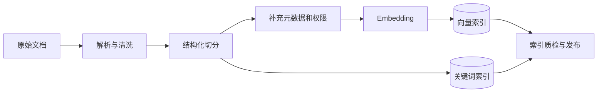

# RAG 系统从文档入库到生成答案的完整流程是什么？

## 原题原文

> RAG系统从文档进入到最终生成答案的完整流程是什么？

## 答案

### 面试直答

RAG 的完整流程分为两条链路：**离线把文档处理成可检索知识库，在线把用户问题转成检索请求，召回并重排证据，再让模型基于证据生成带来源的答案。** 关键不是“接一个向量库”，而是保证数据、检索和生成都能独立评估。

### 一、离线建库

#### 1. 解析与清洗

针对 PDF、HTML、Word、表格选择解析器，保留标题层级、页码、表格关系和来源链接；去除页眉页脚、重复段落与乱码。

#### 2. 文档切分

优先按标题、段落、列表和表格等结构切分，再控制 Chunk 长度和重叠。Chunk 需要既能独立命中，又保留回答问题所需的上下文。

#### 3. 索引构建

为 Chunk 保存文档 ID、版本、时间、权限和标题路径；同时构建向量索引与 BM25/全文索引，以覆盖语义相似和精确关键词两类查询。

> **核心小结：** 离线链路决定知识库上限；解析错误、切分失真或权限缺失，在线模型无法补救。

### 二、在线检索与生成

- Query 改写处理指代、省略、错别字和多意图，但应保留原问题约束。
- 混合召回负责扩大候选覆盖，Reranker 负责把最相关证据排在前面。
- 上下文组装要去重、控制 Token，并避免同一文档的相邻 Chunk 大量挤占窗口。
- Prompt 要求模型仅依据证据回答；证据不足时说明无法确定。
- 最终答案应带来源，便于用户核验，也便于排查幻觉。

> **核心小结：** 召回解决“有没有”，重排解决“靠不靠前”，生成解决“如何组织”，三者应分开定位问题。

### 三、评估体系

不能只看最终答案。应按链路评估：

| 层级 | 关注指标 |
|---|---|
| 数据 | 解析成功率、更新及时性、权限正确率 |
| 召回 | Recall@K、命中率 |
| 排序 | MRR、nDCG、正确证据排名 |
| 生成 | 正确性、忠实度、引用准确性、完整性 |
| 系统 | P95 延迟、失败率、单请求成本 |

评测集需要保存问题、标准证据和参考答案。检索指标正常但答案差，应检查上下文拼接和生成；检索指标已经差，先不要调 Prompt。

> **核心小结：** RAG 必须做到“检索可测、生成可测、端到端可回归”，否则无法知道优化是否真正有效。

### 四、工程实践与取舍

- 文档使用哈希和版本号做增量更新，避免每次全量重建。
- 新索引完成质检后再通过别名或蓝绿方式切换。
- 召回通道、Rerank 数量和 Context 长度需要同时考虑效果、延迟与成本。
- 记录改写后 Query、过滤条件、各通道候选及重排前后名次。
- 对高风险知识使用来源白名单、时效检查和人工审核。

> **核心小结：** 生产 RAG 的核心是可追踪的数据生命周期、可观测的检索链路和可回归的质量指标。

### 常见追问

- **为什么还需要 BM25？** 向量检索擅长语义相似，BM25 对专有名词、编号和精确词更稳定。
- **Top-K 是否越大越好？** 不是。更大的 K 可能提高召回，也会增加延迟和上下文噪声，通常要配合 Rerank 调整。

## 问题来源

- 公司：字节跳动
- 页面标题：字节面经-字节跳动AI Agent开发岗面经-01
- 面经小节：面经 02
- 岗位与面试时间：AI Agent开发岗 ｜ 面试时间：2026 年 8 月 20 日
- 题目在小节内的位置：第 6 条
- 来源链接：https://www.nowcoder.com/discuss/922659050167226368
- 在线核验：2026-09-01 已在公开网页正文中逐条核验
- 证据级别：网页公开正文原文
