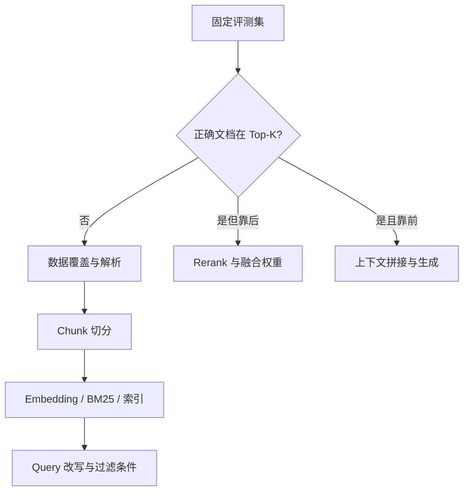

# RAG 召回结果不理想，从哪些维度排查？

## 原题原文

> RAG 召回结果不理想，从哪些维度排查？

## 答案

### 面试直答

我会先用带标准答案的查询集判断：**正确文档到底是没有进入 Top-K，还是已经召回但排序、拼接或生成阶段丢失了**。然后从数据、切分、索引、查询、过滤和重排逐层排查。

### 一、先定义“召回不好”

只看最终答案无法定位问题，应先评估检索层。常用指标：

$$
\operatorname{Recall@K}=\frac{\text{Top-K 中命中的相关文档数}}{\text{全部相关文档数}}
$$

如果每个问题只有一个标准文档，还可以看：

$$
\operatorname{MRR}=\frac{1}{|Q|}\sum_{q\in Q}\frac{1}{\operatorname{rank}_q}
$$

- Recall@K 低：正确文档根本没进入候选集。
- Recall@K 高但 MRR 低：召回到了，但排序靠后。
- 检索指标正常但答案差：问题可能在上下文拼接或生成阶段。

> **核心小结：** 先把“检索失败”和“生成失败”拆开，否则换模型、调 Prompt 都可能治错病。

### 二、按检索链路逐层排查

#### 1. 数据与解析

- 文档是否缺失、过期或被权限规则排除。
- PDF、表格、标题层级是否解析错；乱码会直接污染 Embedding。

> **核心小结：** 库里没有正确内容，任何检索算法都救不了。

#### 2. Chunk 切分

- Chunk 太小：上下文被切断，单块语义不完整。
- Chunk 太大：主题混杂，相似度被无关内容稀释。
- 检查标题是否随正文保存、是否需要重叠或父子索引。

> **核心小结：** Chunk 应尽量对应一个可独立回答问题的语义单元。

#### 3. 召回模型与索引

- 单独测试向量召回和 BM25，判断问题来自语义检索还是关键词检索。
- 检查 Embedding 模型是否适配语言、领域和查询长度。
- 核对向量归一化、距离函数、索引参数及索引是否漏更新。

> **核心小结：** 先做分通道基线，再讨论混合检索；否则无法知道哪个通道贡献了结果。

#### 4. Query、过滤与排序

- Query 是否包含指代、省略、错别字或多意图，需要改写或拆分。
- 租户、时间、语言、标签过滤是否误杀正确文档。
- 正确结果已在候选集时，再调整 RRF、融合权重或 Cross-Encoder Reranker。

> **核心小结：** “召回不到”解决候选生成，“召回但靠后”解决融合与重排。

### 三、工程排查方法

- 建立固定评测集，保存问题、标准文档 ID、标准答案和场景标签。
- 为每次查询记录：改写后 Query、过滤条件、各通道 Top-K、分数、Rerank 前后名次。
- 一次只改一个变量，比较 Recall@K、MRR、延迟和成本。
- 离线指标提升后，再抽查最终答案是否真正使用了正确证据。

> **核心小结：** 可观测日志 + 固定评测集 + 单变量实验，才能把“感觉召回不好”变成可定位、可回归的问题。

### 常见追问

- **是否应该直接换 Embedding 模型？** 不应该；先确认数据、切分和过滤没有问题，再用同一评测集横向比较模型。
- **Top-K 越大越好吗？** 不是。它可能提高召回，却增加延迟和噪声，需要结合 Rerank 与上下文预算调节。

## 问题来源

- 公司：字节跳动
- 页面标题：字节面经-字节跳动AI Agent开发岗面经-01
- 面经小节：面经 03
- 岗位与面试时间：AI Agent开发岗 ｜ 面试时间：2026 年 8 月 19 日
- 题目在小节内的位置：第 2 条
- 来源链接：https://www.nowcoder.com/discuss/922659050167226368
- 在线核验：2026-09-01 已在公开网页正文中逐条核验
- 证据级别：网页公开正文原文
