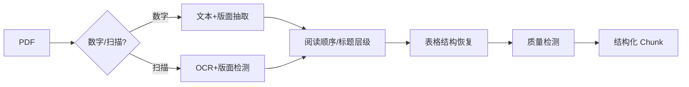

# RAG 预处理阶段如何解析 PDF 和复杂表格？

## 原题原文

> 预处理阶段：PDF和复杂表格怎么解析？

## 答案

### 面试直答

PDF 和复杂表格不能只做纯文本抽取。我会先判断数字版还是扫描版，再组合版面分析、OCR、阅读顺序、表格结构恢复和质量检测；输出统一文档节点，保留页码、标题层级、坐标和表格单元格关系。

### 一、解析流程

表格同时保存 Markdown/HTML 表示和行列坐标；跨页表合并表头，数值单位不能丢。图片和公式保留引用或使用专用识别。

> **核心小结：** 解析目标是恢复文档结构与语义关系，而不是得到一长串字符。

### 二、质量与回退

抽样测字符准确率、阅读顺序、表格单元格 F1 和关键字段完整率；低置信页升级更强 OCR 或人工。每个 Chunk 保留页码和 Bounding Box，便于引用核查。

> **核心小结：** 复杂文档必须有字段级质量检测和可回溯原页，不能假设解析器永远正确。

## 问题来源

- 公司：字节跳动
- 页面标题：字节面经-字节跳动AI Agent开发岗面经-01
- 面经小节：面经 04
- 岗位与面试时间：AI Agent开发岗 ｜ 面试时间：2026 年 8 月 18 日
- 题目在小节内的位置：第 1 条
- 来源链接：https://www.nowcoder.com/discuss/922659050167226368
- 在线核验：2026-09-01 已在公开网页正文中逐条核验
- 证据级别：网页公开正文原文
