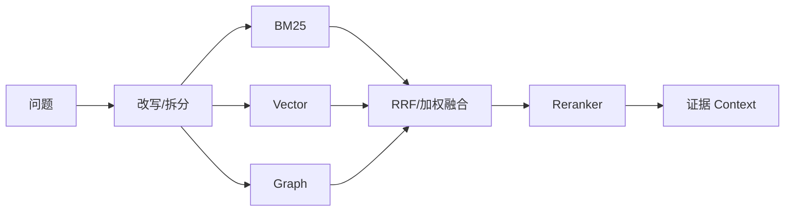

# 如何设计 RAG 的查询改写、混合检索和 GraphRAG，并评估多通道检索效果？

## 原题原文

> 检索增强：Query Rewriting（HyDE、用户意图重写）、混合检索（向量+BM25/全文）、GraphRAG（图谱+向量）、如何衡量多通道查询。

## 答案

### 面试直答

复杂 RAG 可采用查询改写 + 多通道召回 + 融合重排：改写处理歧义和多意图，BM25 与向量检索互补，GraphRAG 用于实体关系和多跳问题。所有通道先独立评估，再在相同预算下比较融合收益。

### 一、链路

GraphRAG 不应默认启用；只有问题依赖实体关系、多跳路径，且图谱质量可控时才有价值。

> **核心小结：** 多通道的目标是覆盖互补错误，不是把所有检索器堆在一起。

### 二、评估

为每个 Query 标注标准证据和问题类型，报告各通道 Recall@K、融合后 nDCG/MRR、Rerank 增益、答案忠实度、延迟和 Token。做消融：无改写、单通道、无 Graph、无 Reranker。

> **核心小结：** 必须证明每个新增模块在目标 Query 类型上带来可归因收益。

## 问题来源

- 公司：字节跳动
- 页面标题：字节面经-字节跳动AI Agent开发岗面经-01
- 面经小节：面经 04
- 岗位与面试时间：AI Agent开发岗 ｜ 面试时间：2026 年 8 月 18 日
- 题目在小节内的位置：第 2 条
- 来源链接：https://www.nowcoder.com/discuss/922659050167226368
- 在线核验：2026-09-01 已在公开网页正文中逐条核验
- 证据级别：网页公开正文原文
