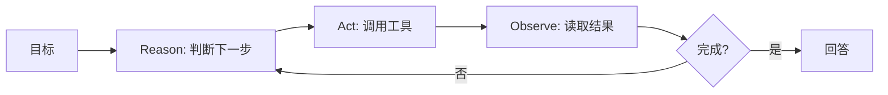

# 你了解 Agent 的 ReAct 框架吗？它的原理是什么？

## 原题原文

> "Agent的ReAct框架你了解吗？

## 答案

### 面试直答

ReAct 是 Reasoning + Acting：模型根据当前目标和已有观察决定一个动作，执行工具后把结果作为 Observation 放回上下文，再决定下一步，直到完成或达到预算。它适合路径依赖真实反馈的开放任务。

### 一、循环

工程实现不必暴露模型私有思维，保存结构化 Action、Observation 和决策摘要即可。

> **核心小结：** ReAct 的关键不是写出“Thought”文字，而是让决策与环境反馈交替推进。

### 二、优缺点

优点是能纠错、处理未知路径；缺点是轮数和延迟不稳定，可能重复调用或路径震荡。生产中设置步数、成本、重复检测和工具权限，固定业务优先 Workflow。

> **核心小结：** ReAct 用灵活性换取可预测性，应只用于真正不确定的局部。

## 问题来源

- 公司：字节跳动
- 页面标题：字节面经-字节跳动AI Agent开发岗面经-01
- 面经小节：面经 05
- 岗位与面试时间：AI Agent开发岗 ｜ 面试时间：2026 年 8 月 16 日
- 题目在小节内的位置：第 2 条
- 来源链接：https://www.nowcoder.com/discuss/922659050167226368
- 在线核验：2026-09-01 已在公开网页正文中逐条核验
- 证据级别：网页公开正文原文
