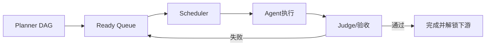

# 多 Agent 系统如何设计任务分配机制？

## 原题原文

> "多Agent系统里，你怎么设计任务分配？

## 答案

### 面试直答

多 Agent 任务分配要同时考虑依赖、能力、成本、Context 和资源冲突。我会让 Planner 生成带依赖和完成条件的 DAG，再由 Scheduler 根据 Agent 能力、工具权限和负载分配；动态任务通过结果反馈重新排队，而不是一次分配到底。

### 一、任务模型

每个任务至少包含：目标、输入、依赖、允许工具、读写范围、优先级、Deadline、预算和验收标准。只有依赖满足的节点才能进入 Ready Queue。

> **核心小结：** 可调度任务必须是结构化状态，而不是一句模糊自然语言。

### 二、分配策略

- 能力匹配：研究、代码、数据库等交给对应 Agent。
- 数据局部性：已有相关 Context 的 Agent优先，减少重复加载。
- 资源隔离：同一文件或外部资源避免并发写。
- 成本与 SLA：简单任务交给小模型，关键判断交给强模型。
- 动态重分配：超时、失败或结果不充分时换 Agent/工具。

> **核心小结：** 分配目标不是让所有 Agent 都忙，而是最小化关键路径和冲突。

### 三、调度闭环

> **核心小结：** Planner 决定任务关系，Scheduler 决定何时由谁执行，Judge 决定是否真正完成。

## 问题来源

- 公司：字节跳动
- 页面标题：字节面经-字节跳动AI Agent开发岗面经-01
- 面经小节：面经 05
- 岗位与面试时间：AI Agent开发岗 ｜ 面试时间：2026 年 8 月 16 日
- 题目在小节内的位置：第 3 条
- 来源链接：https://www.nowcoder.com/discuss/922659050167226368
- 在线核验：2026-09-01 已在公开网页正文中逐条核验
- 证据级别：网页公开正文原文
