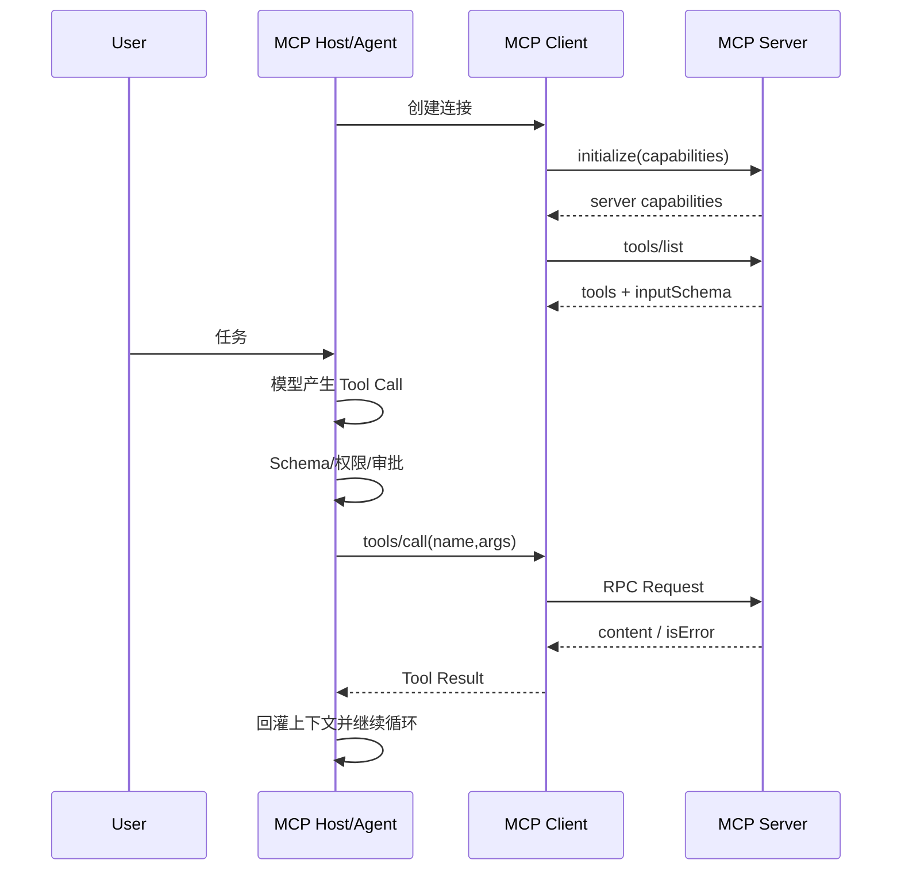

# MCP 调用工具的完整流程是什么？

## 原题原文

> MCP 调用工具的流程是什么？

## 答案

### 面试直答

MCP 调用工具的完整流程是：Host 启动或连接 MCP Client，与 Server 建立 Transport；双方初始化并协商协议/能力；Client 获取工具列表和 JSON Schema；模型选择工具后，Host 校验权限并通过 Client 发起 tools/call；Server 执行并返回结构化内容或错误，Host 再把结果放回 Agent Context。

### 一、时序

> **核心小结：** MCP 标准化的是 Host 与外部能力之间的发现和调用协议，不负责模型如何规划。

### 二、工程注意

Transport 可是 stdio 或网络；连接要有超时、重连和版本协商。Schema 校验、租户权限和用户审批应在 Host 执行边界落实；Server 返回错误要结构化，不能伪装成成功文本。高风险 Tool 还需幂等和审计。

> **核心小结：** MCP 解决互操作，安全、调度和业务正确性仍由 Host/Harness 与 Server 共同负责。

## 问题来源

- 公司：字节跳动
- 页面标题：字节面经-字节跳动AI Agent开发岗面经-01
- 面经小节：面经 07
- 岗位与面试时间：AI Agent 实习 ｜ 面试时间：2026 年 8 月 13 日
- 题目在小节内的位置：第 1 条
- 来源链接：https://www.nowcoder.com/discuss/922659050167226368
- 在线核验：2026-09-01 已在公开网页正文中逐条核验
- 证据级别：网页公开正文原文
