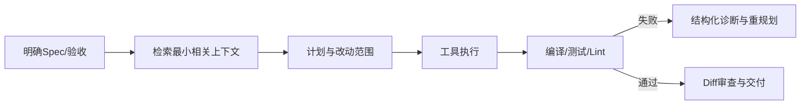

# 如何优化 Coding Agent？

## 原题原文

> 如何优化 Coding Agent？

## 答案

### 面试直答

优化 Coding Agent 不能只换更强模型，应分层优化：任务理解与 Spec、代码检索、计划、工具执行、Context、验证、权限和恢复。核心指标是相同成本与延迟预算下的任务成功率，而不是单轮代码看起来更漂亮。

### 一、优化链路

> **核心小结：** Coding Agent 的反馈源应是代码库和测试，而不是模型自我感觉。

### 二、关键优化

- 用 AGENTS/CLAUDE 指令固化构建命令与规范。
- 搜索后只读相关文件，截断大日志并保留错误核心。
- 跨模块任务先 Plan，小改动直接执行。
- 写操作使用 Patch、工作树隔离和最小权限。
- 自动运行针对性测试，再做类型/构建检查。
- 检测重复读取、重复命令和无进展循环。
- 长任务使用 Checkpoint、压缩、Resume 和子 Agent 隔离。

Codex 的 Thread/Turn/Item、Claude Code 的多级压缩与 Hooks 都说明 Harness 对最终效果影响很大。

> **核心小结：** 最有效的优化通常是更好的上下文、工具反馈和验证闭环，而非无限增加模型推理轮次。

## 问题来源

- 公司：字节跳动
- 页面标题：字节面经-字节跳动AI Agent开发岗面经-01
- 面经小节：面经 07
- 岗位与面试时间：AI Agent 实习 ｜ 面试时间：2026 年 8 月 13 日
- 题目在小节内的位置：第 3 条
- 来源链接：https://www.nowcoder.com/discuss/922659050167226368
- 在线核验：2026-09-01 已在公开网页正文中逐条核验
- 证据级别：网页公开正文原文
