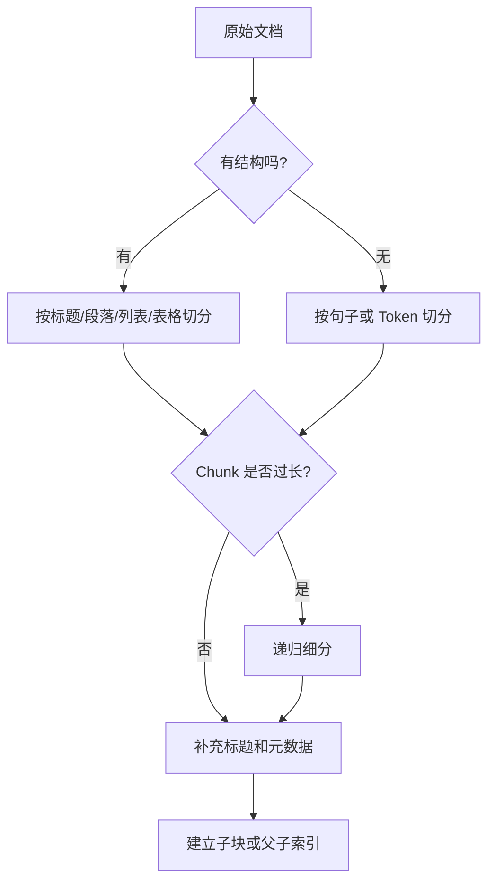

# RAG 流程中的文档切分策略应该如何设计？

## 原题原文

> 在RAG流程中，文档切分（Chunk）策略是如何设计的？

## 答案

### 面试直答

RAG 文档切分没有固定最优长度。我会先按文档结构切分，再根据 Embedding 模型、问题粒度和上下文预算控制 Chunk 大小，并用检索评测集验证，而不是只凭经验设置一个数字。

### 一、为什么需要切分

整篇长文档直接 Embedding 会出现：

- 多个主题混在一个向量里，相似度不够准确；
- 命中后带入大量无关内容，占用模型上下文；
- 无法精确引用命中的段落。

但 Chunk 太小也会让定义、条件与结论被拆开，召回到的片段无法独立回答问题。

> **核心小结：** 切分是在“检索粒度”和“语义完整性”之间做平衡。

### 二、切分策略

优先级通常是：

1. 保留章节、标题、段落、代码块和表格边界。
2. 结构块过长时，按句子或 Token 递归细分。
3. 为每个子块附加文档标题和上级标题，补回语义背景。
4. 对长文档使用父子索引：小块负责召回，大块负责提供上下文。

> **核心小结：** 先尊重文档结构，再使用长度阈值兜底；不要先把全文机械切成等长字符。

### 三、Chunk 大小与重叠怎么定

影响参数的因素包括：

- 问题粒度：事实问答需要更细，章节总结需要更大。
- Embedding 模型：不能超过其有效输入长度，且过长输入可能稀释主题。
- 文档类型：FAQ、合同、代码、表格和论文不应共用同一策略。
- 生成预算：召回多个 Chunk 后仍要给 Prompt 和答案留出空间。

Overlap 用于缓解边界切断，但不是越大越好。重叠过大会制造重复候选、增加索引量，并让相同内容反复占据 Context。更好的做法是优先按句子和结构切分，Overlap 只做补偿。

> **核心小结：** 长度和重叠是可调参数，不是通用常数；应按文档类型分策略并通过评测确定。

### 四、特殊内容处理

- **表格**：保留表头和行列关系；大表可以按行组切分，每块重复表头。
- **代码**：按类、函数或语法节点切分，附带文件路径和符号名。
- **FAQ**：问题与答案应作为一个整体。
- **合同/制度**：保留条款编号和上级章节，避免条件与结论分离。
- **扫描 PDF**：先评估 OCR 质量，低质量文本不应直接进入索引。

> **核心小结：** Chunk 策略应该理解内容结构，而不仅是计算文本长度。

### 五、如何验证切分效果

建立带标准证据的查询集，比较不同策略下：

- Recall@K：正确 Chunk 能否被召回；
- MRR/nDCG：正确 Chunk 是否排在前面；
- 重复率：Top-K 是否充斥相邻重复块；
- 答案正确性和引用准确性；
- 索引规模、P95 延迟和 Token 成本。

一次只改变长度、Overlap 或父子策略中的一个变量，才能判断收益来源。

> **核心小结：** 切分策略最终由检索和答案效果验证，而不是由“常用 500 Token”这类经验值决定。

### 常见追问

- **语义在边界被切断怎么办？** 优先按句子和章节切分，再用小幅重叠、标题补充或父子索引恢复上下文。
- **是否应该使用语义切分？** 可以，但它增加计算和调参成本；应先与简单结构切分建立基线，再用评测证明收益。

## 问题来源

- 公司：字节跳动
- 页面标题：字节面经-字节跳动AI Agent开发岗面经-01
- 面经小节：面经 08
- 岗位与面试时间：AI Agent开发岗 ｜ 面试时间：2026 年 8 月 13 日
- 题目在小节内的位置：第 7 条
- 来源链接：https://www.nowcoder.com/discuss/922659050167226368
- 在线核验：2026-09-01 已在公开网页正文中逐条核验
- 证据级别：网页公开正文原文
