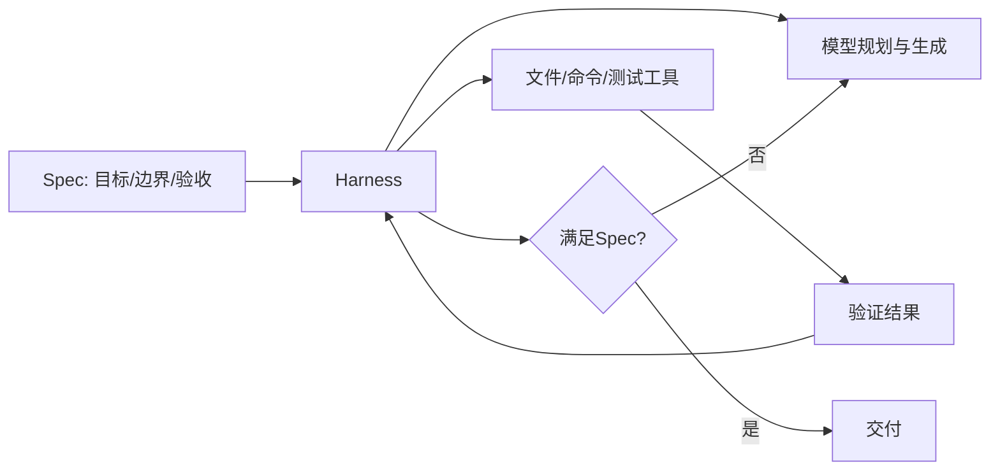

# 如何理解 Spec Coding 和 Harness？

## 原题原文

> 如何理解Spec Coding和Harness？

## 答案

### 面试直答

Spec Coding 是先把需求、约束、接口和验收标准写成可执行规格，再让 Agent 实现；Harness 是包围模型的运行时，负责 Context、工具、状态、权限、验证和恢复。Spec 定义“什么叫做完”，Harness 保证“如何安全持续做到”。

### 一、关系

> **核心小结：** 没有 Spec，Agent 不知道何时完成；没有 Harness，Spec 只能停留在文档。

### 二、好的 Spec

包含背景、用户故事、范围外事项、接口/数据约束、失败行为、测试和非功能指标。避免把实现步骤写死，给 Agent 保留局部决策空间。

### 三、Harness 能力

项目规则加载、代码检索、Patch、沙箱、审批、测试、进度、压缩、Resume 和审计。Codex app-server 展示了 Thread/Turn/Item 式 Harness 如何嵌入产品。

> **核心小结：** Spec 提高目标可验证性，Harness 提高执行可靠性，两者共同降低长任务漂移。

## 问题来源

- 公司：字节跳动
- 页面标题：字节面经-字节跳动AI Agent开发岗面经-01
- 面经小节：面经 09
- 岗位与面试时间：AI Agent开发岗 ｜ 面试时间：2026 年 8 月 13 日
- 题目在小节内的位置：第 4 条
- 来源链接：https://www.nowcoder.com/discuss/922659050167226368
- 在线核验：2026-09-01 已在公开网页正文中逐条核验
- 证据级别：网页公开正文原文
