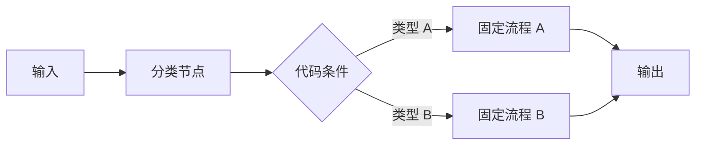
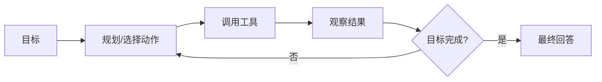
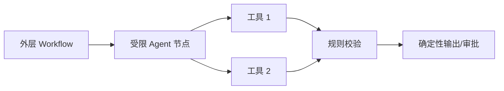

# Agent 与普通 LLM 应用、Workflow 有什么区别？

## 原题原文

> Agent 和普通 LLM 应用、和工作流的区别是什么

## 答案

### 面试直答

普通 LLM 应用、Workflow 和 Agent 的区别主要在 **控制权与执行路径**：普通 LLM 应用通常一次输入一次输出；Workflow 由代码预定义步骤和分支；Agent 则根据目标和环境反馈动态决定下一步并调用工具。

### 一、普通 LLM 应用

典型形式是“输入 → Prompt → 模型 → 输出”。系统可以带 RAG 或模板，但执行路径基本固定，模型主要负责理解和生成。

适合：

- 文本总结、改写、分类和信息抽取；
- 固定的一次检索后生成；
- 不需要多轮工具决策的任务。

> **核心小结：** 普通 LLM 应用让模型完成一个明确步骤，但不赋予它持续决策和执行能力。

### 二、Workflow

Workflow 把业务过程表示为代码定义的节点、分支和状态流转：

模型可以参与某些节点，例如分类或生成，但“下一步走哪个节点”主要由代码规则控制。

适合支付、审批、固定客服流程等规则明确、需要稳定审计的场景。分支越来越多时，维护成本也会提高。

> **核心小结：** Workflow 用确定的代码控制流换取稳定性、可测试性和可审计性。

### 三、Agent

Agent 接收目标后，会结合当前状态和工具结果动态选择动作：

它适合路径无法在设计时完全确定的任务，例如跨多个信息源调研、动态排障和复杂任务规划。代价是行为、延迟和成本更难预测，还可能出现循环、错误工具调用或越权风险。

> **核心小结：** Agent 的关键不是“用了大模型”，而是模型拥有基于反馈动态决定后续动作的控制权。

### 四、三者对比

| 维度 | 普通 LLM 应用 | Workflow | Agent |
|---|---|---|---|
| 执行路径 | 一次或固定少量步骤 | 代码预定义 | 模型动态决定 |
| 灵活性 | 低到中 | 中 | 高 |
| 稳定性 | 高 | 高 | 中低 |
| 工具调用 | 无或固定 | 固定节点调用 | 动态选择 |
| 成本与延迟 | 最容易控制 | 可估算 | 波动最大 |
| 适用任务 | 明确生成任务 | 稳定业务流程 | 路径未知的复杂目标 |

> **核心小结：** 任务越确定，越应该优先使用简单方案；只有执行路径确实不确定时，才需要增加 Agent 的动态性。

### 五、工程上的混合架构

生产系统很少完全自由。常见方式是：

- 外层 Workflow 管理鉴权、状态、审批、失败回退和 SLA；
- 某个复杂节点内部允许 Agent 做有限步规划与工具选择；
- 高风险动作回到确定性代码或人工确认；
- 为 Agent 设置步数、Token、调用次数和工具权限上限。

> **核心小结：** 最常见的生产形态是 Workflow 控制边界，Agent 只处理真正需要动态决策的局部。

### 常见追问

- **用了工具调用就是 Agent 吗？** 不一定。如果工具和顺序由代码固定，它仍可能只是 Workflow。
- **什么时候不该使用 Agent？** 单步任务、固定流程、强确定性或高风险写操作，优先用普通应用或 Workflow。

## 问题来源

- 公司：字节跳动
- 页面标题：字节面经-字节跳动AI Agent开发岗面经-01
- 面经小节：面经 11
- 岗位与面试时间：AI Agent开发岗 ｜ 面试时间：2026 年 8 月 13 日
- 题目在小节内的位置：第 1 条
- 来源链接：https://www.nowcoder.com/discuss/922659050167226368
- 在线核验：2026-09-01 已在公开网页正文中逐条核验
- 证据级别：网页公开正文原文
