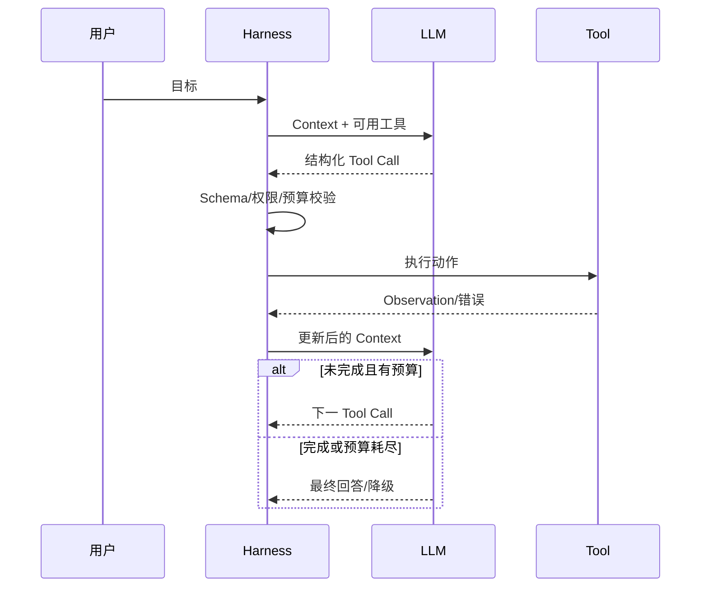

# 请解释 ReAct 的原理并画出完整执行流程。

## 原题原文

> 讲一下 ReAct 的原理，画一遍完整执行流程

## 答案

### 面试直答

ReAct 将一次任务拆成多轮“判断—工具调用—观察”，模型每次只基于最新状态选择下一动作。完整实现还需要 Harness 负责工具路由、权限、超时、结果配对和终止。

### 一、完整流程

> **核心小结：** LLM 选择动作，Harness 保证动作能够安全、可靠地执行并停止。

### 二、工程保护

限制最大步数和 Deadline；检测相同参数重复调用；错误结果结构化；写操作审批；压缩旧工具输出；记录轨迹做过程评估。

> **核心小结：** 没有状态、预算和权限的 ReAct 只是 Demo，不是生产 Agent。

## 问题来源

- 公司：字节跳动
- 页面标题：字节面经-字节跳动AI Agent开发岗面经-01
- 面经小节：面经 11
- 岗位与面试时间：AI Agent开发岗 ｜ 面试时间：2026 年 8 月 13 日
- 题目在小节内的位置：第 2 条
- 来源链接：https://www.nowcoder.com/discuss/922659050167226368
- 在线核验：2026-09-01 已在公开网页正文中逐条核验
- 证据级别：网页公开正文原文
