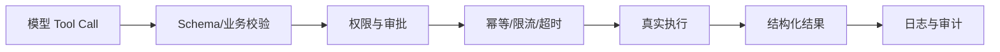

# Tool 的设计原则是什么？

## 原题原文

> Tool 的设计原则是什么？

## 答案

### 面试直答

Tool 设计的核心是：**职责单一、语义清晰、输入可约束、输出可观察、副作用可控制、失败可恢复。** Tool 是模型与真实系统的边界，不应把内部复杂 API 原样暴露给模型，也不能依赖 Prompt 保证安全。

### 一、接口设计

- 一个 Tool 只完成一个明确业务动作，名称使用动词加对象。
- 描述同时写清“何时使用”和“何时不要使用”，降低相似工具误选。
- 输入使用严格 Schema，必填、枚举、格式、范围和互斥关系尽量机器可校验。
- 输出统一为 success、data、error、retryable 和必要引用，不返回含糊文本。
- 查询和写入分开；高风险写操作显式标注副作用。

> **核心小结：** Tool 应暴露稳定的业务能力，而不是把底层 API 的偶然复杂性甩给模型。

### 二、运行时保护

写操作使用幂等键、回读确认和最小权限；网络失败按错误可恢复性重试，不能对不确定写入盲重试。大结果落外部存储，只把摘要和引用放回 Context。

> **核心小结：** 模型负责提出动作，Harness 和 Tool 实现负责验证、授权、执行和审计。

### 三、如何评估

构造正常、缺参、相似工具、无权限、超时、部分失败和注入样本，测选择正确率、参数合法率、首次成功率、P95 延迟、未授权调用率和每成功任务成本。

> **核心小结：** Tool 质量要用成功路径和负面路径共同验证。

## 问题来源

- 公司：字节跳动
- 页面标题：字节面经-字节跳动AI Agent开发岗面经-01
- 面经小节：面经 11
- 岗位与面试时间：AI Agent开发岗 ｜ 面试时间：2026 年 8 月 13 日
- 题目在小节内的位置：第 3 条
- 来源链接：https://www.nowcoder.com/discuss/922659050167226368
- 在线核验：2026-09-01 已在公开网页正文中逐条核验
- 证据级别：网页公开正文原文
