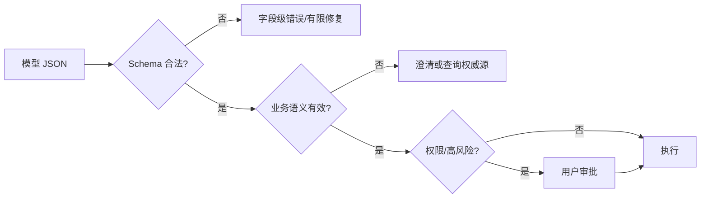

# Tool 的参数 Schema 应该如何设计？

## 原题原文

> 参数 schema 怎么设计？

## 答案

### 面试直答

Tool 参数 Schema 要做到“让模型容易填、让系统严格验”：字段少而明确，类型和必填项准确，枚举优于自由文本，业务对象尽量使用可查询的 ID；Schema 校验后还要做跨字段、权限和真实性校验。

### 一、字段设计

- 名称使用业务语言，描述包含单位、时区、格式和示例边界。
- 必填和可选分清，避免用空字符串表达缺失。
- 有限集合使用 enum；日期用 ISO 8601；数值设置 minimum/maximum。
- 使用 object/array 表达结构，禁止把复杂对象塞进一段 JSON 字符串。
- 用 oneOf/条件规则表达互斥模式，但避免嵌套过深影响模型填写。
- 默认值只用于真正安全且无歧义的字段。

> **核心小结：** Schema 越能表达约束，执行前需要模型“猜”的空间越小。

### 二、Schema 之外的校验

例如酒店 ID 即使是合法字符串，也必须确认真实存在且属于当前租户；入住日期还需满足退房日期更晚。金额、收件人、资源 ID 等不能让模型自由编造。

> **核心小结：** JSON Schema 保证形状，业务规则保证语义，权限系统保证能否执行。

### 三、版本与兼容

新增可选字段优于修改旧字段含义；重大变化使用新 Tool/版本；日志保存 Schema 版本。评测要覆盖首次生成合法率、自动修复率和语义错误率。

> **核心小结：** Schema 是 Agent 与工具之间的长期契约，需要版本化治理。

## 问题来源

- 公司：字节跳动
- 页面标题：字节面经-字节跳动AI Agent开发岗面经-01
- 面经小节：面经 11
- 岗位与面试时间：AI Agent开发岗 ｜ 面试时间：2026 年 8 月 13 日
- 题目在小节内的位置：第 4 条
- 来源链接：https://www.nowcoder.com/discuss/922659050167226368
- 在线核验：2026-09-01 已在公开网页正文中逐条核验
- 证据级别：网页公开正文原文
