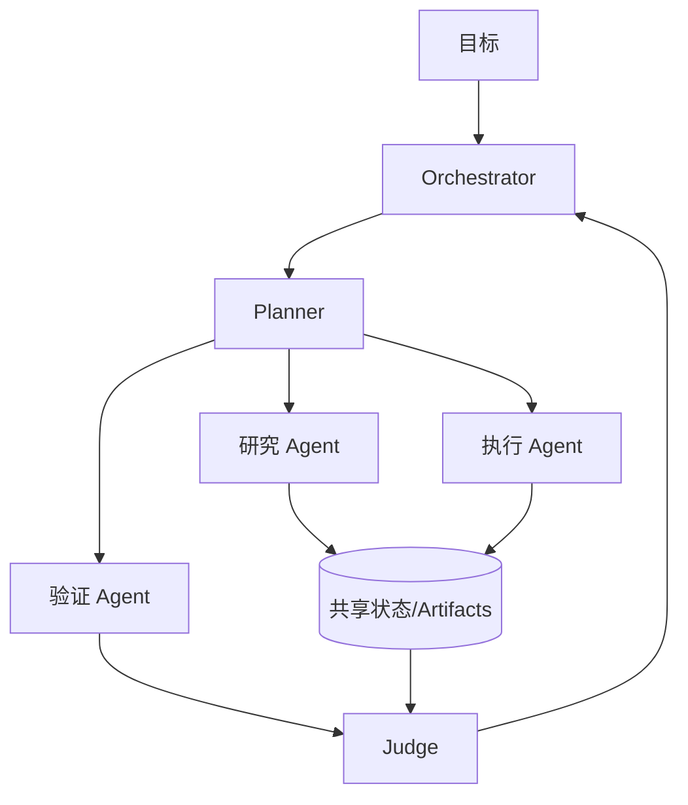

# 多 Agent 协作系统应该如何设计？

## 原题原文

> 多 Agent 协作系统怎么设计？

## 答案

### 面试直答

多 Agent 系统应围绕“为什么必须多 Agent”设计。常见架构是一个 Orchestrator 管理任务 DAG、共享状态和预算，专业 Agent在隔离 Context 中执行，结果通过结构化协议返回，再由 Judge 或确定性规则验收。

### 一、核心模块

共享状态只保存任务、Artifact 引用和结论，不把所有子 Agent 原始轨迹广播给所有人。

> **核心小结：** 多 Agent 的关键是任务边界、状态协议和验收，不是多开几个模型会话。

### 二、可靠性设计

- DAG 明确依赖和完成条件；无依赖节点才并行。
- 每个 Agent 使用最小工具和权限。
- 写操作使用 Worktree、租约或单写者规则。
- 总预算、单任务 Deadline、重试上限和取消信号统一管理。
- 记录 Agent 输入、输出、版本和证据，支持重放。

> **核心小结：** Orchestrator 必须控制并发、权限、成本和失败传播。

### 三、何时不使用

任务高度串行、共享 Context 很大或单 Agent 已能稳定完成时，多 Agent 会增加通信和一致性成本。先建立单 Agent 基线，再验证并行或专业化是否有净收益。

> **核心小结：** 多 Agent 是复杂度换吞吐或专业化，必须用相同预算的实验验证。

## 问题来源

- 公司：字节跳动
- 页面标题：字节面经-字节跳动AI Agent开发岗面经-01
- 面经小节：面经 11
- 岗位与面试时间：AI Agent开发岗 ｜ 面试时间：2026 年 8 月 13 日
- 题目在小节内的位置：第 5 条
- 来源链接：https://www.nowcoder.com/discuss/922659050167226368
- 在线核验：2026-09-01 已在公开网页正文中逐条核验
- 证据级别：网页公开正文原文
