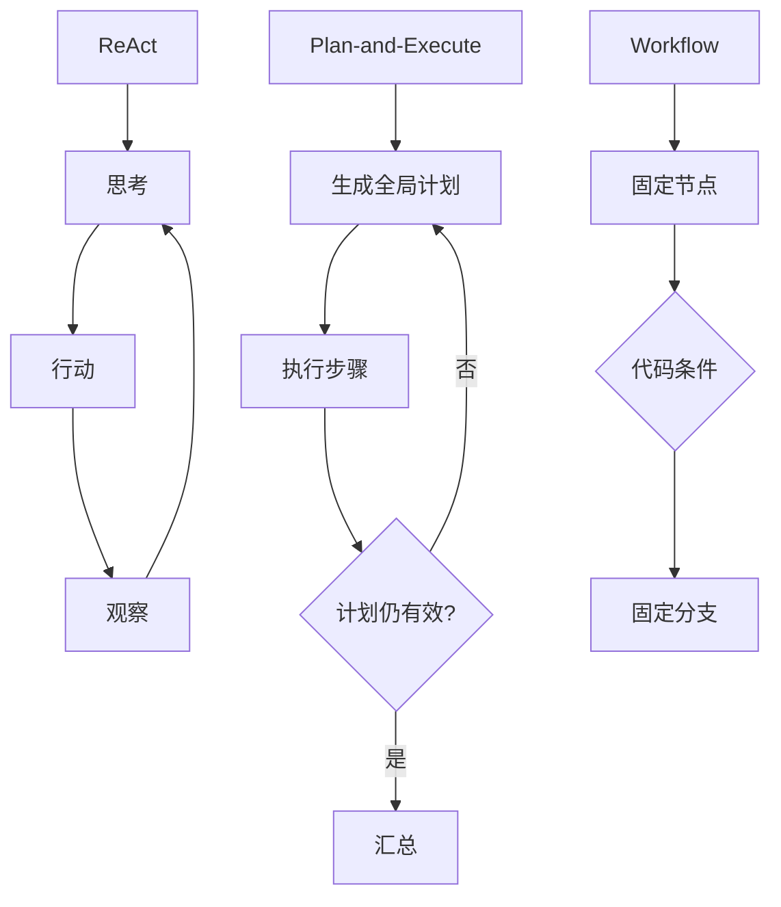
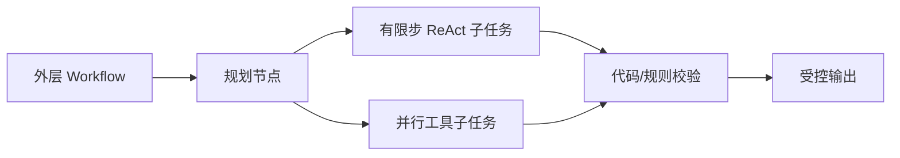

# ReAct、Plan-and-Execute 和 Workflow 有什么区别？

## 原题原文

> ReAct、Plan-and-Execute、Workflow 三者有什么区别？

## 答案

### 面试直答

ReAct、Plan-and-Execute 和 Workflow 的本质区别是 **谁控制下一步**：ReAct 由模型边执行边决定，Plan-and-Execute 先由模型生成全局计划，Workflow 则由代码预先定义节点和转移条件。

### 一、三种范式的工作原理

#### 1. ReAct：观察后再决定下一步

第 $t$ 步根据任务、历史轨迹和最新观察选择动作：

$$
a_t=\pi(x,h_t,o_t)
$$

执行工具得到 $o_{t+1}$，再进入下一轮 Thought → Action → Observation。

- 优点：能根据工具结果即时调整，适合路径未知的探索任务。
- 缺点：容易循环、路径震荡，调用次数和延迟不稳定。

> **核心小结：** ReAct 是局部动态决策，灵活但可预测性较弱。

#### 2. Plan-and-Execute：先看全局，再逐项完成

先生成计划 $P=[p_1,p_2,\ldots,p_n]$，Executor 按步骤执行；环境变化时可以重新规划。

- 优点：长任务结构更清晰，独立子任务可以并行。
- 缺点：初始计划可能基于错误假设；重新规划会增加成本。

> **核心小结：** Plan-and-Execute 用一次全局规划换取任务结构，但必须允许计划被校验和修正。

#### 3. Workflow：代码定义控制图

Workflow 可以表示为图 $G=(V,E)$：节点 $V$ 是固定业务步骤，边 $E$ 由代码条件决定。模型只在某些节点内完成分类、抽取或生成。

- 优点：行为稳定、容易测试和审计。
- 缺点：难处理设计时没有覆盖的新路径，流程维护成本会随分支增加。

> **核心小结：** Workflow 把控制权放在代码中，牺牲部分灵活性换取确定性。

### 二、控制流对比

| 维度 | ReAct | Plan-and-Execute | Workflow |
|---|---|---|---|
| 控制粒度 | 每一步动态决定 | 先计划，再执行 | 代码预定义 |
| 灵活性 | 高 | 中高 | 低到中 |
| 稳定性 | 中低 | 中 | 高 |
| 延迟 | 调用轮次不固定 | 规划有额外开销 | 通常最可控 |
| 适合 | 探索、路径未知 | 长任务、多子任务 | 稳定生产流程 |

> **核心小结：** 三者不是能力高低关系，而是灵活性、全局性和确定性之间的取舍。

### 三、工程落地怎么选

- 步骤未知、工具结果会改变决策：使用 ReAct，并设置最大步数、去重和超时。
- 任务可以拆成多个较独立子目标：使用 Plan-and-Execute，并增加计划校验、依赖关系和重规划条件。
- 流程固定、合规或 SLA 要求高：使用 Workflow，把模型限制在少数可控节点。
- 生产系统通常采用混合架构：外层 Workflow 控制权限、状态和失败分支；复杂节点内部使用 Planning 或有限步 ReAct。

> **核心小结：** 最稳妥的生产形态通常不是三选一，而是代码控制边界、模型处理不确定性。

### 常见追问

- **Plan-and-Execute 与 ReAct 最大区别？** 前者先建立全局任务结构，后者每得到一次观察再决定下一步。
- **Workflow 就不是 Agent 吗？** 是否叫 Agent 不是重点；关键看模型是否拥有目标驱动的动态决策权。
- **怎样防止 ReAct 失控？** 限制步数和预算、检测重复状态、约束工具权限，并设置可验证的停止条件。

## 问题来源

- 公司：字节跳动
- 页面标题：字节面经-字节跳动AI Agent开发岗面经-01
- 面经小节：面经 13
- 岗位与面试时间：AI Agent开发岗 ｜ 面试时间：2026 年 8 月 11 日
- 题目在小节内的位置：第 1 条
- 来源链接：https://www.nowcoder.com/discuss/922659050167226368
- 在线核验：2026-09-01 已在公开网页正文中逐条核验
- 证据级别：网页公开正文原文
