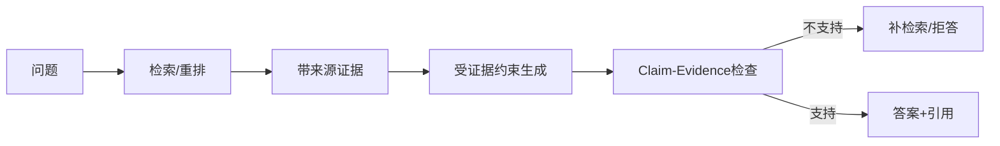

# 如何缓解 RAG 系统中的幻觉问题？

## 原题原文

> RAG 的幻觉问题怎么解决？

## 答案

### 面试直答

缓解 RAG 幻觉要先区分三类来源：没召回正确证据、召回了错误或冲突证据、模型没有忠实使用正确证据。对应地优化数据与检索、证据质量与排序、生成约束与拒答，不能只在 Prompt 中要求“不许幻觉”。

### 一、分层治理

| 层次 | 常见问题 | 处理 |
|---|---|---|
| 数据 | 文档过期、解析错、缺知识 | 版本、质检、增量更新 |
| 检索 | 漏召回、实体不准 | 查询改写、混合召回、Rerank |
| Context | 证据冲突、噪声过多 | 去重、来源和时间排序 |
| 生成 | 脱离证据补全 | 引用、证据约束、拒答 |
| 验证 | 无法发现错误 | Claim-Evidence 校验 |

> **核心小结：** RAG 幻觉往往是整条链路的错误，不能全部归因于生成模型。

### 二、生成与验证

要求关键结论绑定具体 Chunk 引用；证据不足或冲突时明确说明，不强行回答。生成后将答案拆成 Claim，检查每个 Claim 是否被证据支持；高风险事实再查询权威源。Judge 只能辅助，不能代替事实验证。

> **核心小结：** 可靠回答必须做到“证据可找到、结论可对齐、缺证据可拒答”。

### 三、评估

评测集同时保存标准答案和标准证据，分别测 Recall@K、忠实度、引用准确率、无证据拒答率及过期信息命中率。

> **核心小结：** 只有标准证据才能区分检索幻觉和生成幻觉。

## 问题来源

- 公司：字节跳动
- 页面标题：字节面经-字节跳动AI Agent开发岗面经-01
- 面经小节：面经 13
- 岗位与面试时间：AI Agent开发岗 ｜ 面试时间：2026 年 8 月 11 日
- 题目在小节内的位置：第 3 条
- 来源链接：https://www.nowcoder.com/discuss/922659050167226368
- 在线核验：2026-09-01 已在公开网页正文中逐条核验
- 证据级别：网页公开正文原文
