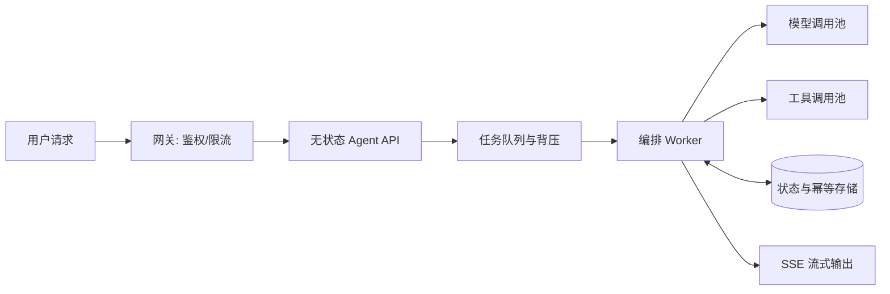

# 高并发场景下，Agent 服务怎么设计？

## 原题原文

> 高并发场景下，Agent 服务怎么设计？

## 答案

### 面试直答

高并发 Agent 服务要把 **入口、Agent 编排、模型调用、工具调用和状态存储分层隔离**，每层独立限流、超时和降级，避免一个慢模型或慢工具拖垮整条链路。

### 一、为什么 Agent 比普通接口更难扩展

一次 Agent 请求可能触发多轮模型和多个工具调用，延迟与资源消耗都不固定：

- 模型服务受 Token 吞吐和并发配额限制。
- 外部工具的容量、延迟和稳定性各不相同。
- ReAct 或重规划会放大单请求的下游调用量。
- 流式连接持续时间较长，占用连接和内存。

> **核心小结：** 外部 QPS 相同，不代表内部负载相同；容量评估必须看每次请求会放大成多少模型和工具调用。

### 二、分层架构

- API 层无状态化，便于水平扩容。
- 长任务或可异步任务进入队列，Worker 按容量消费。
- 模型、检索、每类工具使用不同并发池，防止相互挤占。
- 任务状态独立存储，实例重启后仍能恢复或安全终止。

> **核心小结：** 隔离不是多部署几个服务，而是让每种资源拥有独立的容量上限和故障边界。

### 三、背压、超时与重试

请求需要一套从外到内递减的超时预算，例如：总任务超时 > 单轮模型超时 > 单次工具超时。

- 队列满时拒绝、排队或降级，不能无限堆积。
- 重试只针对明确的瞬时错误，并使用指数退避和抖动。
- 写操作必须带幂等键，避免超时重试造成重复提交。
- 连续失败时熔断慢工具，返回部分结果或替代方案。
- 限制最大 Agent 步数、Token 和工具调用次数。

> **核心小结：** 没有背压的队列、没有预算的重试和没有上限的 Agent 循环，都会把局部故障放大成雪崩。

### 四、缓存、降级与流式返回

- 缓存稳定的检索结果、工具元数据和 Prompt 前缀，避免重复工作。
- 高峰期可切换小模型、减少候选数、关闭低优先级子任务。
- 流式返回降低首字等待时间，但不会降低总计算量。
- 客户端断开后，应及时取消仍在运行的模型和工具任务。

> **核心小结：** 降级要提前定义“哪些能力可以少、哪些正确性不能丢”。

### 五、监控指标

- 入口：QPS、排队时间、拒绝率、活跃流式连接数。
- Agent：平均步骤数、循环率、任务完成率、取消率。
- 下游：模型与各工具的 P50/P95/P99、错误率、超时率。
- 成本：每请求 Token、模型调用次数和工具调用次数。

> **核心小结：** 只监控 API 延迟看不到真正瓶颈，必须能下钻到每一步模型和工具调用。

## 问题来源

- 公司：字节跳动
- 页面标题：字节面经-字节跳动AI Agent开发岗面经-01
- 面经小节：面经 13
- 岗位与面试时间：AI Agent开发岗 ｜ 面试时间：2026 年 8 月 11 日
- 题目在小节内的位置：第 4 条
- 来源链接：https://www.nowcoder.com/discuss/922659050167226368
- 在线核验：2026-09-01 已在公开网页正文中逐条核验
- 证据级别：网页公开正文原文
