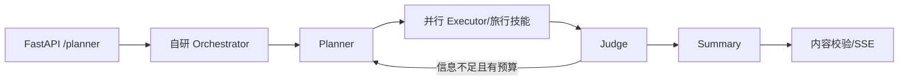

# 项目使用了什么 Agent 框架？为什么选择它？

## 原题原文

> 你们用的 Agent 框架是什么？

## 答案

### 面试直答

如果结合当前 Dynamic Planner 项目回答，我会明确说：**主链路没有使用 LangChain 或 LangGraph，而是基于 FastAPI、异步任务和自研 Orchestrator 实现。** Orchestrator 编排 Planner、并行 Executor、Judge 和 Summary，原因是旅行查询链路明确、强调 SSE 和低延迟，自研控制流更直接。

### 一、当前真实架构

Memory 在请求开始异步加载，Planner 需要时注入。`process_query` 当前无条件进入 `run_orchestrator`；仓库中的旧顺序 Planner 代码只用于回滚，不能描述为另一条活跃主链路。

> **核心小结：** 项目框架选择应以活跃调用链为证据，而不是看到目录名就套用 LangGraph。

### 二、为什么没有强行引入通用框架

现有 DAG 和角色边界相对稳定，自研代码可以直接控制并发、Judge 回路、旅行 Skill、Codeword 短路和 SSE 事件；引入框架会增加状态映射、调试和迁移成本。若未来需要通用持久化 Checkpoint、复杂条件图、人工中断恢复或大量可复用节点，再评估 LangGraph。

> **核心小结：** 框架的价值要覆盖其抽象与迁移成本；当前能稳定满足业务时不必为了“Agent 化”更换。

### 三、回答边界

可以说明理解 LangGraph 的 State、Node、Edge 和 Checkpoint，但不能把未使用的框架说成项目经历。具体线上收益也需要真实压测和评测报告。

> **核心小结：** 项目题优先讲真实选型与约束，框架知识作为对比而不是包装。

## 问题来源

- 公司：字节跳动
- 页面标题：字节面经-字节跳动AI Agent开发岗面经-01
- 面经小节：面经 15
- 岗位与面试时间：AI Agent开发岗 ｜ 面试时间：2026 年 8 月 5 日
- 题目在小节内的位置：第 1 条
- 来源链接：https://www.nowcoder.com/discuss/922659050167226368
- 在线核验：2026-09-01 已在公开网页正文中逐条核验
- 证据级别：网页公开正文原文
