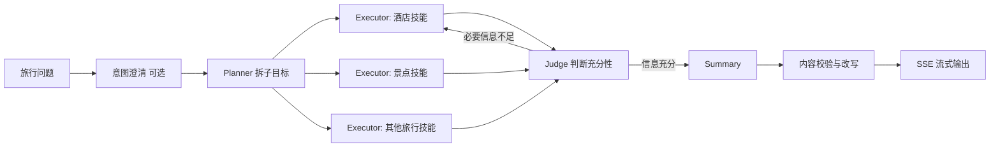

# 项目用的什么架构？

## 原题原文

> 项目用的什么架构？

## 答案

### 面试直答

我参与的 Dynamic Planner 是一个面向移动端旅行查询的业务 Agent。当前主链路采用角色编排：**Planner 拆解旅行子目标，Executor 并行调用技能，Judge 判断必要信息是否充分，Summary 生成答案，最后经过内容校验并以 SSE 流式返回。**

### 一、业务问题与设计目标

旅行问题通常不是单一步骤，例如“周末带孩子去杭州，两晚预算三千，安排酒店和景点”同时包含：

- 目的地与日期约束；
- 酒店、景点等多个业务子目标；
- 子目标之间的预算、位置和时间关联；
- 外部旅行数据可能缺失、超时或返回不完整。

因此系统不能只靠一次 Prompt 直接生成，需要把规划、执行、充分性判断和总结拆开。

> **核心小结：** Dynamic Planner 解决的是多约束旅行查询，不是通用文件操作或自主修改系统。

### 二、当前主链路

#### Planner

根据用户问题和可用技能拆出子目标，并区分必须完成和可选任务。Planner 流式产生子目标后，Executor 可以尽早启动，不必等完整计划结束。

> **核心小结：** Planner 负责把一个旅行问题变成可执行、可判断完成度的子目标。

#### Executor

每个 Executor 处理一个子目标并调用对应旅行技能。相互独立的子目标并行执行，以降低总体等待时间。

> **核心小结：** Executor 负责取数和执行，业务结果来自真实技能，不由 Summary 凭空生成。

#### Judge

Judge 重点检查 must 子目标是否成功并获得足够数据。信息不足时继续等待或补充，充分后才进入 Summary。

> **核心小结：** Judge 将“有没有足够证据”从“怎么组织答案”中分离出来。

#### Summary 与输出

Summary 将不同技能结果整理为面向用户的回答；之后执行内容校验和必要改写，再通过 SSE 返回移动端。

> **核心小结：** Summary 只负责整合已有结果，输出前仍要经过系统级校验。

### 三、关键工程设计

- Memory 在请求开始时异步加载，Planner 构造上下文时再等待并注入，减少串行等待。
- Planner 流式吐出子目标，Executor 可边规划边执行。
- 可选子目标不阻塞最终回答，必须子目标由 Judge 检查充分性。
- 工具结果包含特定 trip_link codeword 时，可以跳过 Summary，直接返回结构化结果。
- 每个角色和工具调用都有链路记录，便于定位规划、取数或总结问题。

> **核心小结：** 这个架构的重点是并行取数、必要信息闭环和适配移动端的稳定输出。

### 四、架构边界与取舍

- 它是业务 DAG，不是每一步都自由探索的通用 ReAct Loop。
- 角色拆分增加了模型调用和编排复杂度，换来更清楚的职责与可评估性。
- 仓库中的旧顺序 Planner 流水线用于回滚，当前活跃路径是角色编排器。

> **核心小结：** 面试时既要讲主链路，也要讲为什么选择它、付出了什么成本，以及哪些旧代码不属于当前运行路径。

### 项目依据

- agent/orchestrator.py：Planner、并行 Executor、Judge 主循环。
- agent/roles/：三个角色的具体实现。
- agent/summary.py：结果总结与结构化内容处理。
- service/planner_service.py：内容校验和 SSE 返回。

## 问题来源

- 公司：字节跳动
- 页面标题：字节面经-字节跳动AI Agent开发岗面经-01
- 面经小节：面经 15
- 岗位与面试时间：AI Agent开发岗 ｜ 面试时间：2026 年 8 月 5 日
- 题目在小节内的位置：第 2 条
- 来源链接：https://www.nowcoder.com/discuss/922659050167226368
- 在线核验：2026-09-01 已在公开网页正文中逐条核验
- 证据级别：网页公开正文原文
