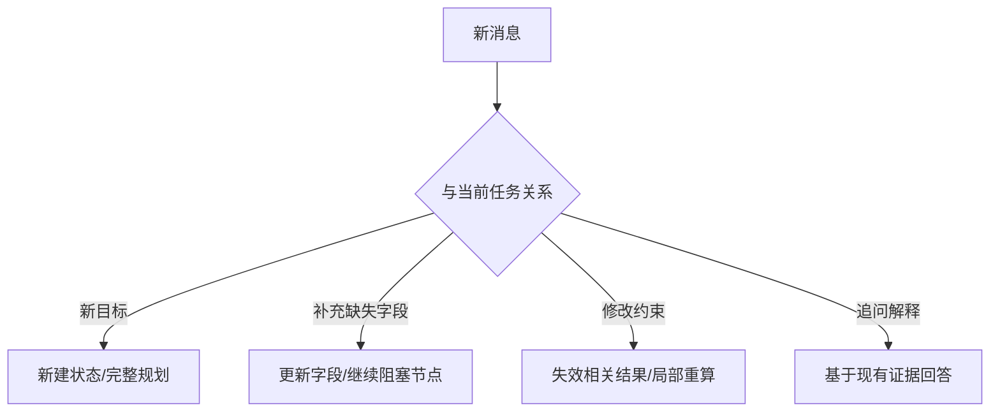

# 首次生成和多轮补充请求的路由链路应该如何区分和实现？

## 原题原文

> 首次生成和多轮补充的链路路由怎么区分和实现？

## 答案

### 面试直答

首次生成和多轮补充应先识别请求类型：新目标创建新的任务状态和计划；补充信息更新现有缺口并从受影响节点继续；修改约束需要使相关结果失效并局部重算；完全换题则开启新任务。

### 一、路由

路由综合会话 ID、当前等待字段、实体和意图；低置信度时澄清，不能把所有消息都追加到旧 Prompt 后重新跑全链路。

> **核心小结：** 多轮路由的关键是判断新消息对现有状态造成什么变化。

### 二、工程保护

每个结果记录依赖字段；约束变化时按依赖失效。使用版本号防并发覆盖，保留用户确认的最终约束。

> **核心小结：** 增量更新比全量重跑更快，但必须有可追踪依赖和失效规则。

## 问题来源

- 公司：字节跳动
- 页面标题：字节面经-字节跳动AI Agent开发岗面经-01
- 面经小节：面经 15
- 岗位与面试时间：AI Agent开发岗 ｜ 面试时间：2026 年 8 月 5 日
- 题目在小节内的位置：第 5 条
- 来源链接：https://www.nowcoder.com/discuss/922659050167226368
- 在线核验：2026-09-01 已在公开网页正文中逐条核验
- 证据级别：网页公开正文原文
