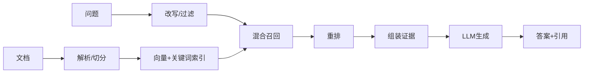

# RAG 的完整流程是什么？

## 原题原文

> RAG完整流程是怎样的？

## 答案

### 面试直答

RAG 的完整流程分成离线建库和在线问答：离线完成文档解析、清洗、切分、元数据、Embedding 和索引；在线完成 Query 理解、权限过滤、混合召回、重排、Context 组装、基于证据生成和引用。每一层都要独立评估。

### 一、两条链路

解析阶段保留标题、页码、表格和权限；在线阶段用向量检索覆盖语义、BM25 覆盖专名和编号，Reranker 提升正确证据排名。

> **核心小结：** 离线链路决定知识上限，在线链路决定证据能否被准确、及时地送给模型。

### 二、评估与工程

检索看 Recall@K、MRR/nDCG；生成看正确性、忠实度、完整性和引用准确率；系统看 P95 延迟、失败率与成本。文档用版本和哈希增量更新，新索引质检后再切换。证据不足时应拒答或提示缺失。

> **核心小结：** RAG 优化必须先定位是数据、召回、排序还是生成问题，不能只调 Prompt。

### 常见追问

- **Top-K 越大越好吗？** 不一定，过大会增加噪声和 Token，应与 Rerank 联合调参。
- **为什么要混合检索？** 向量擅长语义，关键词对精确实体更稳定。

## 问题来源

- 公司：字节跳动
- 页面标题：字节面经-字节跳动AI Agent开发岗面经-01
- 面经小节：面经 16
- 岗位与面试时间：AI Agent开发岗 ｜ 面试时间：2026 年 8 月 4 日
- 题目在小节内的位置：第 4 条
- 来源链接：https://www.nowcoder.com/discuss/922659050167226368
- 在线核验：2026-09-01 已在公开网页正文中逐条核验
- 证据级别：网页公开正文原文
