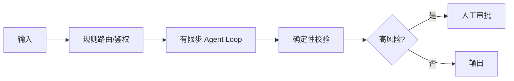

# Workflow 与 Agent Loop 分别应该如何设计？

## 原题原文

> Workflow和Agent的Loop各自怎么设计？

## 答案

### 面试直答

Workflow 与 Agent Loop 的设计边界取决于确定性：固定顺序、强 SLA 和高风险动作放 Workflow；需要根据工具结果动态选择路径的局部放 Agent Loop。常见生产架构是外层 Workflow 包住有限步 Agent。

### 一、组合方式

Workflow 管状态、重试、补偿和审计；Agent 根据非结构化信息选择工具。Agent 返回结构化结果，不能直接绕过外层控制。

> **核心小结：** 把确定性留给代码，把不确定性留给模型。

### 二、选型指标

比较任务成功率、P95 延迟、步骤方差、无效调用率和人工介入率。若路径高度稳定，应逐步固化为 Workflow；异常分支仍可保留 Agent。

> **核心小结：** Agent 与 Workflow 是连续谱，系统可根据线上轨迹逐步收敛控制流。

## 问题来源

- 公司：字节跳动
- 页面标题：字节面经-字节跳动AI Agent开发岗面经-01
- 面经小节：面经 17
- 岗位与面试时间：AI Agent开发岗 ｜ 面试时间：2026 年 8 月 3 日
- 题目在小节内的位置：第 4 条
- 来源链接：https://www.nowcoder.com/discuss/922659050167226368
- 在线核验：2026-09-01 已在公开网页正文中逐条核验
- 证据级别：网页公开正文原文
