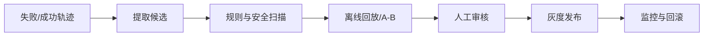

# Agent 自进化产物的提取标准应该如何设计？

## 原题原文

> agent自进化最后的产物第一你的提取的一个标准是怎样？

## 答案

### 面试直答

Agent 自进化产物不能按“模型觉得有用”直接沉淀，应按**可复用、可验证、可归因、无敏感信息、风险可控**筛选。候选可以是 Prompt、Skill、规则、测试样本或工具策略，但必须经过离线评测、人工审核和版本化发布。

### 一、提取标准

- 重复性：同类问题多次出现，而非一次偶然轨迹。
- 有效性：在独立回放集上稳定提升任务成功率。
- 通用性：明确适用范围，不绑定一次会话临时状态。
- 可解释：记录来源、修改理由和预期影响。
- 安全性：不包含凭据、个人信息和未经授权的代码。
- 可回滚：有版本、灰度和失效条件。

> **核心小结：** 可沉淀产物必须从“成功过一次”升级为“在独立样本上可重复验证”。

### 二、发布流程

生产 Agent 只能读取已发布版本，不能直接把本轮生成物写进全局 Skill。

> **核心小结：** 自进化应是受治理的离线发布流水线，不是线上模型自我授权。

## 问题来源

- 公司：字节跳动
- 页面标题：字节面经-字节跳动AI Agent开发岗面经-01
- 面经小节：面经 18
- 岗位与面试时间：AI Agent开发岗 ｜ 面试时间：2026 年 7 月 31 日
- 题目在小节内的位置：第 2 条
- 来源链接：https://www.nowcoder.com/discuss/922659050167226368
- 在线核验：2026-09-01 已在公开网页正文中逐条核验
- 证据级别：网页公开正文原文
