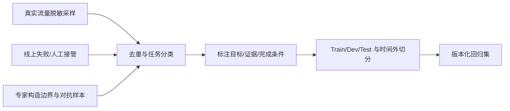

# 如何测试 Agent 并设计评测集？

## 原题原文

> agent测评你怎么测试，怎么设计测试集

## 答案

### 面试直答

测试 Agent 要把系统拆成**确定性组件测试、节点评测、轨迹评测和端到端任务评测**。评测集按真实流量、核心能力、失败案例和对抗边界分层，并固定数据版本，才能判断一次改动到底提升了什么。

### 一、测试金字塔

1. **单元测试**：Schema、路由、状态转换、权限、重试和解析器。
2. **工具契约测试**：参数校验、超时、错误码、幂等和 Mock 返回。
3. **节点评测**：Planner 拆解、Retriever 召回、Judge 评分、Summary 忠实度。
4. **轨迹评测**：工具顺序、无效步骤、循环、预算和恢复。
5. **端到端评测**：用户目标是否在 SLA 和成本内完成。

> **核心小结：** 越靠下越稳定、定位越快；越靠上越接近用户价值，但波动和成本越大。

### 二、评测集怎么设计

每条样本至少保存输入、上下文、允许工具、标准证据、完成条件和安全约束。高频场景保证覆盖率，低频高风险场景单独设红线集。防止同一模板改写泄漏到训练和测试两边。

> **核心小结：** 评测集不是问题列表，而是包含环境、工具、证据和验收条件的可复现任务。

### 三、评分与工程实践

优先级通常是执行验证 > 规则 > 人工 > LLM Judge。随机性任务重复运行并报告均值、方差和失败分布；固定模型、Prompt、工具版本和温度。上线前跑回归，上线后灰度或 A/B，并把新失败回灌。

> **核心小结：** 只有环境与版本可复现，Agent 对比才有意义。

### 常见追问

- **评测集多大才够？** 取决于场景分层和置信区间；先保证关键桶都有足够样本，而不是追求一个总数。
- **如何降低 LLM Judge 偏差？** 使用明确 Rubric、隐藏系统身份、人工校准，并检查不同 Judge 的一致性。

## 问题来源

- 公司：字节跳动
- 页面标题：字节面经-字节跳动AI Agent开发岗面经-01
- 面经小节：面经 19
- 岗位与面试时间：AI Agent开发岗 ｜ 面试时间：2026 年 7 月 30 日
- 题目在小节内的位置：第 1 条
- 来源链接：https://www.nowcoder.com/discuss/922659050167226368
- 在线核验：2026-09-01 已在公开网页正文中逐条核验
- 证据级别：网页公开正文原文
