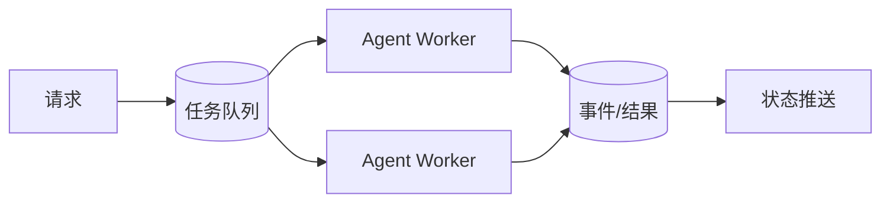

# 消息队列在 AI Agent 系统中有什么作用？

## 原题原文

> 消息队列在 AI Agent 系统中的作用是什么？

## 答案

### 面试直答

消息队列在 Agent 系统中用于削峰、异步解耦、任务调度、重试和事件流。它让 API 快速接收任务，Worker 按容量消费，并支持长任务状态更新；但队列不自动保证业务 exactly-once，仍需幂等。

### 一、典型链路

> **核心小结：** 队列把用户到达速率与模型/工具处理速率解耦。

### 二、工程注意

消息包含 task_id、租户、优先级、Deadline、尝试次数和幂等键；使用可见性超时、死信队列和指数退避。过期任务在消费前丢弃，避免排队后仍昂贵执行。

> **核心小结：** 队列解决调度和背压，幂等、顺序和状态一致性仍需业务设计。

## 问题来源

- 公司：字节跳动
- 页面标题：字节面经-字节跳动AI Agent开发岗面经-01
- 面经小节：面经 21
- 岗位与面试时间：AI Agent开发岗 ｜ 面试时间：2026 年 7 月 29 日
- 题目在小节内的位置：第 3 条
- 来源链接：https://www.nowcoder.com/discuss/922659050167226368
- 在线核验：2026-09-01 已在公开网页正文中逐条核验
- 证据级别：网页公开正文原文
