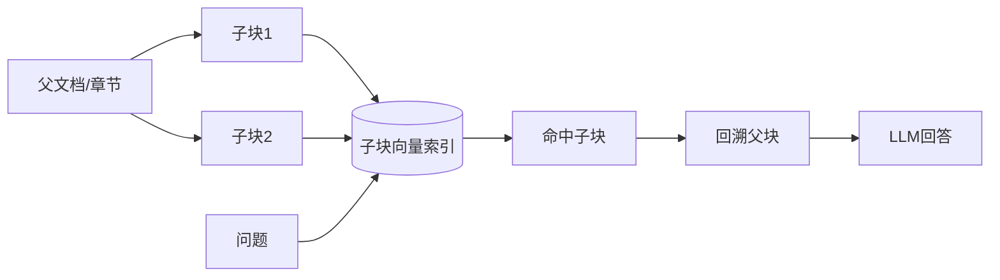

# RAG 流程中为什么要引入父子索引？

## 原题原文

> RAG 流程中为什么要引入父子索引？

## 答案

### 面试直答

父子索引用“小块召回、大块生成”解决粒度矛盾：子 Chunk 足够小，Embedding 主题集中、易命中；召回后返回它所属的父段落或章节，为模型提供完整上下文。

### 一、工作流程

索引保存 child_id、parent_id、标题路径和权限。检索时对子块排序、去重父 ID，再按 Token 预算取父块或子块邻域。

> **核心小结：** 子块提高召回精度，父块恢复回答所需的语义完整性。

### 二、适用与代价

适合论文、制度、合同和长章节；不适合本身已经很短的 FAQ。父块过大会重新引入噪声，多个子块映射同一父块也会浪费 Context，因此需要去重和大小限制。评估应对比普通切分与父子索引的 Recall、答案正确性、重复率、延迟和 Token。

> **核心小结：** 父子索引不是固定增益，父块大小和回溯策略要通过评测确定。

### 常见追问

- **父块一定是整章吗？** 不一定，可以是段落、窗口或结构节点。
- **与 Overlap 有何区别？** Overlap 在相邻块复制内容；父子索引保留层级关系，召回后按需扩展。

## 问题来源

- 公司：字节跳动
- 页面标题：字节面经-字节跳动AI Agent开发岗面经-01
- 面经小节：面经 21
- 岗位与面试时间：AI Agent开发岗 ｜ 面试时间：2026 年 7 月 29 日
- 题目在小节内的位置：第 6 条
- 来源链接：https://www.nowcoder.com/discuss/922659050167226368
- 在线核验：2026-09-01 已在公开网页正文中逐条核验
- 证据级别：网页公开正文原文
