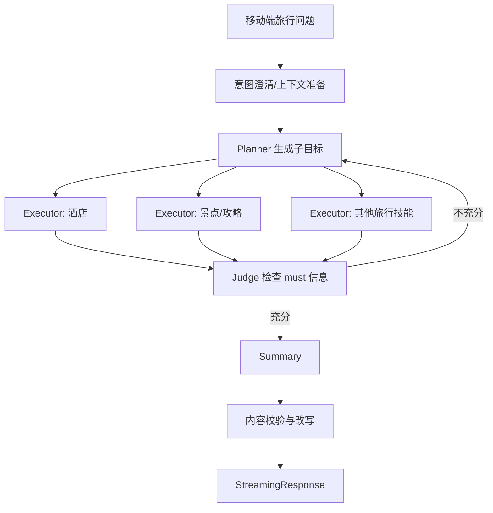

# 之前参与的 Agent 项目采用了什么架构？

## 原题原文

> 你之前的Agent项目用的什么架构？

## 答案

### 面试直答

如果基于当前 Dynamic Planner 项目回答，我会说它采用的是**受控的单主链路、多角色编排架构**：入口完成意图处理后进入 Orchestrator，由 Planner 拆分旅行子目标，多个 Executor 并行调用旅行技能，Judge 判断信息充分性，最后由 Summary 生成 SSE 流式回答。它不是多个完全自治 Agent 自由对话，也不是无限步 ReAct。

### 一、真实主链路

Memory 在请求开始时异步加载，在 Planner 构建上下文时注入。当前 `process_query` 主链路无条件进入 `run_orchestrator`；仓库里保留的旧顺序 Planner 流水线是回滚代码，不能描述为同时在线的第二套架构。

> **核心小结：** 当前生产思路是 Planner 管拆解、Executor 管并行技能、Judge 管充分性、Summary 管表达。

### 二、为什么这样设计

旅行查询既有多意图，又强调移动端低延迟。完全开放的 ReAct 会让“查一次—看结果—再决定”串行增长；这里先拆分相对稳定的酒店、景点等子目标，再并行调用工具，可以降低串行等待。同时用 Judge 设置有限回路，避免一次检索不足，也避免无限探索。

> **核心小结：** 这套架构用受控 DAG 和有限重规划，在灵活性、延迟与可预测性之间折中。

### 三、边界与代价

- Planner 增加一次模型耗时，只有并行收益大于规划开销才划算。
- Judge 不是事实真值，需要用标准证据和失败样本评估。
- 多 Executor 会带来并发限流、结果去重和部分失败处理。
- Summary 只能组织已有证据，不能补救上游工具漏召回。
- 项目指标应引用真实评测报告；当前代码能证明架构，不能证明具体线上收益。

> **核心小结：** 架构描述必须区分源码可证实的主链路、回滚代码和尚未验证的效果指标。

### 常见追问

- **这是多 Agent 吗？** 更准确地说是一个 Orchestrator 内的多角色协作，不是多个长期自治主体。
- **为什么不用 LangGraph？** 当前重点是业务 DAG、并行技能和 SSE，是否换框架要看状态持久化、可观测性和迁移成本，而不是框架名。

## 问题来源

- 公司：字节跳动
- 页面标题：字节面经-字节跳动AI Agent开发岗面经-01
- 面经小节：面经 22
- 岗位与面试时间：AI Agent开发岗 ｜ 面试时间：2026 年 7 月 29 日
- 题目在小节内的位置：第 1 条
- 来源链接：https://www.nowcoder.com/discuss/922659050167226368
- 在线核验：2026-09-01 已在公开网页正文中逐条核验
- 证据级别：网页公开正文原文
