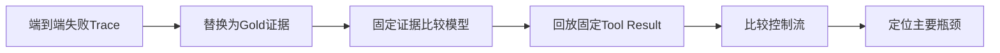

# 优化 Agent 时，如何判断性能瓶颈来自模型、检索还是工具调用？

## 原题原文

> Agent 优化过程中，如何判断性能瓶颈到底来自模型、检索还是工具调用？

## 答案

### 面试直答

判断 Agent 瓶颈要做分层 Trace 和可控消融：把一次请求拆成路由或规划、检索、模型、工具、Judge 和生成，记录每层耗时、错误、输入输出与质量；然后固定其他层替换或回放单层，观察端到端指标变化。

### 一、先看症状

| 现象 | 优先怀疑 |
|---|---|
| 正确证据从未进入 Top-K | 检索或数据 |
| 证据正确但答案错误 | 模型、Prompt 或 Context |
| 参数错误、超时、空结果 | Tool、Schema 或依赖 |
| 结果正确但 P95 很高 | 串行控制流、慢工具或模型 |
| 重复动作和循环 | Planner 或 Harness |

> **核心小结：** 用过程证据定位，不根据最终回答失败就直接怪模型。

### 二、单变量验证

- **检索**：把标准证据直接喂给模型；若回答恢复，问题在检索链路。
- **模型**：固定同一证据比较模型或 Prompt；或用 Gold Answer 检查 Judge。
- **工具**：回放固定 Tool Result；若流程恢复，问题在调用或依赖。
- **编排**：比较固定 Workflow、单轮、有限 Loop，在相同预算下测。

> **核心小结：** Gold 输入与回放能隔离上游错误，是最有效的归因方法。

### 三、指标

检索看 Recall@K/MRR；模型看忠实度、格式和 Judge 校准；工具看成功率、参数错误和 P95；系统看任务成功率和每成功任务成本。

> **核心小结：** 每层都有自己的质量与效率指标，最终用端到端任务成功做闭环。

## 问题来源

- 公司：阿里巴巴
- 页面标题：阿里面经-阿里AI Agent开发岗面经-01
- 面经小节：面经 01
- 岗位与面试时间：AI Agent 开发 ｜ 面试时间：2026 年 8 月 17 日
- 题目在小节内的位置：第 1 条
- 来源链接：https://www.nowcoder.com/discuss/923739430513299456
- 在线核验：2026-09-01 已在公开网页正文中逐条核验
- 证据级别：网页公开正文原文
