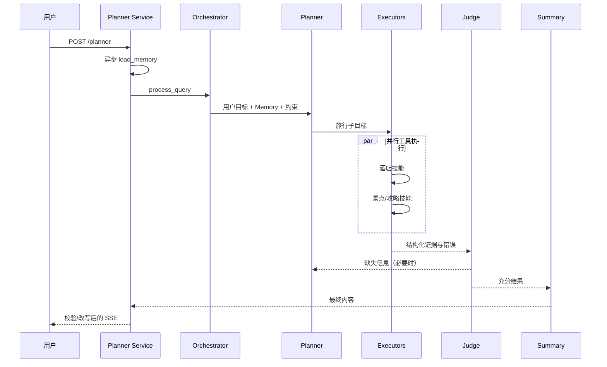

# 项目中 Agent 的完整执行流程是什么？

## 原题原文

> 项目中 Agent 的完整流程是怎样的？

## 答案

### 面试直答

当前 Dynamic Planner 的完整执行流程是：**请求进入 FastAPI → 异步加载 Memory → 可选意图澄清 → Orchestrator 调用 Planner → 并行 Executor 执行旅行技能 → Judge 检查信息充分性并有限重规划 → Summary 生成回答 → 内容校验后通过 SSE 流式返回。**

### 一、端到端流程

Memory 不是先阻塞全部入口，而是在请求开始时创建异步任务，Planner 真正需要时再等待；这可以把部分 I/O 与前置处理重叠。Planner 输出子目标后，Executor 对没有依赖的旅行技能并行执行。

> **核心小结：** 主链路通过异步 Memory 和并行 Executor 缩短等待，通过 Judge 和内容校验控制质量。

### 二、异常和回退

- 工具失败应返回结构化错误，而不是空字符串。
- 部分 Executor 成功时，Judge 判断是否仍能回答或需要补查。
- 重规划必须有次数和耗时预算，不能无限循环。
- SSE 要区分进度、内容、错误和完成事件，客户端才能正确恢复 UI。
- 高风险或证据不足时明确降级，不让 Summary 编造缺失信息。

> **核心小结：** 完整流程不仅包括成功路径，还包括部分失败、预算耗尽和流式中断的处理。

### 三、如何评估

分层记录 Planner 拆解正确率、工具成功率与延迟、Judge 误判、最终答案正确性、P95 总延迟和单请求成本。只看最终回答无法定位问题；只看节点成功也不代表用户目标完成。

> **核心小结：** 端到端指标判断业务结果，节点指标定位规划、工具、判断和生成中的具体瓶颈。

### 常见追问

- **旧的标准 Planner 流水线还在用吗？** 当前活跃路径是 `run_orchestrator`，旧代码主要用于回滚，不应当成双路同时运行。
- **为什么使用 SSE？** 旅行查询耗时包含规划和多工具调用，SSE 可逐步反馈进度并降低用户感知等待。

## 问题来源

- 公司：阿里巴巴
- 页面标题：阿里面经-阿里AI Agent开发岗面经-01
- 面经小节：面经 03
- 岗位与面试时间：AI Agent 开发 ｜ 面试时间：2026 年 8 月 5 日
- 题目在小节内的位置：第 1 条
- 来源链接：https://www.nowcoder.com/discuss/923739430513299456
- 在线核验：2026-09-01 已在公开网页正文中逐条核验
- 证据级别：网页公开正文原文
