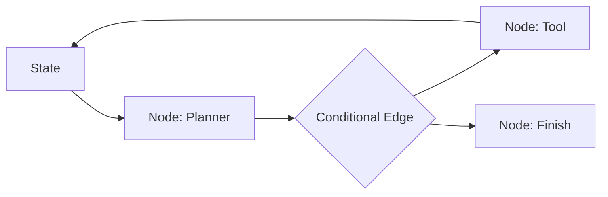

# 为什么选择 LangChain 或 LangGraph？是否了解其底层流程？

## 原题原文

> langchain、langgraph 这些框架为什么选择？底层流程了解吗？

## 答案

### 面试直答

LangChain 更像组件和集成库，提供模型、Prompt、Retriever、Tool 等统一接口；LangGraph 更像有状态图运行时，用 Node、Edge、State 和 Checkpoint 编排长流程。选择它们应因为集成生态、持久状态、人机中断或复杂图确有需要，而不是因为项目叫 Agent。

### 一、底层流程

LangChain 的典型链路是 Runnable 接收输入，依次调用模型、解析器、Retriever 或 Tool，并通过 Callback/Tracing 观察。LangGraph 则将共享 State 输入 Node，Node 返回状态更新，Reducer 合并字段，条件 Edge 决定下一个 Node；Checkpoint 按 Thread 保存状态，支持暂停、恢复和 Human-in-the-loop。

> **核心小结：** LangChain 抽象调用组件，LangGraph 抽象有状态控制流，两者可以组合但职责不同。

### 二、为什么选或不选

适合：需要大量现成 Connector、复杂条件图、Checkpoint、人工审批和 Trace。可能不适合：链路很短、对极低延迟和定制事件协议要求高，或现有自研 Runtime 已稳定。框架升级和抽象泄漏也是成本。

当前 Dynamic Planner 主链路使用自研 Orchestrator，而非 LangGraph；这能直接控制 Planner、并行旅行技能、Judge 和 SSE。回答项目经历时应如实说明。

> **核心小结：** 选型要从状态复杂度、恢复需求、生态复用和迁移成本出发。

## 问题来源

- 公司：阿里巴巴
- 页面标题：阿里面经-阿里AI Agent开发岗面经-01
- 面经小节：面经 03
- 岗位与面试时间：AI Agent 开发 ｜ 面试时间：2026 年 8 月 5 日
- 题目在小节内的位置：第 7 条
- 来源链接：https://www.nowcoder.com/discuss/923739430513299456
- 在线核验：2026-09-01 已在公开网页正文中逐条核验
- 证据级别：网页公开正文原文
