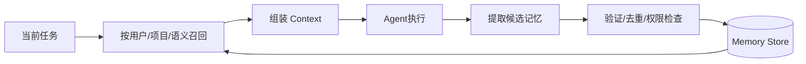

# Agent 的记忆模块应该如何设计？

## 原题原文

> 记忆模块是怎么设计的？

## 答案

### 面试直答

Agent Memory 应设计成分层系统：工作记忆保存当前任务状态；情景记忆保存历史任务及结果；语义记忆保存稳定事实与偏好；程序性记忆保存可复用流程。写入、检索、冲突处理和删除必须由 Harness 管理。

### 一、读写闭环

召回综合语义相似、时间衰减、重要度和作用域；写入保留来源与证据。

> **核心小结：** Memory 是有选择的读写系统，不是把每轮对话都存进向量库。

### 二、可靠性

新旧事实冲突时保留版本并优先当前权威来源；敏感数据加密和租户隔离；高风险动作重新查询真实系统。评估召回正确率、过期率、错误写入率和任务增益。

> **核心小结：** 好 Memory 的关键是正确写、相关读、可更新、可删除。

## 问题来源

- 公司：阿里巴巴
- 页面标题：阿里面经-阿里AI Agent开发岗面经-01
- 面经小节：面经 03
- 岗位与面试时间：AI Agent 开发 ｜ 面试时间：2026 年 8 月 5 日
- 题目在小节内的位置：第 9 条
- 来源链接：https://www.nowcoder.com/discuss/923739430513299456
- 在线核验：2026-09-01 已在公开网页正文中逐条核验
- 证据级别：网页公开正文原文
