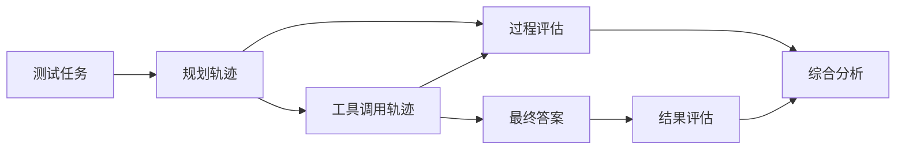

# 如何设计评价 Agent 系统好坏的指标体系？

## 原题原文

> 如何设计评价 Agent 系统好坏的指标体系？

## 答案

### 面试直答

评价 Agent 不能只看最终答案，还要同时衡量 **任务结果、执行过程、效率成本、可靠性与安全性**；离线评测负责可重复对比，线上指标负责验证真实用户效果。

### 一、结果指标：任务有没有完成

不同任务应先定义可判定的成功条件：

- 任务成功率：成功完成的样本数 / 总样本数。
- 答案正确率：事实、计算和引用是否正确。
- 约束满足率：预算、时间、格式、权限等要求是否全部满足。
- 部分完成率：复杂任务中完成了多少必要子目标。

结果最好优先使用规则、工具返回值或人工标准答案判定；开放回答再使用人工或 LLM Judge。

> **核心小结：** 先定义什么叫“完成”，否则一个模糊总分无法指导优化。

### 二、过程指标：Agent 是怎么完成的

- 工具选择正确率和参数正确率。
- 无效调用率、重复调用率和平均步骤数。
- 规划覆盖率：必要子目标是否被拆出。
- 失败恢复率：工具超时或空结果后是否能正确回退。
- 证据一致性：最终答案是否真正来自工具结果。

> **核心小结：** 结果失败时，过程指标能告诉我们错在规划、工具还是生成，而不是只得到一个低分。

### 三、效率、可靠性和安全性

| 维度 | 典型指标 |
|---|---|
| 效率 | P50/P95 延迟、Token、模型调用数、单任务成本 |
| 可靠性 | 超时率、异常率、循环率、重试成功率 |
| 安全性 | 越权调用率、敏感信息泄露率、危险操作拦截率 |
| 体验 | 首字延迟、用户打断率、追问率、满意度 |

> **核心小结：** 成功率相近时，应选择延迟更稳定、成本更低、风险更可控的方案。

### 四、评测数据与方法

测试集应覆盖：

- 高频真实任务和长尾任务；
- 多轮对话、长上下文和多工具组合；
- 工具超时、空结果、脏数据等失败场景；
- 越权请求、Prompt Injection 等安全样本。

LLM Judge 适合规模化评审开放回答，但要先用人工样本检查一致性，并固定模型、Prompt 和评分标准。关键指标应尽量由确定性规则复核。

> **核心小结：** LLM Judge 是评测工具，不应成为唯一真值来源。

### 五、离线到线上闭环

- 新版本先做离线回归，防止旧能力退化。
- 通过后进行小流量灰度或 A/B 测试。
- 将线上失败案例分类并补回测试集。

> **核心小结：** 好的评估体系不是一次打分，而是让线上失败持续变成下一轮可复现测试。

## 问题来源

- 公司：阿里巴巴
- 页面标题：阿里面经-阿里AI Agent开发岗面经-01
- 面经小节：面经 04
- 岗位与面试时间：AI Agent 开发 ｜ 面试时间：2026 年 7 月 14 日
- 题目在小节内的位置：第 2 条
- 来源链接：https://www.nowcoder.com/discuss/923739430513299456
- 在线核验：2026-09-01 已在公开网页正文中逐条核验
- 证据级别：网页公开正文原文
