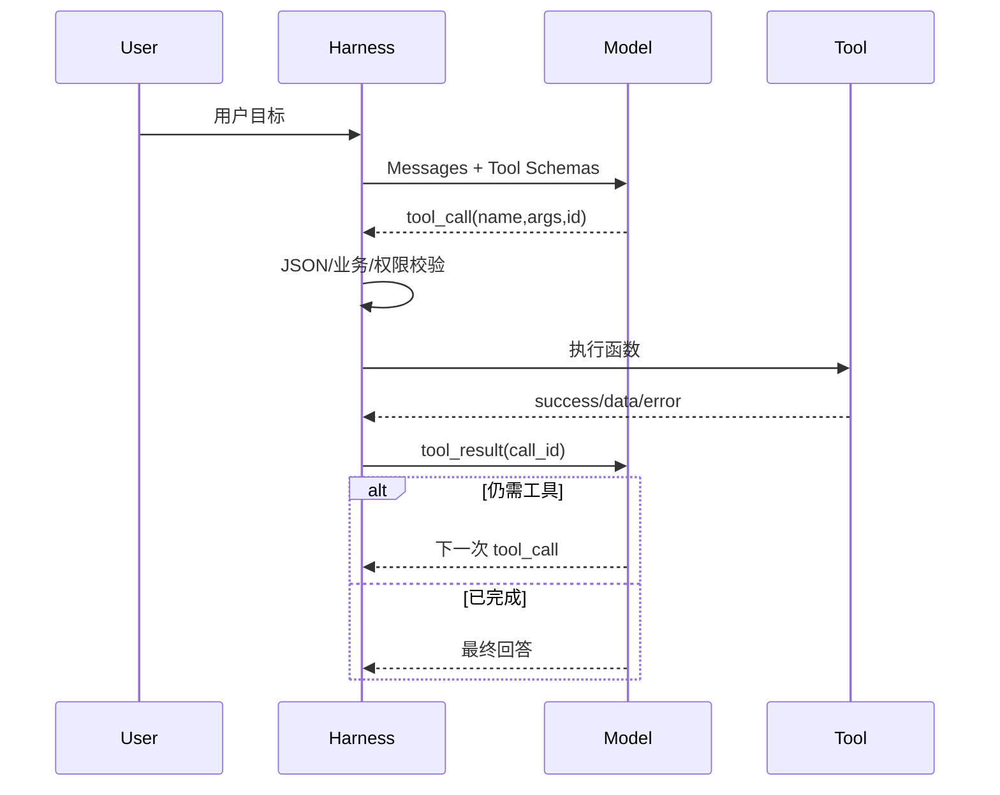

# Function Calling 的完整流程是什么？

## 原题原文

> 项目二中 Function Calling 的流程是怎样的？

## 答案

### 面试直答

Function Calling 的完整流程是：应用把工具名称、描述和参数 Schema 随上下文发送给模型；模型返回结构化 Tool Call；Harness 校验参数、权限和业务规则后执行真实函数；再把带 Tool Call ID 的结果回传模型，模型基于结果继续调用或生成最终回答。

### 一、时序

> **核心小结：** 模型只生成调用意图，函数的真实执行、权限与副作用由应用负责。

### 二、关键工程点

- Tool Call 与 Tool Result 使用唯一 ID 配对。
- 参数通过 JSON Schema 后仍做业务真实性校验。
- 写操作使用幂等键、审批和回读确认。
- 错误返回 code、message 和 retryable，不能伪装成普通成功文本。
- 多工具调用按依赖并行或串行，总轮数和 Deadline 有上限。

> **核心小结：** Function Calling 是结构化接口，不等于模型获得了直接执行权限。

### 三、与 MCP 的区别

Function Calling 描述模型与 Host 的结构化调用方式；MCP 标准化 Host 与外部 Tool Server 的发现、Schema 和 RPC。两者可组合：模型发 Function Call，Host 再通过 MCP Client 调用 Server。

> **核心小结：** Function Calling 是模型接口机制，MCP 是外部能力互操作协议。

## 问题来源

- 公司：阿里巴巴
- 页面标题：阿里面经-阿里AI Agent开发岗面经-01
- 面经小节：面经 04
- 岗位与面试时间：AI Agent 开发 ｜ 面试时间：2026 年 7 月 14 日
- 题目在小节内的位置：第 6 条
- 来源链接：https://www.nowcoder.com/discuss/923739430513299456
- 在线核验：2026-09-01 已在公开网页正文中逐条核验
- 证据级别：网页公开正文原文
