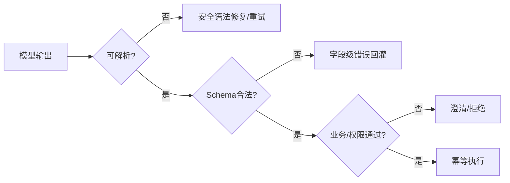

# Function Calling 返回的 JSON 不规范时如何处理？

## 原题原文

> Function Call 返回的 JSON 不标准怎么解决？

## 答案

### 面试直答

Function Calling JSON 不规范时，先由严格解析和 Schema 校验给出字段级错误，再把错误反馈给模型做一次或有限次修复；能确定的安全格式问题可由 Parser 修复，但不能猜业务值。仍失败时澄清、降级或人工处理，绝不能直接执行。

### 一、错误分层

| 错误 | 处理 |
|---|---|
| JSON 语法错误 | 严格解析；可做安全的括号/转义修复 |
| 缺少必填字段 | 返回缺失路径，要求模型补全或询问用户 |
| 类型/枚举错误 | Schema 错误回灌，重新生成 |
| 跨字段冲突 | 业务 Validator 拒绝 |
| 实体/金额等捏造 | 查询权威系统或用户确认 |

> **核心小结：** 自动修复只处理表达形式，不替模型猜测事实和高风险参数。

### 二、推荐流程

优先使用模型 API 的结构化输出或严格 Tool Schema；温度降低只能辅助，不能代替验证。日志保存原始输出、错误和修复次数，并对敏感字段脱敏。

> **核心小结：** 可靠方案是“约束生成 + 确定性验证 + 有限修复 + 安全失败”。

### 三、指标

统计首次合法率、修复成功率、语义校验失败率、错误执行率和额外延迟。若某字段持续失败，应改 Schema 描述或工具边界，而不是无限加重试。

> **核心小结：** JSON 错误是模型、Schema 和工具设计共同作用的信号。

## 问题来源

- 公司：阿里巴巴
- 页面标题：阿里面经-阿里AI Agent开发岗面经-01
- 面经小节：面经 04
- 岗位与面试时间：AI Agent 开发 ｜ 面试时间：2026 年 7 月 14 日
- 题目在小节内的位置：第 7 条
- 来源链接：https://www.nowcoder.com/discuss/923739430513299456
- 在线核验：2026-09-01 已在公开网页正文中逐条核验
- 证据级别：网页公开正文原文
