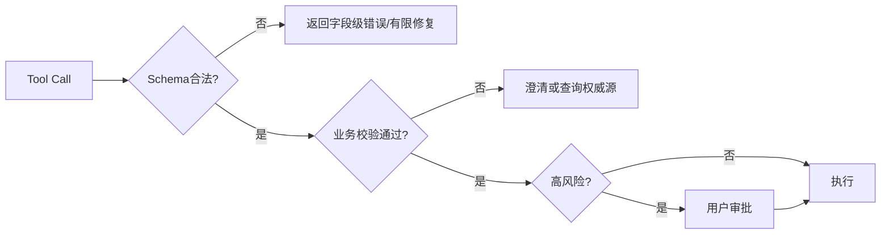

# 大模型捏造工具调用参数时应该如何处理？

## 原题原文

> 大模型经常捏造工具调用参数，怎么处理？

## 答案

### 面试直答

模型捏造工具参数时，绝不能直接执行。先做 JSON Schema 和业务语义校验；缺失信息向用户澄清，可从可信上下文确定的字段才自动补全；实体 ID、金额、日期和权限等高风险字段必须查询真实系统或确认。

### 一、处理流程

> **核心小结：** 参数合法不等于参数真实，Schema 后还要做业务和权限校验。

### 二、工程原则

参数标注来源；枚举和 ID 尽量由 Tool 返回候选，不让模型自由生成；修复最多有限次数；写操作使用幂等键并回读确认。日志中脱敏参数。

> **核心小结：** 模型负责提议参数，权威系统和用户负责确认关键事实。

## 问题来源

- 公司：阿里巴巴
- 页面标题：阿里面经-阿里AI Agent开发岗面经-01
- 面经小节：面经 04
- 岗位与面试时间：AI Agent 开发 ｜ 面试时间：2026 年 7 月 14 日
- 题目在小节内的位置：第 8 条
- 来源链接：https://www.nowcoder.com/discuss/923739430513299456
- 在线核验：2026-09-01 已在公开网页正文中逐条核验
- 证据级别：网页公开正文原文
