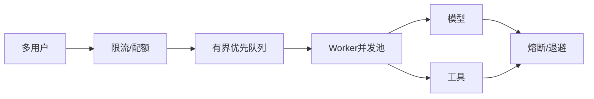

# 多用户并发调用 API 时，任务过多导致系统卡死，应该如何设计？

## 原题原文

> 多用户同时调用 API，任务一多就卡死，怎么设计？

## 答案

### 面试直答

多用户任务过多卡死，根因通常是无界并发和下游容量不匹配。我会设置接入限流、租户配额、有界队列、Worker 并发池、总体 Deadline、背压和熔断；超过容量时排队或快速失败，而不是继续创建协程。

### 一、容量链路

> **核心小结：** 系统必须让到达率服从可处理容量，不能用无限异步掩盖过载。

### 二、工程措施

按模型、租户和工具分别设信号量；长短任务分队列；请求携带 Deadline，排队过期直接取消；流式连接限制时长；缓存重复请求；监控队列深度、等待时间、P99、拒绝率和资源饱和度。

> **核心小结：** 背压应尽早传回入口，保护已经在执行的请求和关键用户。

## 问题来源

- 公司：阿里巴巴
- 页面标题：阿里面经-阿里AI Agent开发岗面经-01
- 面经小节：面经 04
- 岗位与面试时间：AI Agent 开发 ｜ 面试时间：2026 年 7 月 14 日
- 题目在小节内的位置：第 10 条
- 来源链接：https://www.nowcoder.com/discuss/923739430513299456
- 在线核验：2026-09-01 已在公开网页正文中逐条核验
- 证据级别：网页公开正文原文
