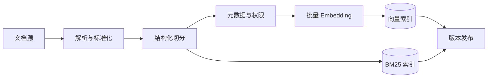

# 如何为一万个长文档构建 RAG 知识库？

## 原题原文

> 场景题：处理一万个长文档构建 RAG 知识库，怎么做？

## 答案

### 面试直答

一万个长文档的重点不是“一次性全部向量化”，而是设计 **可增量、可追踪、可评测的离线建库流水线**，并在查询侧使用权限过滤、混合召回和重排。

### 一、离线建库流程

#### 1. 文档解析与去重

- 按 PDF、Word、HTML、表格等类型选择解析器。
- 保留标题层级、表格结构和页码，不能只抽取纯文本。
- 用文件哈希识别重复内容，用文档 ID 和版本号追踪更新。

> **核心小结：** 建库质量上限首先由解析质量决定；脏文本会同时污染关键词索引和向量索引。

#### 2. Chunk 切分

- 优先按章节、标题、段落和表格等语义结构切分。
- 过大的 Chunk 主题混杂，过小的 Chunk 缺少上下文。
- 给每个 Chunk 附带文档标题和上级标题，必要时使用父子索引。

> **核心小结：** Chunk 应是可以独立命中、又保留足够回答上下文的最小语义单元。

#### 3. 元数据、权限和索引

每个 Chunk 至少保存：文档 ID、版本、来源、标题路径、时间、语言和访问权限。向量索引负责语义相似，BM25 负责专有名词、编号和精确关键词。

> **核心小结：** 权限应在召回阶段过滤，不能检索后再依赖模型隐藏敏感内容。

### 二、在线查询流程

- 对指代、省略和多意图问题做改写或拆分。
- 向量与 BM25 并行召回，再用 RRF 或加权融合候选。
- Cross-Encoder Reranker 对较小候选集精排。
- 去除重复 Chunk，并按上下文预算组装证据。
- 输出答案时带文档来源，证据不足则明确说明。

> **核心小结：** 召回负责不漏，重排负责靠前，上下文组装负责把有限 Token 留给最有用证据。

### 三、增量更新与稳定性

- 解析、切分和 Embedding 使用异步批处理，支持限速、重试和断点续跑。
- 根据文档版本只重建新增或变化的 Chunk，并清理旧版本。
- 新索引构建完成后做抽样与回归测试，再通过别名或蓝绿方式切换。
- 失败任务进入死信队列，记录失败阶段和原始文档。
- Embedding 模型或切分策略变化时建立新索引版本，避免新旧向量混用。

> **核心小结：** 一万篇并不算极端规模，真正难点是更新时不漏数据、不混版本、不中断线上查询。

### 四、如何评估

- 建立问题到标准文档或标准 Chunk 的标注集。
- 先看 Recall@K，确认相关内容能进入候选集。
- 再看 MRR/nDCG，确认正确内容是否排在前面。
- 最后评估答案正确性、引用准确性、P95 延迟和单请求成本。
- 按文档类型、语言、问题类型和时间范围切片，避免平均指标掩盖局部问题。

> **核心小结：** 建库完成不等于系统可用；检索、生成、延迟和成本都必须通过固定评测集回归。

## 问题来源

- 公司：阿里巴巴
- 页面标题：阿里面经-阿里AI Agent开发岗面经-01
- 面经小节：面经 04
- 岗位与面试时间：AI Agent 开发 ｜ 面试时间：2026 年 7 月 14 日
- 题目在小节内的位置：第 11 条
- 来源链接：https://www.nowcoder.com/discuss/923739430513299456
- 在线核验：2026-09-01 已在公开网页正文中逐条核验
- 证据级别：网页公开正文原文
