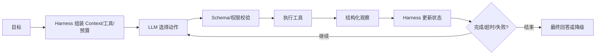

# Agent 项目中的“思考”由大模型推理完成，还是由模型外机制控制？整体方案如何设计？

## 原题原文

> agent 项目方案是什么？AI 思考是指思考什么，思考依赖大模型本身的推理能力，还是在模型之外搭建一套机制？

## 答案

### 面试直答

Agent 的“思考”不是全由大模型完成，也不是全由代码完成。更合理的分工是：**模型负责语义理解、规划和不确定性判断；Harness 负责循环调度、状态、工具执行、权限、预算、错误处理和终止。** 生产 Agent 的能力来自两者组合。

### 一、模型和代码分别控制什么

| 适合模型 | 适合代码/Harness |
|---|---|
| 理解用户意图和隐含约束 | 鉴权、沙箱和审批 |
| 拆分开放任务 | 超时、重试、限流和幂等 |
| 根据工具结果调整下一步 | 状态持久化和事件流 |
| 综合多份证据生成回答 | 最大步数、Token 和成本预算 |
| 判断证据是否足够 | 硬规则、Schema 和内容校验 |

如果让模型直接控制权限和终止，它可能越权或陷入循环；如果所有路径都写死在代码里，又无法处理开放问题。

> **核心小结：** 模型处理语义不确定性，代码执行不可妥协的系统约束。

### 二、整体方案

Codex 和 Claude Code 都体现了这种分工：模型产生 Tool Call，Harness 流式执行并处理审批、沙箱、工具结果配对、压缩和恢复。把它概括为 ReAct 思想可以帮助理解，但具体产品远比简单 Prompt 循环多。

> **核心小结：** Agent Loop 是模型决策与确定性运行时交替推进的状态机。

### 三、工程设计

- 每次模型动作都转成结构化 Item，禁止直接执行自由文本。
- 工具结果带状态、错误码和可重试性，便于模型正确观察。
- 终止条件同时包含目标完成、最大步数、超时和成本上限。
- 高风险动作使用代码审批；模型不能自行扩大权限。
- 用过程指标评估循环：重复动作率、无效调用率、重规划次数和恢复成功率。

> **核心小结：** “智能”可以由模型提供，“可控、可恢复、可审计”必须由 Harness 提供。

### 常见追问

- **CoT 就等于 Agent 思考吗？** 不是。CoT 是模型内部推理表达，Agent 思考还包含外部状态、工具反馈和控制逻辑。
- **Planner 必须是 LLM 吗？** 不必须；固定业务可以用规则或代码 DAG。

## 问题来源

- 公司：阿里巴巴
- 页面标题：阿里面经-阿里大模型算法岗面经-02
- 面经小节：面经 01
- 岗位与面试时间：AI 应用研发 ｜ 面试时间：2026 年 4 月 22 日
- 题目在小节内的位置：第 1 条
- 来源链接：https://www.nowcoder.com/discuss/923309821460221952
- 在线核验：2026-09-01 已在公开网页正文中逐条核验
- 证据级别：网页公开正文原文
